title: 程序员随想
date: 2019-02-01 23:37:00
tags: 

- Java


## 程序员随想

***
 - 2016.5.30杂谈
    今天先记录几个关键词吧(Android学习方面)，也很迟了zzz: 多线程、反编译（dex2jar和jdgui）、okhttp、retrofit（对okhttp进行封装）、学习网站：CSDN、Github、appxcode、博客园（cnblogs）、极客学院、CSDN学院、Android官网、Segmentfault、cnbeta（资讯类）。

    <!--more-->
------

- 2016.5.31随想

  今天还是主要在学习之前下好安装好的IntelliJ IDEA的使用，上手也不算难，也试了一个web项目和一个用了SSH框架的web项目，很爽 \(≧▽≦)/和Eclipse、Myeclipse相比较只能用四个字形容感受：相见恨晚！╮(╯▽╰)╭ 1.8的JDK环境加Tomcat8的本地服务器，不知道是IDE优化了还是各种加成，重新部署项目很快,点一下Run汤姆猫6,7秒就Redeploy好了，这可真是比用Myeclipse+JDK1.6+Tomcat7快的多了。还有一个必须提的就是代码提示很强大，快键键也很多（因为和Android Studio是同平台产品的所以快捷键完全一样）。说说遇到的问题吧，最令我印象深刻的是，这Spring的applicationContext.xml里面配的数据库连接改了之后还是原来那个数据库，很怪，用IDEA自带的Database管理工具改变了连接的数据库参数好像也是没有什么变化，后台的Hibernate的DAO还是会到原来那个数据库那里去访问数据，甚至我把applicationContext.xml数据库的连接信息的		

```
	 <property name="url"value="jdbc:mysql://localhost:3306/xyb"></property>
```

去掉最后的数据库名字（xyb）变成 "jdbc:mysql://localhost:3306/" 这样居然也能对数据访问和操作，而且还是最初的那个数据库（xyb），这真是日了鬼了，确实是没怎么想明白——6月2日补充：是可以在hbm.xml中更改连接的数据库名字的，疏忽了

```
//Account.hbm.xml
<hibernate-mapping>
	<class name="com.po.Account" table="account" catalog="xyb">
	……
</hibernate-mapping>
```

，对了，IDEA里用SQL语句也有代码提示，，挺方便的吧。还有Android Studio里菜单栏下面有一排工具栏，怎么IDEA里一个都没了，嗯，原来是要手动显示菜单栏中的View->Toolbar，打上勾就出来了。


	然后今天还更熟悉了foreach遍历集合，发现（对于我算是发现了）当集合中没有元素时（不为NULL）用foreach去遍历并且在遍历中使用遍历的对象并不会报出异常，这就很明显了，当遇到不为NULL的空集合时foreach一次也不会循环，这真是奈斯。
	

------

- 2016.6.1记录

```
	IDEA关闭重复代码检测：Settings->搜索Duplicated code，把勾取消。
	 
SSH框架下的用JUnit和Spring-test进行单元测试（直接在单元测试类中操作和验证数据库中的数据）。参看文章《SSH框架下用JUnit+spring-test单元测试》。
今天还熟悉了Map用entrySet遍历的方法，并且将Map对象作为List集合的元素。entry就相当于Map中的一个实体。通过entry.getKey( )和entry.getValue( )方法可以很方便地得到这个实体的键和值。上代码了。
```

```
       List<Map<String,String>> list1=new ArrayList<Map<String,String>>();
        Map<String,String> map1=new HashMap<String, String>();
        map1.put("heihei", "heihei");
        map1.put("haha", "haha");
        Map<String,String> map2=new HashMap<String, String>();
        map2.put("lel", "lele");
        map2.put("nunu", "nunu");

        list1.add(map1);
        list1.add(map2);
        String ke;
        String va;
        for(Map.Entry entry2:map2.entrySet()){
            ke=entry2.getKey().toString();
            va=entry2.getValue().toString();
            System.out.println("key:"+ke+", "+"value:"+va);
        }
```

输出：
key:lel, value:lele
key:nunu, value:nunu

遍历以Map为集合元素的List：

```
        for(Map<String, String> map3:list1){
            Iterator iterator2=map3.entrySet().iterator();
            while(iterator2.hasNext()){
                Map.Entry entry=(Map.Entry)iterator2.next();
                ke=entry.getKey().toString();
                va=entry.getValue().toString();
                System.out.println("key:"+ke+", "+"value:"+va);
                System.out.println("");
            }
```

输出：
key:haha, value:haha

key:heihei, value:heihei

key:lel, value:lele

key:nunu, value:nunu

------

- 2016.6.4记录
  Java判断字符串内容是否为数字方法之一：利用正则表达式

```
String str="64738";
boolean result=str.matches("[0-9]+");//result为true或false
//matches方法判断是否匹配所给的正则表达式
```

判断是否为浮点数：

```
  public static boolean isDouble(String str) {    
    Pattern pattern = Pattern.compile("^[-\\+]?[.\\d]*$");    
    return pattern.matcher(str).matches();    
  }  
```

final关键字修饰**类**时该类**不能被继承**，
final关键字修饰**方法**时该方法**不能被其子类方法覆盖**(覆盖表示子类方法中参数类型、或参数个数、或参数顺序不同)
final关键字修饰**变量**时该变量的**值不能改变**，该变量不能再去指向别的对象，一旦初始化后无法改变。但其指向的对象的值可以改变，如：

```
static String b="222";
final static String a=b;
System.out.println(a);//输出"222"
b="3333";  
System.out.println(b); //输出"3333"
System.out.println(a);//还是输出"222"，因为前面已经初始化赋值了b的值"222"，值不再更改
```

------

- 2016.6.9随想
  Java中一个方法中的匿名内部类调用该方法中的局部变量时，该变量必须在方法中声明为final，如

```
        final TextView tvtopkymn=(TextView)popupView.findViewById(R.id.tvtopktmn);
        tvtopkymn.setOnClickListener(new View.OnClickListener() {
            @Override
            public void onClick(View v) {
                tvtopkymn.setText("我是调用final变量");
            }
        });

```

这是为了克服局部变量和内部类之间生命周期的不一致性，内部类的生命周期比方法（等同于局部变量的生命周期）要长。设想一下：方法f被调用,从而在它的调用栈中生成了变量i,此时产生了一个局部内部类对象 inner_object,它访问了该局部变量i .当方法f()运行结束后,局部变量i就已死亡了,不存在了.但:局部内部类对象 inner_object还可能一直存在(只能没有人再引用该对象时,它才会死亡),它不会随着方法f()运行结束死亡.这时:出现了一个"荒唐"结果:局部内部类对象 inner_object要访问一个已不存在的局部变量i!	
	

------

- 2016.6.16记录
  java.lang.String中的**split方法**，实现方法为
   **`public String[] split(String regex)`**根据给定正则表达式的匹配拆分此字符串，将所有符合条件的都拆分完全，相当于下面一种的limit参数为0。
   或者
   **`public String[] split(String regex,int limit)`**根据匹配给定的正则表达式来拆分此字符串，limit参数限制目标数组中的元素个数，即该模式最多应用（limit-1）次就不再继续往下拆分；如果limit为0，则拆完为止，和不带这个limit参数结果一样。
   举个栗子

```
public class Test{
   public static void main(String args[]){
      String Str = new String("Welcome-to-cheetahlou-cheetah.com");

      for (String retval: Str.split("-", 2)){
         System.out.println(retval);
      }
      System.out.println("");

      for (String retval: Str.split("-", 3)){
         System.out.println(retval);
      }
      System.out.println("");

//limit参数为0
      for (String retval: Str.split("-", 0)){
         System.out.println(retval);
      }
      System.out.println("");
//无limit参数，其实就是limit参数为0
      for (String retval: Str.split("-")){
         System.out.println(retval);
      }
   }
}

```

输出结果将是：

Welcome
to-cheetahlou-cheetah.com

Welcome
to
cheetahlou-cheetah.com

Welcome
to
cheetahlou
cheetah.com

Welcome
to
cheetahlou
cheetah.com

另外，
1、如果用“.”作为分隔的话，必须是如下写法：`String.split("\\.")`,这样才能正确的分隔开，不能用`String.split(".")`;
2、如果用“|”作为分隔的话，必须是如下写法：`String.split("\\|")`,这样才能正确的分隔开，不能用`String.split("|")`;
“.”和“|”都是转义字符，必须得加"\\";
3、如果在一个字符串中有多个分隔符，可以用“|”作为连字符，比如：“a=1 and b =2 or c=3”,把三个都分隔出来，可以用`String.split("and|or")`; 再比如：`String str="Java string-split#test"`,可以用`Str.split(" |-|#")`把每个字符串分开。

------

- 2016.6.19记录
  CSS中margin和padding的区别用图表示为
   

------

 -2016.6.24感想
 没什么具体的代码方面的想说，只是想到今天考完了可能是大学最后一门考试，也是有些感慨，感慨里夹杂着一丝丝害怕，一丝丝莫名的害怕，也许是我的内心不够强大，还是会有对未知未来的不确定，有时候还真是会想未来啊你来的慢一点，But，the only thing we can do is KEEP GOING! 

------

- 2016.7.6记录
  用shiro框架验证登录：根据url过滤用户，设计用户组和权限，密码加密，记住密码登录

------

- 2016.8.6记录 
  对于 Android 深入的点会问一些自定义组件、性能优化，屏幕适配，IPC、Binder的理解，插件化，常用开源库以及原理等等。

------

- 2016.10.6记录
  回调方法，另见摘录的博文《Java中的回调（摘录）》。

------

- 2016.11.7记录
  jQuery是一个类数组对象，而DOM对象就是一个单独的DOM元素。

------

- 2017.1.2记录
  好的命名相当于给代码加了一段有用的注释

------

- 2017.2.13记录
  **jQuery的常用功能总结**
  - 在 DOM 树中进行查询
  - 修改 DOM 树及 DOM 相关操作
  - 事件处理
  - Ajax
  - Deferred 和 Promise
  - 对象和数组处理
  - 还有一个一直在用却很难在列清单时想到的——跨浏览器

------

- 2017.3.5记录
  **Java中String的拆箱装箱**
   先看个例子：

```
	String str1 ="abc";
	String str2 ="abc";
	System.out.println(str2==str1);  //输出为 true 
	System.out.println(str2.equals(str1));  //输出为 true 
            
	String str3 =new String("abc");
	String str4 =new String("abc"); 
	System.out.println(str3==str4);  //输出为 false 
	System.out.println(str3.equals(str4));  //输出为 true

```

再看个例子：

```
	String d ="2"; 
	String e ="23";
	e = e.substring(0, 1);
	System.out.println(e.equals(d)); //输出为 true 
	System.out.println(e==d); //输出为 false

```

第二个例子中，e的初始值与d并不同，因此e与d是各自创建了个对象，（e==d）为false 。
同理可知，第一个例子中的str3与str4也是各自new了个对象，而str1与str2却是引用了同一个对象。
**补充**：obj1==obj2 判断是obj1,obj2这两个引用变量是否相等，即它们所指向的对象是否为同一个对象。言外之意就是要求两个变量所指内存地址相等的时候，才能返回true，每个对象都有自己的一块内存，因此必须指向同一个对象才返回ture。

------

- 2017.3.10记录
  **Java跳出多重循环**
  在Java中，如何跳出当前的多重嵌套循环？
  答：在最外层循环前加一个标记如A，然后用break A;可以跳出多重循环。（Java中支持带标签的break和continue语句，作用有点类似于C和C++中的goto语句，但是就像要避免使用goto一样，应该避免使用带标签的break和continue，因为它不会让你的程序变得更优雅，很多时候甚至有相反的作用，所以这种语法其实不知道更好）

------

- 2017.3.19记录
  **类加载器工作机制**

  1.装载：将Java二进制代码导入jvm中，生成Class文件。

  2.连接：a）校验：检查载入Class文件数据的正确性 b）准备：给类的静态变量分配存储空间 c）解析：将符号引用转成直接引用

  3：初始化：对类的静态变量，静态方法和静态代码块执行初始化工作。

  双亲委派模型：类加载器收到类加载请求，首先将请求委派给父类加载器完成

  用户自定义加载器->应用程序加载器->扩展类加载器->启动类加载器。

------

2017.4.20记录
**Android Studio 项目push到GitHub报错**

```
Can't finish GitHub sharing process
		Successfully created project 'CareU' on GitHub, but initial push failed:
		unable to access 'https://github.com/cheetahlou/CareU.git/': error setting certificate verify locations:

```

找了很久没有发现原因，后来发现是CA证书的问题，电脑重装过一次Git没有重新安装过，CA证书没有导入，在Git安装目录中安装证书（有好几个，我装了其中的一两个，举例如下路径），然后再在Android Studiopush一次，会跳出windows证书提示你输入github的账户密码，success后就可以正常使用了。

```
	"G:\Android\Git\mingw64\ssl\certs\ca-bundle.crt"

```

------

- 2017.5.4一点记录
  **GroupId、ArtifactId**

  ```
  Maven项目的GroupId相当于公司和部门名，ArtifactId相当于项目名
  
  ```

------

- 2017.6.17记录
  **Socket连接建立流程**

1. 服务端实例化ServerSocket
2. 服务端执行accept()监听指定端口
3. 客户端实例化Socket尝试连接服务器（IP,port）
4. TCP三次握手成功，服务端的accept()返回Socket实例，同时客户端的Socket实例创建成功。

------

- 2017.6.20记录
  **不同变量默认值**
  · 对基本数据类型来说，对于类变量（static）和全局变量，如果不显式地对其赋值而直接使用，则系统会为其赋予默认的零值，而对于局部变量来说，在使用前必须显式地为其赋值，否则编译时不通过。
  · 对于同时被static和final修饰的常量，必须在声明的时候就为其显式地赋值，否则编译时不通过；而只被final修饰的常量则既可以在声明时显式地为其赋值，也可以在类初始化时显式地为其赋值，总之，在使用前必须为其显式地赋值，系统不会为其赋予默认零值。
  · 对于引用数据类型reference来说，如数组引用、对象引用等，如果没有对其进行显式地赋值而直接使用，系统都会为其赋予默认的零值，即null。
  · 如果在数组初始化时没有对数组中的各元素赋值，那么其中的元素将根据对应的数据类型而被赋予默认的零值。

------

- 2017.6.30记录
  **Java取模运算**
  Java中取模运算%的结果的正负符号和被除数一致。
  如：
  	

  ```
  17 % 10 = 7；
  -17 % 10 = -7；
  -17 % (-10) = -7；
  
  ```

------

- 2017.8.4记录
  **count(1),count(*)和count(column)**
  <code>如果你的数据表没有主键，那么count(1)比count(*)快 
  如果有主键的话，那主键（联合主键）作为count的条件也比count(*)要快 
  如果你的表只有一个字段的话那count(*)就是最快的啦 
  count(*) count(1) 两者比较。主要还是要count(1)所相对应的数据字段。 
  如果count(1)是聚索引,id,那肯定是count(1)快。但是差的很小的。 
  因为count(*),自动会优化指定到那一个字段。所以没必要去count(1)，用count(*),sql会帮你完成优化的 
  因此：count(1)和count(*)基本没有差别！
  count(*)和count(column)比较时，和选取的column有关，越靠后越慢，column有索引时，如果索引可以为null则count(column)较快，如果索引要求不为null则两者一样快。
      综合来看，大多数场景可以大胆地使用count(*)。
      <code>

------

- 2017.8.7记录
  Mybatis中如果使用**ResultType**而不是**ResultMap**的话,以实体类为接收对象举例，默认实体类中的属性名要和数据库中的字段名相同才能得到数据，也可以和别名相同。如属性名是userName，则select t.user_name as userName,也能接收成功。

  SpringMVC中如果要接收多个参数可以用(HttpServletRequest request)获取，然后用request.getParameter("参数名")获取参数值。

  **@RestController注解**

> A convenience annotation that is itself annotated with @Controller and @ResponseBody. Types that carry this annotation are treated as controllers where @RequestMapping methods assume @ResponseBody semantics by default.  
> 注解本身使用@Controller和@ResponseBody注解。使用了这个注解的类会被看作一个controller-使用@RequestMapping的方法有一个默认的@ResponseBody注解。  
> @ResponseBody – As of version 4.0 this annotation can also be added on the type level in which case is inherited and does not need to be added on the method level.  
> @ResponseBody也可以加到类一级，通过继承方法一级不需要添加。 

------

- 2017.8.10记录
  **sql中用union all或in代替or**

应尽量避免在 where 子句中使用 or 来连接条件，否则将导致引擎放弃使用索引而进行**全表扫描**。而改用union之后，性能就大大提高了。
使用"union all"的性能比"union"更高一些。因为当SQL 语句需要UNION两个查询结果集合时，这两个结果集合会以UNION-ALL的方式被合并， 然后在输出最终结果前进行排序。 如果用UNION ALL替代UNION， 这样排序就不是必要了，效率就会因此得到提高。

```sql
select * from Member where MemberName = '张三' 
union all
select * from Member where MemberName = '李四'
或
select * from Member where MemberName in ('张三','李四')

```

来代替or
~~select * from Member where MemberName = '张三' or MemberName = '李四'~~
相关链接：[避免全表扫描，提高sql查询效率](http://panyi5202.iteye.com/blog/612414)

- **MySQl的全表扫描情况**

```
 在以下几种条件下，MySQL就会做全表扫描： 
1)  数据表是在太小了，做一次全表扫描比做索引键的查找来得快多了。当表的记录总数小于10且记录长度比较短时通常这么做。 
2)  没有合适用于 ON 或 WHERE 分句的索引字段。 
3)  让索引字段和常量值比较，MySQL已经计算（基于索引树）到常量覆盖了数据表的很大部分，因此做全表扫描应该会来得更快。 
4)  通过其他字段使用了一个基数很小（很多记录匹配索引键值）的索引键。这种情况下，MySQL认为使用索引键需要大量查找，还不如全表扫描来得更快。

 对于小表来说，全表扫描通常更合适。但是对大表来说，尝试使用以下技术来避免让优化程序错误地选择全表扫描： 
 1)  执行 ANALYZE TABLE tbl_name 更新要扫描的表的索引键分布。 
 2)  使用 FORCE INDEX 告诉MySQL，做全表扫描的话会比利用给定的索引更浪费资源。 
 SELECT * FROM t1, t2 FORCE INDEX (index_for_column) 
 WHERE t1.col_name=t2.col_name; 
 3)  启动 mysqld 时使用参数 --max-seeks-for-key=1000 或者执行 SET max_seeks_for_key=1000 来告诉优化程序，所有的索引都不会导致超过1000次的索引搜索

```

------

- 2017.8.11记录
  **ajax跨域处理**

1.在response的头文件添加

```java
httpServletResponse.setHeader("Access-Control-Allow-Origin","*");

```

2.SpringMVC解决跨域问题的注解

```java
@CrossOrigin("http://test.com")
@CrossOrigin(origins="http://test.com",maxAge=3600)

```

 **Ajax请求SpringMVC返回到浏览器中文乱码**
 原因：Spring在处理`@ResponseBody`这个annotation的时候，org.springframework.web.servlet.mvc.annotation.AnnotationMethodHandlerAdapter使用了org.springframework.http.converter.StringHttpMessageConverter进行处理，而StringHttpMessageConverter默认了字符编码为`ISO-8859-1`（如下）：

```java
 public static final Charset DEFAULT_CHARSET = Charset.forName("ISO-8859-1");

```

- 解决办法一
  使用SpringMVC提供的在@RequestMapping中加入produces注解

```
@RequestMapping(value = "/xxx", method = RequestMethod.GET,produces = "text/plain;charset=UTF-8")

```

- 解决办法二(自行验证)
  链接：
   [解决Spring MVC @ResponseBody返回中文字符串乱码问题](http://www.cnblogs.com/dyllove98/p/3180158.html)
   [Who sets response content-type in Spring MVC (@ResponseBody)](https://stackoverflow.com/questions/3616359/who-sets-response-content-type-in-spring-mvc-responsebody)

------

------

- 2017.9.23记录 **linux服务器能ping通ip不能ping通域名**
  做的电商项目调用物流网站的API时服务器一直请求不到，而本地电脑可以，还以为时json解析的问题，排查了好久发现是服务器解析域名的问题
   问题：`ping: unknown host www.kuaidi100.com`
   先查看
   ` # cat /etc/resolv.conf`
   修改DNS服务
   ` # vi /etc/resolv.conf`
   添加nameserver(公共DNS服务器)，如

> nameserver 8.8.8.8
> nameserver 223.5.5.5

------

- 2017.9.26记录 **Java中Date加一天,和Calendar转化**

```java
	 Calendar curCal= Calendar.getInstance();
     curCal.setTime(new Date());
     curCal.add(Calendar.DATE,-1);
     Date newDate=curCal.getTime();

```

------

转自[老D博客](https://laod.cn/design/page/javascript-texiao.html)：
一、添加鼠标点击特效：
添加鼠标点击特效，("富强", "民主", "文明", "和谐", "自由", "平等", "公正" ,"法治", "爱国", "敬业", "诚信", "友善")等。

```js
<script type="text/javascript">
/* 鼠标点击特效 */
var a_idx = 0;
jQuery(document).ready(function($) {
    $("body").click(function(e) {
var a = new Array("富强", "民主", "文明", "和谐", "自由", "平等", "公正" ,"法治", "爱国", "敬业", "诚信", "友善");
var $i = $("<span/>").text(a[a_idx]);
        a_idx = (a_idx + 1) % a.length;
var x = e.pageX,
        y = e.pageY;
        $i.css({
"z-index": 999999999999999999999999999999999999999999999999999999999999999999999,
"top": y - 20,
"left": x,
"position": "absolute",
"font-weight": "bold",
"color": "#ff6651"
        });
        $("body").append($i);
        $i.animate({
"top": y - 180,
"opacity": 0
        },
        1500,
function() {
            $i.remove();
        });
    });
});
</script>

```

效果如图：

二、添加评论框输入特效：
添加以下代码到主题尾部调用即可

```js
<script src="activate-power-mode.js"></script>
<script>
POWERMODE.colorful = true; // 控制开启/开启礼花特效  
POWERMODE.shake = false; // 控制开启/关闭屏幕震动特效  
document.body.addEventListener('input', POWERMODE);
</script>

```

在输入框打字时跟随光标弹出烟花很是炫酷（还可以开启屏幕震动哦！）
true 为开启
false 为关闭
效果如图：


------

------

- 2017.12.25 Redis 记录
  Redis keys通配符
   keys的模式支持下面通配符：
  \*通配符。该通配符表示所有的意思。如：keys * 匹配数据库中所有 key 。
  ?通配符。表示一个任意字符。如：keys h?llo 命令匹配 hello ， hallo 和 hxllo 等。
  *通配符。表示任何字符。如：keys h*llo 表示任何一h开头，llo结尾的key，如匹配 hllo 和 heeeeello 等。
  []通配符。这和正则表示中的[]类似，每次可以配其中任何一个字符。如：keys h[ae]llo 匹配 hello 和 hallo ，但不匹配 hillo，因为i不在[ae]中 。

参考Blog：[Redis操作总结](http://blog.csdn.net/LanSeTianKong12/article/details/50148937)

------

- 2018.1.5 集合操作`java.lang.UnsupportedOperationException`
  对于Collections.EMPTY_LIST或Arrays.asList(3, 5)等构建的固定大小的集合不能对其使用add,remove,addAll等方法改变大小，因其没有重写addAll方法，也不需要重写这些不合理（因其大小固定）的方法。同理可以推断以后遇到该异常的时候可以查看其是否支持，尤其是重写该方法了。

------

- 2018.1.24 **分布式和集群**
  分布式：一个业务分拆多个子业务，部署在不同的服务器上，集群：同一个业务，部署在多个服务器上
   集群用在解决高可用、负载均衡等，如redis集群，分布式将核心业务抽取出来单独作为独立服务，一个系统由多个子业务组成，如Dubbo和Git

------

- 2018.2.2  **快递100免费物流查询自用方法(返回物流信息列表json)**

```
    /**
     * 获取订单物流详情
     *
     * @return
     */
    @RequestMapping(value = "/consultLogstics", method = RequestMethod.GET)
    public JsonResp consultLogstics(Long orderId) {
        log.debug("获取订单物流详情");
        if (null == orderId)
            return JsonResp.toFail("订单id不能为空");
        Orders orders = ordersService.selectById(orderId);
        JSONObject jsonObject = new JSONObject();
        if (orders.getIsLogistics() == 0)
            return JsonResp.ok(jsonObject);
        String type = orders.getLogiCom();
        String postid = orders.getLogisticsNumber();
       /* String type="shentong";
        String postid="3333872084245";*/
        String consultUrl = "http://www.kuaidi100.com/query?type=" + type + "&postid=" + postid;
        String result = HttpClientUtil.sendGetSSLRequest(consultUrl, "UTF-8");
        Object obj = JSON.parse(result); 
        return JsonResp.ok(obj);
    }

```

------

- 2018.2.27  **网关Gateway相关摘录**
  网关实质上是一个网络通向其他网络的IP地址。用于两个高层协议不同的网络互连，网关的IP地址是具有路由功能的设备的IP地址，具有路由功能的设备有路由器、启用了路由协议的服务器（实质上相当于一台路由器）、代理服务器（也相当于一台路由器）

------

- 2018.3.15 **幂等性**
  *幂等性*：对同一个系统，使用同样的条件，一次请求和重复的多次请求对系统资源的影响是一致的；在数学中表示为f(x)=f(f(x))；常用于分布式系统设计中，在电商、互联网金融领域尤为重要。以此避免重复地调用接口造成数据被多次修改。
   refer via 简书：[幂等性浅谈](https://www.jianshu.com/p/475589f5cd7b)

------

- 2018.6.6 **SpringMVC中的重定向参数RedirectAttributes的addFlashAttribute()  **
  SpringMVC中的重定向参数RedirectAttributes的addFlashAttribute方法，是将参数的键值存到session中，而在分布式环境中时，如果没有做统一session管理，就会出现重定向以后接不到参数的情况。 

------

- 2018.6.12 **BigDecimal精度丢失**
  有小数点的值（浮点数）用BigDecimal构造函数初始化时，不论加减乘除，如果不添加双引号，会发生丢失精度的情况；
  比如`BigDecimal bd= new BigDecimal(2.48);`
  会变成`2.4799999999999999999999998223`
  所以，用字符串进行初始化`BigDecimal bd= new BigDecimal("2.48");` ，不会出现这个问题，还有记得除不尽时加 *scale* 和 *roundMode* 。

------

```java
response推json:
   /**
     * 将某个对象转换成json格式并发送到客户端
     * @param response
     * @param obj
     * @throws Exception
     */
    public static void sendJsonMessage(HttpServletResponse response, Object obj) throws Exception {
        response.setContentType("application/json; charset=utf-8");
        PrintWriter writer = response.getWriter();
        writer.print(JSONObject.toJSONString(obj, SerializerFeature.WriteMapNullValue,
                SerializerFeature.WriteDateUseDateFormat));
        writer.close();
        response.flushBuffer();
    }

```

------

- 2018.7.2 读取配置文件

```java
    public static String get(String key) {
        if (prop != null)
            return prop.getProperty(key);
        try {
            InputStream file = GlobEnvUtil.class.getClassLoader().getResourceAsStream("globEnv.properties");
            prop = new Properties();
            prop.load(file);
        } catch (Exception e) {
            System.out.println(e.getMessage());
        }
        return prop.getProperty(key);
    }

    static Properties prop = null;
    static {
        try {
            InputStream file = GlobEnvUtil.class.getClassLoader().getResourceAsStream("globEnv.properties");
            Properties prop = new Properties();
            prop.load(file);
        } catch (Exception e) {

            System.out.println(e.getMessage());
        }
    }

```

固定读取相应环境的"globalEnv.properties"文件，
*举个栗子*

> globalEnv.properties配置：
> `server.login.graphCode = https://ip:port/module/path`
> valocity的toolbox.xml配置:
>
> ```<?xml version="1.0" encoding="UTF-8" ?>
> <toolbox>
> <xhtml>true</xhtml>
> <tool>
> 	<key>env</key>
> 	<scope>application</scope>
> 	<class>com.xx.utils.velocity.GlobEnvUtil</class>
> </tool>
> 
> ```
>
> velocity读取：
> `var path = $env.getPath('server.login.graghCode');`

------

- 2018.7.4 **拆箱装箱和==、equals**
  包装类型的自动拆箱和基本类型的自动装箱方便了两者的互换和书写阅读。
  用==可以用于基本类型和包装类型之间的比较，只比较拆装后两者的值是否相等如

```java
       Integer zz = 213;
       System.out.println(zz==(short)213);//结果为true

```

Character、Byte、Short、Integer、Long等包装类型的equals方法，比较相等时先判断比较对象是否是该类型，类型不同直接返回false，类型相同再先强转为包装类，调用intValue()、shortValue()、longValue()等取到其基本类型的值，比较两者基本类型的值是否相等。

这里可以引申因为基本数据类型的存在而讨论Java是否是完全面向对象的语言？

*举栗：Integer类的equals方法*

```java
    /**
     * Compares this object to the specified object.  The result is
     * {@code true} if and only if the argument is not
     * {@code null} and is an {@code Integer} object that
     * contains the same {@code int} value as this object.
     *
     * @param   obj   the object to compare with.
     * @return  {@code true} if the objects are the same;
     *          {@code false} otherwise.
     */
    public boolean equals(Object obj) {
        if (obj instanceof Integer) {
            return value == ((Integer)obj).intValue();
        }
        return false;
    }

```

举栗：

```java
        Integer ez = 13;
        Integer ez1 = new Integer(127);
        Integer ez2 = new Integer(127);
        System.out.println(ez1==ez2);//false
        System.out.println(2.00f==(short)2);//true
        System.out.println(ez.equals((short)13));//false
        System.out.println("233".equals(233));//false

```

------

- 2018.7.16 **MySQL同一事务**
  MySQL同一事务中，后面的读数据会读到前面更新操作后的数据。
    比如原来count=1，更新操作commit后count应为0，那么同一个事务的后续查询会读到count=0，即使它还没有commit。

------

- 2018.7.17 **Linux日志查询**

1. 按关键字查找日志行号：`cat -n test.log | grep 关键字`

2. 找到行号后打印前后某几行日志：用tail和head 打印，`tail -n +行号 文件名 | head -n 20` 或者 用sed `sed -n '23882,24182p' test.log`

3. sed打印某段时间内的日志：`sed -n '/2018-08-01 14:52:00/,/2018-08-01 14:53:00/p' test.log`    

   某段时间内包含关键字翻页查 `sed -n '/2019-04-08 16:59:15/,/2019-04-08 17:30/p' catalina.out |grep exec-7 | more`

4. less打印某关键词所在位置日志，可以按N和n分别查找前后一个关键词的日志，并且高亮该关键词，`less -N +?keyword  test.log` 或者`less -N +/keyword  test.log`，"?" 和"/"的区别是 按n和N不同方向匹配文本。用more不会高亮该关键词。

> less ?keyword　　向上查找
> n    向上匹配下一处匹配文本
> N    向下匹配下一处匹配文本 
>
> less /keyword　　向下查找
> n    向下匹配下一处匹配文本
> N    向上匹配下一处匹配文本


------

- 2018.7.19 **有赞权限系统实现关键点摘录**

```
SAM(Security Access Manager)权限系统模型的实现
在传统的 RBAC 模型中，通常通过一张关系表来保存角色与权限集的对应关系，实现权限与角色相关联。可以预见的是，随着零售业务的不断发展会积累下不计其数的功能点，导致关联表的数据极难维护和使用。SAM 权限系统利用进制转换的策略解决了这个问题 ，同时提高了存储效率以及权限判定效率。一个基本类型为 Long 的十进制数字，它也可以看做是由 64 位 0 或 1 组成的二进制。在 SAM 系统模型设计中，每一个功能点定义为一个权限点，该权限点由 idx 和 pos 两个属性确保是全局唯一的权限点。idx 表示第几个 Long 型空间，pos 表示 Long 型对应的二进制数中所处的位置，64 位长度即可代表 64 个不同能功能点。当 64 位满时无法再容放更多的功能点，这时 idx 属性会自增，重新申请一个 Long 型空间。如此一个 64 位的 Long 数字，通过 0 或 1 的组合，即可表示最多对 64 个不同的功能点所拥有权限的状态描述。
例如：权限集{1}表示拥有 idx=0, pos=0 对应功能点的权限，权限集{-1,1}表示拥有idx=0,pos∈[0,1,2,..,63]与 idx=1,pos=0 对应功能点的权限。
SAM 权限系统将资源与所代表的功能点的关联关系通过进制的方式管理起来，采用计算机进制的思想，抽象出功能集换算公式来完成资源与二进制之间的映射，以及角色与二进制的映射。
权

作者：有赞技术

```

------

- 2018.7.25 **MySQL比较两个时间字段大小，取较大者**
  两个时间字段中有可能有的为NULL，先取时间not null的，都有时间则取较大者。
   思路：用case when配合if语句将取值统一用时间戳比较大小，NULL作为时间戳的0。

```sql
select 
(CASE WHEN IF (time_field_A IS NULL,0,UNIX_TIMESTAMP(time_field_A)) > IF (time_field_B IS NULL,0,UNIX_TIMESTAMP(time_field_B)) THEN time_field_A ELSE time_field_B END) greater_time
from table

```

------

- 2018.7.26 **MySQL通过存储过程批量造数据**

```sql
/*
--  批量新增
*/
DELIMITER //
DROP PROCEDURE
IF EXISTS createTest ; CREATE PROCEDURE createTest ()
BEGIN
	DECLARE
		num INT ;
	SET num = 1 ;
	WHILE num < 1002 DO

	SET @DATE = '2018-07-26' ;
	SET @NAME = concat('名字', num) ; 
INSERT INTO tableName (field1, field2, field3)
	VALUES
		(@DATE, @NAME, '99',) ;
	SET num = num + 1 ;
	END
	WHILE ;
	END ; 
CALL createRemindTest () ;

```

------

- 2018.9.5 **Java List<T>和Set<T>检查重复和去重**

LIst和Set的contains(Object e)方法都用e的equals()方法检查集合中是否存在e对象。和hashCode方法，重写即可

Set的HashSet实现类的的add()方法和addAll()方法实际调用的HashMap的put再调putVal方法，将元素值作为HashMap的put方法的key作检查，可以看到是从hash值和equals方法判断是否已有重复元素，所以要判重或去重时按需重写对象的**equals()和hashCode()** 方法。。

**`HashSet中的add()方法`    **

```
public boolean add(E e) {
        return map.put(e, PRESENT)==null;
    }

```

**`HashMap.java中的put方法`**

```java
    public V put(K key, V value) {
        return putVal(hash(key), key, value, false, true);
    }
    
    final V putVal(int hash, K key, V value, boolean onlyIfAbsent,
                   boolean evict) {
        Node<K,V>[] tab; Node<K,V> p; int n, i;
        if ((tab = table) == null || (n = tab.length) == 0)
            n = (tab = resize()).length;
        if ((p = tab[i = (n - 1) & hash]) == null)
            tab[i] = newNode(hash, key, value, null);
        else {
            Node<K,V> e; K k;
            if (p.hash == hash &&
                ((k = p.key) == key || (key != null && key.equals(k))))
                e = p;
            else if (p instanceof TreeNode)
                e = ((TreeNode<K,V>)p).putTreeVal(this, tab, hash, key, value);
            else {
                for (int binCount = 0; ; ++binCount) {
                    if ((e = p.next) == null) {
                        p.next = newNode(hash, key, value, null);
                        if (binCount >= TREEIFY_THRESHOLD - 1) // -1 for 1st
                            treeifyBin(tab, hash);
                        break;
                    }
                    if (e.hash == hash &&
                        ((k = e.key) == key || (key != null && key.equals(k))))
                        break;
                    p = e;
                }
            }
            if (e != null) { // existing mapping for key
                V oldValue = e.value;
                if (!onlyIfAbsent || oldValue == null)
                    e.value = value;
                afterNodeAccess(e);
                return oldValue;
            }
        }
        ++modCount;
        if (++size > threshold)
            resize();
        afterNodeInsertion(evict);
        return null;
    }

```

------

- 2018.9.6 **集合的Fail-fast机制记录**

> 有两个线程（线程A，线程B），其中线程A负责遍历list、线程B修改list。线程A在遍历list过程的某个时候（此时expectedModCount = modCount=N），线程启动，同时线程B增加一个元素，这是modCount的值发生改变（modCount + 1 = N + 1）。线程A继续遍历执行next方法时，通告checkForComodification方法发现expectedModCount  = N  ，而modCount = N + 1，两者不等，这时就抛出ConcurrentModificationException 异常，从而产生fail-fast机制。

**volatile**关键字：

> Java提供了volatile关键字来保证可见性。
> <br>
> 当一个共享变量被volatile修饰时，它会保证修改的值会立即被更新到主存，当有其他线程需要读取时，它会去内存中读取新值。  
> <br>
> 而普通的共享变量不能保证可见性，因为普通共享变量被修改之后，什么时候被写入主存是不确定的，当其他线程去读取时，此时内存中可能还是原来的旧值，因此无法保证可见性。

------

- 2018.9.10 **volatile关键字相关记录**

***参考:*** [并发编程中的volatile关键字](http://www.techug.com/post/java-volatile-keyword.html)
***相关资料:*** [全面理解Java内存模型(JMM)及volatile关键字](https://blog.csdn.net/javazejian/article/details/72772461)

**volatile特性：**

> 1.保证了不同线程对该变量操作的内存可见性;
> 2.禁止指令重排序

**volatile底层的实现机制**：

> " 如果把加入volatile关键字的代码和未加入volatile关键字的代码都生成汇编代码，会发现加入volatile关键字的代码会多出一个lock前缀指令。 lock前缀指令实际相当于一个内存屏障，内存屏障提供了以下功能： 1.重排序时不能把后面的指令重排序到内存屏障之前的位置 2.使得本CPU的Cache写入内存 ** **3.写入动作也会引起别的CPU或者别的内核无效化其Cache，相当于让新写入的值对别的线程可见 "
>
> > 

但是**volatile**关键字不能保证操作的 原子性 如下程序想得到结果为 `10000`
,实际结果极大概率为`10000` 不到一点，因变量`inc++` 操作实际分为

```java
public class Test {
    public volatile int inc = 0;

    public void increase() {
        inc++;
    }

    public static void main(String[] args) {
        final Test test = new Test();
        for (int i = 0; i < 10; i++) {
            new Thread(() -> {
                for (int j = 0; j < 1000; j++)
                    test.increase();
            }).start();
        }

        while (Thread.activeCount() > 1)  //保证前面的线程都执行完
            Thread.yield();
        System.out.println(test.inc);
    }
}

```

------

- 2018.9.14 **获取当周起讫时间**

```java
    Calendar calendar = Calendar.getInstance();
        calendar.set(Calendar.HOUR_OF_DAY, 0);
        calendar.set(Calendar.MINUTE, 0);
        calendar.set(Calendar.SECOND, 0);
        calendar.set(Calendar.MILLISECOND, 0);
        int dayOfWeek = calendar.get(Calendar.DAY_OF_WEEK);
        //周日——周六 有不同的代表value 1-7
        if (dayOfWeek == 1) {
            dayOfWeek += 7;
        }
        int addOrSub = 2-dayOfWeek;
        //获取当周周一00:00和周日23:59
        Date weekStart = DateUtils.addOrSubDay(calendar.getTime(),addOrSub);
        Date weekEnd = DateUtils.addOrSubDay(weekStart, 6);
        weekEnd = DateUtils.getFinalTimeOfDay(weekEnd);

```

------

- 2018.10.26 **linux获取进程pid，杀进程命令**

```shell
P_ID=`ps -ef | grep -w "$SERVICE_NAME" | grep -v "grep" | awk '{print $2}'`

		if [ "$P_ID" == "" ]; then
            echo "=== $SERVICE_NAME process not exists or stop success"
        else
            echo "=== $SERVICE_NAME process pid is:$P_ID"
            echo "=== begin kill $SERVICE_NAME process, pid is:$P_ID"
            kill -9 $P_ID
        fi

```

重启脚本 服务.sh：

```shell
#!/bin/sh

## java env
export JAVA_HOME=/usr/java/jdk1.8.0_131
export JRE_HOME=$JAVA_HOME/jre


SERVICE_DIR=/usr/local/目录
SERVICE_NAME=服务名
JAR_NAME=$SERVICE_NAME\.jar
PID=$SERVICE_NAME\.pid

cd $SERVICE_DIR

case "$1" in

    start)
        echo "$JRE_HOME/bin/java -Xms128m -Xmx512m -Dfile.encoding=UTF-8 -jar $SERVICE_DIR/$JAR_NAME"
        echo $! > $SERVICE_DIR/$PID
        echo "=== start $SERVICE_NAME"
#!/bin/sh

## java env
export JAVA_HOME=/usr/java/jdk1.8.0_131
export JRE_HOME=$JAVA_HOME/jre


SERVICE_DIR=/usr/local/目录
SERVICE_NAME=服务名
JAR_NAME=$SERVICE_NAME\.jar
PID=$SERVICE_NAME\.pid

cd $SERVICE_DIR

case "$1" in

    start)
        nohup $JRE_HOME/bin/java -server -Xms256m -Xmx2048m -XX:+UseG1GC -XX:ParallelGCThreads=4 -XX:SurvivorRatio=8 -XX:+DisableExplicitGC -XX:HeapDumpPath=/usr/java/activity_heap.dump -XX:+HeapDumpOnOutOfMemoryError -Dfile.encoding=UTF-8 -jar $SERVICE_DIR/$JAR_NAME >$SERVICE_DIR/logs/服务名.out 2>&1 &
        echo "$JRE_HOME/bin/java -Xms128m -Xmx512m -Dfile.encoding=UTF-8 -jar $SERVICE_DIR/$JAR_NAME"
        echo $! > $SERVICE_DIR/$PID
        echo "=== start $SERVICE_NAME"
        ;;

    stop)
        kill `cat $SERVICE_DIR/$PID`
        rm -rf $SERVICE_DIR/$PID
        echo "=== stop $SERVICE_NAME"

        sleep 5
        P_ID=`ps -ef | grep -w "$SERVICE_NAME" | grep -v "grep" | awk '{print $2}'`
        if [ "$P_ID" == "" ]; then
            echo "=== $SERVICE_NAME process not exists or stop success"
        else
            echo "=== $SERVICE_NAME process pid is:$P_ID"
            echo "=== begin kill $SERVICE_NAME process, pid is:$P_ID"
            kill -9 $P_ID
        fi
        ;;

    restart)
        $0 stop
        sleep 2
        $0 start
        echo "=== restart $SERVICE_NAME"
        ;;

    *)
        ## restart

```

------

- 2018.11.20 **Linux sz rz命令**

> <font color=red>**sz**</font> 命令（Send ZMODEM）通过ZMODEM协议，可将多个文件从远程服务器下载到本地。注意不能下载文件夹，如果下载文件夹，请先打包再下载

比如下载多个文件

```shell
 sz  file1 file2 file3

```

> <font color = red>**rz**</font> 命令（Receive ZMODEM），使用ZMODEM协议，将本地文件批量上传到远程Linux/Unix服务器，注意不能上传文件夹。

比如在XShell或其他虚拟终端软件中敲rz和回车可以打开系统资源管理器选择本地文件上传。

------

- 2018.12.12 **IDEA refactor remark**
  如下图，IDEA用refactor重构方法名的时候默认会把字符串、注释等中的部分也包括进去，这样当字符串中的某一部分和方法名相同时就会被一起refactor掉。太智能惹的锅？
  

------

------

- 2018.12.13 **Linux开放端口**

```shell
 1.  查看已打开的端口  # netstat -anp
 2. 查看想开的端口是否已开 # firewall-cmd --query-port=666/tcp
  若此提示 FirewallD is not running 
  表示为不可知的防火墙 需要查看状态并开启防火墙

 3. 查看防火墙状态  # systemctl status firewalld
 running 状态即防火墙已经开启
 dead 状态即防火墙未开启
 4. 开启防火墙，# systemctl start firewalld  没有任何提示即开启成功
 5. 开启防火墙 # service firewalld start  
   关闭防火墙 # systemctl stop firewalld
   centos7.3 上述方式可能无法开启，可以先#systemctl unmask firewalld.service 然后 # systemctl start firewalld.service

 6. 查看想开的端口是否已开 # firewall-cmd --query-port=666/tcp    提示no表示未开
 7. 开永久端口号 firewall-cmd --add-port=666/tcp --permanent   提示    success 表示成功
 8. 重新载入配置  # firewall-cmd --reload    比如添加规则之后，需要执行此命令
 9. 再次查看想开的端口是否已开  # firewall-cmd --query-port=666/tcp  提示yes表示成功
 10. 若移除端口 # firewall-cmd --permanent --remove-port=666/tcp

 11. 修改iptables  有些版本需要安装iptables-services # yum install iptables-services 然后修改进目录 /etc/sysconfig/iptables   修改内容

```

------

- 2019.1.10 **Js中的对象类型精确判断**

  在js 中 , 有一种判断数据基本类型的方法 typeof , 只能判断5中基本类型:即 “number”，”string”，”undefined”，”boolean”，”object” 五种。
  可见: typeof 会根据对象类型返回对应的类型字符串, 但是有几个缺点:

  对于数组、函数、对象来说，其关系错综复杂，使用 typeof 都会统一返回 “object” 字符串,null也会返回’object’,对NaN返回是’number’ 
  Object.prototype.toString.call(obj) == "[object String]" ?

```js
console.log(Object.prototype.toString.call("jerry"));//[object String]
console.log(Object.prototype.toString.call(12));//[object Number]
console.log(Object.prototype.toString.call(true));//[object Boolean]
console.log(Object.prototype.toString.call(undefined));//[object Undefined]
console.log(Object.prototype.toString.call(null));//[object Null]
console.log(Object.prototype.toString.call({name: "jerry"}));//[object Object]
console.log(Object.prototype.toString.call(function(){}));//[object Function]
console.log(Object.prototype.toString.call([]));//[object Array]
console.log(Object.prototype.toString.call(new Date));//[object Date]
console.log(Object.prototype.toString.call(/\d/));//[object RegExp]
function Person(){};
console.log(Object.prototype.toString.call(new Person));//[object Object]
```

------

- 2019.01.15  **泛型方法**
  定义泛型方法，其格式是：修饰符 <类型参数列表> 返回类型 方法名(形参列表) { 方法体 }。例如：
   `public static <T, S> int func(List<T> list, Map<Integer, S> map) { ... }`
   其中T和S是泛型类型参数。

------

- 2019.01.31 **设计原则Remark 《Head First设计模式》**
  1. 找出应用中可能需要变化之处, 把它们独立出来. (设计系统时可以预先考虑独立出来)
  2. 针对接口编程, 而不是针对实现编程(如父类引用指向子类实例Animal a = new Dog())
  3. 多用组合，少用继承

***

- 2019.02.13 **反向代理 Reverse Proxy**

  **正向代理:** (前向代理)表示对客户端请求的代理, 隐藏了客户端的真实地址 一定程度上保护了客户端的隐私。作为客户端的代理，将从互联网上服务器上获取资源, 再打包返回给一个或多个的客户端，服务端（如Web服务器）只知道代理的IP地址而不知道客户端的IP地址。如常见的科学上网工具就是客户端代理。

  **反向代理:** 则相对于正向代理而言, 而反向代理是作为服务器端（如Web服务器）的代理使用,隐藏真实服务端，而不是客户端。简单地说就是服务器端的一个负载均衡器, 单台服务器的处理请求能力有限, 可以配置多个服务器进行负载均衡, **也意味着用户做服务器域名解析时，解析得到的IP其实是负载均衡的IP，而不是服务器的IP**

**反向代理**代理的对象从客户端换成了服务器, 收发服务器的响应, 隐藏真实服务器的IP地址。


<div style="background-color:#ddd">
	由此可见, 正向代理和反向代理的概念并不冲突, 两者可以同时存在 分别服务于客户端和服务器。(BTW, 个人不是很感冒将这样的形式称为正向和反向代理, 这个名词造的真的是不太形象, 也许是为了区别原来客户端代理用了单词"*Proxy*", 命名的人用了"*Reverse Proxy*"这样随意一点词不达意的命名, 导致我们现在很难从字面上一眼看出这大概是个什么概念, 个人觉得也许用"*Server Proxy*"这样的命名会不会更好一些呢) </div>


#### 功能(via Wikipedia)

反向代理的主要作用为：

- 对客户端隐藏服务器（簇）的IP地址
- 安全：作为[应用层防火墙](https://zh.wikipedia.org/wiki/%E6%87%89%E7%94%A8%E5%B1%A4%E9%98%B2%E7%81%AB%E7%89%86)，为网站提供对基于Web的攻击行为（例如[DoS](https://zh.wikipedia.org/wiki/DoS)/[DDoS](https://zh.wikipedia.org/wiki/DDoS)）的防护，更容易排查[恶意软件](https://zh.wikipedia.org/wiki/%E6%83%A1%E6%84%8F%E8%BB%9F%E9%AB%94)等
- 为后端服务器（簇）统一提供加密和[SSL](https://zh.wikipedia.org/wiki/SSL)加速（如SSL终端代理）
- [负载均衡](https://zh.wikipedia.org/wiki/%E8%B4%9F%E8%BD%BD%E5%9D%87%E8%A1%A1)，若服务器簇中有负荷较高者，反向代理通过[URL重写](https://zh.wikipedia.org/wiki/URL%E9%87%8D%E5%AF%AB)，根据连线请求从负荷较低者获取与所需相同的资源或备援
- 对于静态内容及短时间内有大量访问请求的动态内容提供[缓存服务](https://zh.wikipedia.org/wiki/Web%E7%BC%93%E5%AD%98)
- 对一些内容进行[压缩](https://zh.wikipedia.org/wiki/%E8%B3%87%E6%96%99%E5%A3%93%E7%B8%AE)，以节约[带宽](https://zh.wikipedia.org/wiki/%E9%A0%BB%E5%AF%AC)或为网络带宽不佳的网络提供服务
- 减速上传
- 为在私有网络下（如[局域网](https://zh.wikipedia.org/wiki/%E5%8D%80%E5%9F%9F%E7%B6%B2%E8%B7%AF)）的服务器簇提供[NAT穿透](https://zh.wikipedia.org/wiki/NAT%E7%A9%BF%E9%80%8F)及外网发布服务
- 提供HTTP访问认证[[2\]](https://zh.wikipedia.org/wiki/%E5%8F%8D%E5%90%91%E4%BB%A3%E7%90%86#cite_note-2)
- 突破[互联网封锁](https://zh.wikipedia.org/wiki/%E9%98%B2%E7%81%AB%E9%95%BF%E5%9F%8E)（不常用，因为反向代理与客户端之间的连线不一定是加密连线，非加密连线仍有遭内容审查进而遭封禁的风险；此外面对针对[域名](https://zh.wikipedia.org/wiki/%E7%B6%B2%E5%9F%9F%E5%90%8D%E7%A8%B1)的[关键字过滤](https://zh.wikipedia.org/wiki/%E9%97%9C%E9%8D%B5%E5%AD%97%E9%81%8E%E6%BF%BE)、[DNS缓存污染/投毒攻击](https://zh.wikipedia.org/wiki/DNS%E6%8A%95%E6%AF%92%E6%B1%A1%E6%9F%93)乃至[深度数据包检测](https://zh.wikipedia.org/wiki/%E6%B7%B1%E5%BA%A6%E5%B0%81%E5%8C%85%E6%AA%A2%E6%B8%AC)也无能为力）

***

- 2019.02.18  **Servlet**

  ##### MIME 

  > MIME在浏览器和we服务器通信的过程中约定需要解释的内容类型， 在HTTP请求头中表明，Multipirpose Internet Mail Extension （多用途Internet邮件扩展），比如普通ASCII文本的MIME类型是text/plain，web页面源代码的MIME类型是text/html，此时浏览器应当将内容解释为html源代码。

  ##### Servlet

  > 早期服务器处理web请求需要创建单独进程还需要为每个单独的客户端请求打开和关闭数据库连接，Servlet在web服务器的地址空间内执行请求处理，并且使用Java因而平台独立。Tomcat是Servlet应用服务器，管理Servlet的创建销毁。
  > Servlet的生命周期init(),service(),destroy()分别是创建、处理请求和响应、销毁servlet。  

***

- 2019.02.20 **Git 查看某个用户名提交代码行数**

```bash
git log --author="username" --pretty=tformat: --numstat | awk '{ add += $1; subs += $2; loc += $1 - $2 } END { printf "added lines: %s, removed lines: %s, total lines: %s\n", add, subs, loc }'

```


***

- 2019.02.22 **IDEA 报错: Error:java: Compilation failed: internal java compiler error**

``` java
Information:java: javacTask: 源发行版 8 需要目标发行版 1.8
Information:java: Errors occurred while compiling module 'springboot-demo'
Information:javac 1.8.0_162 was used to compile java sources
Information:2019/2/22 16:01 - Build completed with 1 error and 0 warnings in 5 s 490 ms
Error:java: Compilation failed: internal java compiler error
```

找到IDEA的设置中的java compiler 中右边的Target Bytecode Version 改到提示版本以上,我是1.5改成8

***
- 2019.02.23 **JDK中的设计模式** 

Integer.valueOf的设计模式，享元模式。BufferReader和BufferWriter的设计模式 ，装饰模式

> 扩展阅读： [JDK里的设计模式](https://coolshell.cn/articles/3320.html)

***

- 2019.02.28 **JVM不自动回收垃圾的情况导致内存泄露**

虽然Java拥有垃圾回收机制，但同样会出现内存泄露问题，比如下面提到的几种情况：

(1). 诸如 HashMap、Vector 等集合类的静态使用最容易出现内存泄露，因为这些静态变量的生命周期和应用程序一致，所有的对象Object也不能被释放，因为他们也将一直被Vector等引用着。

```java
private static Vector v = new Vector(); 

public void test(Vector v){

    for (int i = 1; i<100; i++) { 
        Object o = new Object(); 
        v.add(o); 
        o = null; 
    }
}
```

　　在这个例子中，虚拟机栈中保存者 Vector 对象的引用 v 和 Object 对象的引用 o 。在 for 循环中，我们不断的生成新的对象，然后将其添加到 Vector 对象中，之后将 o 引用置空。问题是虽然我们将 o 引用置空，但当发生垃圾回收时，我们创建的 Object 对象也不能够被回收。因为垃圾回收在跟踪代码栈中的引用时会发现 v 引用，而继续往下跟踪就会发现 v 引用指向的内存空间中又存在指向 Object 对象的引用。也就是说，尽管o 引用已经被置空，但是 Object 对象仍然存在其他的引用，是可以被访问到的，所以 GC 无法将其释放掉。如果在此循环之后， Object 对象对程序已经没有任何作用，那么我们就认为此 Java 程序发生了内存泄漏。

　　(2). 各种资源连接包括数据库连接、网络连接、IO连接等没有显式调用close关闭，不被GC回收导致内存泄露。

　　(3). 监听器的使用，在释放对象的同时没有相应删除监听器的时候也可能导致内存泄露。

##### （附）如何理解java的垃圾回收：

首先应该知道，java中创建一个对象是在堆中，但是堆的大小是有限制的，不能无限制的创建，当你创建的对象把堆放满的时候，jvm开始进行垃圾回收。（其实还有一种情况就是jvm长时间空闲的时候，也会执行垃圾回收）。
1）首先确定哪个对象是“垃圾”；引用计数法、可达性分析
2）然后明确java的垃圾回收算法；标记清除、标记整理、复制、分代算法
3）典型的垃圾回收器；

相关链接：[图解Java 垃圾回收机制](https://blog.csdn.net/justloveyou_/article/details/71216049)

***

- 2019.03.06 **Java反射机制的缺点**

​        Java中的反射机制正是因为可以在运行时获取到对象的所有可以访问到所有私有的变量和方法, 这违背了私有变量和方法的设计初衷,且因为通过指定的变量名和方法名来获取的话不利于更改移植.比如更改了变量名方法名等等原来通过反射获取的代码就变得难以查找和重构.降低了可移植性.

***

- 2019.03.07 **二/八/十/十六进制表示**

> ```
> 整数各种进制的字面量如下：
> 十进制数，没有前缀
> 二进制数，前缀是0b
> 八进制数，前缀是0o
> 十六进制数，前缀是0x
> 
> 开头的“0”令解析器更易辨认数，而“x”则代表十六进制（就如“O”代表八进制）。在“0x”中的“x”可以大写或小写。
> ```

Java中int最大值用 @Native 注解表示计算机本地**原码**


Integer.MAX_VALUE如下

```java
    /**
     * A constant holding the maximum value an {@code int} can
     * have, 2<sup>31</sup>-1.
     */
    @Native public static final int   MAX_VALUE = 0x7fffffff;
```

0x表示十六进制数，后面的8位十六进制码表示二进制的 0111···1111，第一位符号位0表示正数，所以int最大值是正数的十进制的2^31-1，同理最小值为`0x8fffffff`,十进制为-2^31


> 补充：
>
> 所谓原码就是二进制定点表示法，即最高位为符号位，“0”表示正，“1”表示负，其余位表示数值的大小。 　　
>
> 反码表示法规定：正数的反码与其原码相同；负数的反码是对其原码逐位取反，但符号位除外。 　　
>
> 补码表示法规定：正数的补码与其原码相同；负数的补码是在其反码的末位加1。
>
> 
>
> 计算机为了简化处理器结构，只设置了加法处理器而没有减法处理器，这就导致计算机不识别减法运算，补码可以进行求补运算，可以让减法变做加法。
> 反码通常用于原码和补码之间的过渡。负数的反码+1=该数值的补码

***

- 2019.03.18  **Bootstrap3.X modal模态框关闭后页面左移**

  页面加入样式 。 `overflow-y`在没有滚动条的时候可以不加.

```css
<style>
    .modal-open{
        overflow-y: scroll;
    }
    body{
        padding-right:0px!important;
    }
</style>
```


***

- 2019.03.21 **B树(即B-树)和B+树**

# 树的阶

树的阶是多路查找树的概念，比如B树。我们常说的m阶B树是指，***一个节点的子节点数目的最大值为m***。当m为2时就是二叉B树，即平衡二叉树。

规定m阶B树：

*1.树中每个结点至多有m个孩子；*

*2.除根结点和叶子结点外，其它每个结点至少有m/2个孩子；*

*3.根结点至少有2个孩子（如果B树只有一个结点除外）,这条性质是由B树的插入分裂策略决定的；*

*4.所有叶结点在同一层，B树的叶结点可以看成一种外部节点，不包含任何信息；*

*5.有k个关键字(关键字按递增次序排列)的非叶结点恰好有k+1个孩子；*

*6.非根结点至少有[m/2]（向上取整）个子结点，相应的，关键字个数为[m/2]-1~m-1。*

*7.一个节点如果由n个关键字，则节点内数据结构为P0，K1，P1，K2，P2.........Pn-1，Kn，Pn 其中 P为指向其子节点的指针，因为父子的大小关系和节点内大小关系，满足Kj大于Pj指针所指向的子树上的所有关键字小于Pj+1指针所指向子树上的所有关键字*

B+树是应文件系统所需而产生的一种B树的变形树（文件的目录一级一级索引，只有最底层的叶子节点（文件）保存数据）非叶子节点只保存索引


***

**设置JVM内存的参数有四个：**

-Xmx   Java Heap最大值，默认值为物理内存的1/4，最佳设值应该视物理内存大小及计算机内其他内存开销而定；

-Xms   Java Heap初始值，Server端JVM最好将-Xms和-Xmx设为相同值，开发测试机JVM可以保留默认值；

-Xmn   Java Heap Young区大小，不熟悉最好保留默认值；

-Xss   每个线程的Stack大小，不熟悉最好保留默认值；

***

IDEA 使用技巧之一, 找到对应代码块的开始/结束处

> ### 大括号匹配 ctrl+] 和 ctrl+[
>
> ------
>
> 这个也非常有用，因为代码太长，某个for循环，可能已经撑满整个屏幕了。这个时候，找到某个大括号对应的另外一边就很费劲。你可以将光标定位在某个大括号一边，然后使用`ctrl+]`或者`ctrl+[`来回定位即可。
>
> ### 弹窗查看类/方法定义
>
> ctrl shift i

***

- 2019.04.03  **Vue v-cloak**

  HTML 绑定 Vue实例，在页面加载时会闪烁

  在 css 中加上

  ```css
  [v-cloak] {
    display: none;
  }
  ```

  在 html 中的加载点加上 v-cloak

  ```html
  <div id="app" v-cloak>
      {{msg}}
  </div>
  ```

这个指令保持在元素上直到关联实例结束编译, 可以解决这个问题。


#### Vue filter:{...} 对数据进行二次处理/格式化

如

```js
        filters: {
            // 格式化时间
            formatDate: date => {
                return moment(date).format('YYYY-MM-DD HH:mm:ss');
            },
            // 转换为百分比，默认保留2位小数
            toPercent: (value, digits = 2) => {
                return (value * 100).toFixed(digits) + "%";
            },
            // 保留小数，默认保留2位
            toFixed: (value, digits = 2) => {
                return !value?"" : value.toFixed(digits);
            }
        },
```

***

- 2019-04-17  **boostrap-select ajax refresh render**

Boostrap-select  用ajax异步加载数据后, 需用其提供的api中的refresh和render方法重新刷新和渲染数据

``` js
 $('#id').selectpicker('refresh');
 $('#id').selectpicker('render');
```

***

- 2019-04-22 **JS decodeURIComponent(encodedURI)**

**encodedURI**:编码后的部分 URI

**作用**: 将已编码 URI 中所有能识别的转义序列转换成原字符

**举栗**: 包含中文的, 包含西里尔字母的等等

解码一个西里尔字母的URL

```js
decodeURIComponent("JavaScript_%D1%88%D0%B5%D0%BB%D0%BB%D1%8B");
// "JavaScript_шеллы"
```

***

- 2019-04-23 **Spring-boot 起步依赖**

起步依赖 spring-boot-starter-xx, 以spring-boot-starter-打头

****


> 当Optional的结果为空时调用get方法会抛异常`java.util.NoSuchElementException: No value present`,所以建议用isPresent()方法先判断。JAVA推荐使用Optional来消除空指针异常

``` java
@Test
public void reduceTest() {
    Integer testInt[]={};
    Optional<Integer> sumAll = Stream.of(testInt).reduce(Integer::sum);
    System.out.println(sumAll);// Optional.empty
    if(sumAll.isPresent()){
        System.out.println(sumAll.get());
    }else{
        System.out.println(sumAll.empty());// Optional.empty
    }
}
```


- 2019.5.8 **三目运算符的NPE**

  当Java中的三目运算符的第二, 第三操作数中既有基本类型和对象时, 其中的对象就会拆箱为基本类型进行比较

  比如:

  ```java
  Map<String,Boolean> map =  new HashMap<String, Boolean>();
  Boolean b = (map!=null ? map.get("test") : false);
  
  //反编译后
  HashMap hashmap = new HashMap();
  Boolean boolean1 = Boolean.valueOf(hashmap == null ? false : ((Boolean)hashmap.get("test")).booleanValue());
  ```

  > hashmap.get(“test”)->null;
  >
  > (Boolean)null->null;
  >
  > null.booleanValue()->报错

解决办法 :  二三操作数都用对象类型就可以 `Boolean b = (map!=null ? map.get("test") : Boolean.FALSE);`


可以用AES(对称加密)方法 生成**邀请码**:

```
secretKey=Ktchyeo+ANj3VxnesYCqgA==
```

```java
String targetCode = AES.encrypt(userId.toString(), AES.generateKey(Base64.decode(appConfig.getUserIdSecretKey())));
```


- 2019.05.09 **A方法调用B方法事务**

  Spring事务处理中, A方法无事务, 用比如`this.`调用同一个类中带事务注解的B方法, 那么B方法中的事务将不生效.

  

  原因: **在一个Service内部进行事务方法的嵌套调用,普通方法和事务方法之间的嵌套调用，都不会开启新的事务。spring采用动态代理机制来实现事务控制，而动态代理最终都是要调用原始对象的，而原始对象再去调用方法时，是不会再触发代理了**
  

当从类外调用方法a()时，从spring容器获取到的serviceImpl对象实际是包装好的proxy对象，因此调用a()方法的对象是动态代理对象。而在类内部a()调用b()的过程中，实质执行的代码是this.b()，此处this对象是实际的serviceImpl对象而不是本该生成的代理对象，因此直接调用了b()方法。


参考链接: [spring 事务处理中，同一个类方法调用事务不生效问题](https://blog.csdn.net/liming19890713/article/details/79225894)

另外`@Transactional`注解放到非public的方法上声明的事务也将被忽略。


  思路: @Transactional的事务开启 ，或者是基于接口的 或者是基于类的代理被创建。所以在同一个类中一个无事务的方法调用另一个有事务的方法，事务是不会起作用的。

  

  解决: 想办法让方法调用能走代理, 而不是普通调用。可以把方法B放到另外一个service或者dao，然后把这个server或者dao通过@Autowired注入到方法A的bean里面，这样即使方法A没用事务，方法B也可以执行自己的事务了。 通过接口方法调用, 接口可以是其他接口类, 也可以是自身`@Autowired`注入的(如下)

  ```
  @Autowired
  private XxxService selfService;
  ```

  或者在主方法上加上事务注解, 也可以生效(前提是调用的方法上能正确抛出异常,没有用try/catch包住等)

```java
    @Autowired
    private TeamService selfService;
    
    @Override
    public String test() {
        EntityPo po = new EntityPo();
        po.setName("zzzz");
        xxxDao.insert(po);
        selfService.test1();
        throw new RuntimeException("rollback!");
    }

    @Override
    @Transactional(rollbackFor = Exception.class)
    public void test1(){
        EntityPo po = new EntityPo();
        po.setName("zzzz");
        xxxDao.insert(po);
        throw new RuntimeException("rollback!!!!!!");
    }
```

**同样的道理也适用于其他使用动态代理实现的注解等功能失效的问题。**


-   2019.05.11 **Spring AOP执行顺序**

参考博文: [spring多个AOP执行先后顺序](https://blog.csdn.net/qqXHwwqwq/article/details/51678595)


-   2019.05.13   **MongoDB使用场景**

相关文章链接: [什么场景应该用 MongoDB ?](http://www.mongoing.com/archives/3609)


实际项目中MongoDB常用做第三方服务的响应日志记录。


#### 常见http请求中的 contentType:

<blockquote>
  <p><em>附enctype取值编码含义</em></p>
  <div class="table-box"><table>
<thead>
<tr>
  <th>值</th>
  <th>描述</th>
</tr>
</thead>
<tbody><tr>
  <td>application/x-www-form-urlencoded</td>
  <td>在发送前编码所有字符<br>（默认，空格转换为 “+” 加号，特殊符号转换为 ASCII HEX 值）</td>
</tr>
<tr>
  <td>multipart/form-data</td>
  <td>不对字符编码<br>（在使用包含文件上传控件的表单时，必须使用该值）</td>
</tr>
<tr>
  <td>text/plain</td>
  <td>纯文本<br>（空格转换为 “+” 加号，但不对特殊字符编码，据说get方式会这样，post时不会）</td>
</tr>
</tbody></table></div>
</blockquote>


####  常见的RuntimeException:

>   NullPointerException- 空指针引用异常
>   ClassCastException - 类型强制转换异常。
>   IllegalArgumentException - 传递非法参数异常。
>   ArithmeticException - 算术运算异常
>   ArrayStoreException - 向数组中存放与声明类型不兼容对象异常
>   IndexOutOfBoundsException - 下标越界异常
>   NegativeArraySizeException - 创建一个大小为负数的数组错误异常
>   NumberFormatException - 数字格式异常
>   SecurityException - 安全异常
>   UnsupportedOperationException - 不支持的操作异常


### 正则表达式的元字符


-   2019-05-15  **static关键字静态导包**

`static`关键字的另一个作用, 静态导包, 通过`import static` 引入静态类/静态成员/静态方法

好处是可以少写一些代码...


生产环境JAVA进程高CPU占用故障排查

参考文章: [生产环境JAVA进程高CPU占用故障排查](http://blog.chinaunix.net/uid-10449864-id-3463151.html)

>     问题描述：
>   生产环境下的某台tomcat7服务器，在刚发布时的时候一切都很正常，在运行一段时间后就出现CPU占用很高的问题，基本上是负载一天比一天高。
>
>   问题分析：
>   1，程序属于CPU密集型，和开发沟通过，排除此类情况。
>   2，程序代码有问题，出现死循环，可能性极大。
>
>   问题解决：
>   1，开发那边无法排查代码某个模块有问题，从日志上也无法分析得出。
>   2，记得原来通过strace跟踪的方法解决了一台PHP服务器CPU占用高的问题，但是通过这种方法无效，经过google搜索，发现可以通过下面的方法进行解决，那就尝试下吧。
>
>   解决过程：
>   1，根据top命令，发现PID为2633的Java进程占用CPU高达300%，出现故障。
>
>   2，找到该进程后，如何定位具体线程或代码呢，首先显示线程列表,并按照CPU占用高的线程排序：
>   [root@localhost logs]# ps -mp 2633 -o THREAD,tid,time | sort -rn
>
>   显示结果如下：
>   USER     %CPU PRI SCNT WCHAN  USER SYSTEM   TID     TIME
>   root     10.5  19    - -         -      -  3626 00:12:48
>   root     10.1  19    - -         -      -  3593 00:12:16
>
>   找到了耗时最高的线程3626，占用CPU时间有12分钟了！
>
>   将需要的线程ID转换为16进制格式：
>   [root@localhost logs]# printf "%x\n" 3626
>   e18
>
>   最后打印线程的堆栈信息：
>   [root@localhost logs]# jstack 2633 |grep e18 -A 30
>
>
>   将输出的信息发给开发部进行确认，这样就能找出有问题的代码。  

-   2019.05.22  **npm基本操作**

`npm run dev` 运行

`npm build` 打包

-   2019.05.23  **泛型方法返回不同List<T>**

    

    今天的应用场景 返回一个List,该List的元素类型可以是不同的类,根据参数动态获取不同的属性映射到不同的类, 想到根据传参(传入Class类型)不同返回不同的List<T>

    

```java
  {
  		Collection<Field<?>> fields = xxx;
        if(isOpen){
            fields.add(DMP_TEAM_USER.TEAM_ID);
            fields.add(DMP_TEAM_USER.USER_ID);
        }
        return fields;
    }

    /**
     * 查询团队成员 信息
     * @param param
     * @param isOpen 返回是否包含userId,teamId等 ,true = 包含
     */
    public <T> List<T> fetchTeamMembersContainLeader(Class<T> clazz ,TeamUserParam param, Boolean isOpen) {
        return dslContext.select(bizResultMap(isOpen)).from(DMP_TEAM_USER)
                .fetchInto(clazz);
    }
```

-   2019.05.30 **实体entity、JavaBean、Model、POJO、domain**

>   - JavaBean: 先说JavaBean，JavaBean更多的是一种规范，也即包含一组set和get方法的Java对象。
>
>   　- POJO: 普通的Java对象，对于属性一般实现了JavaBean的标准，另外还可以包含一些简单的业务逻辑(方法)。
>
>   　- PO: POJO在持久层的体现，对POJO持久化后就成了PO。PO更多的是跟数据库设计层面相关，一般PO与数据表对应，一个PO就是对应数据表的一条记录。 
>   　　- DAO: PO持久化到数据库是要进行相关的数据库操作的(CRUQ)，这些对数据库操作的方法会统一放到一个Java对象中，这就是DAO。
>
>   BO: POJO在业务层的体现，对于业务操作来说，更多的是从业务上来包装对象，如一个User的BO，可能包括name, age, sex, privilege, group等，这些属性在数据库中可能会在多张表中，因为每一张表对应一个PO，而我们的BO需要这些PO组合起来(或说重新拼装)才能成为业务上的一个完整对象。
>
>   　- VO(Value Object/View Object): POJO在表现层的体现。 当我们处理完数据时，需要展现时，这时传递到表现层的POJO就成了VO。它就是为了展现数据时用的。
>
>   　- DTO(Data Transfer Object): POJO在系统间传递时。当我们需要在两个系统间传递数据时，一种方式就是将POJO序列化后传递，这个传递状态的POJO就是DTO。
>
>   　- EJB(Enterprise JavaBean): 我认为它是一组”功能”JavaBean的集合。上面说了JavaBean是实现了一种规范的Java对象。这里说EJB是一组JavaBean，的意思是这一组JavaBean组合起来实现了某个企业组的业务逻辑。这里的一组JavaBean不是乱组合的，它们要满足能实现某项业务功能的搭配。找个比方，对于一身穿着来说，包括一顶帽子，一件衣服，一条裤子，两只鞋,这穿着就是EJB.


***

- 2019.07.24  **Google java规范摘录**


> ### **4.6 空白**
>
> 
>
> #### **4.6.1 垂直空白**
>
> 
>
> 以下情况需要使用一个空行：
>
> 
>
> 1. 类内连续的成员之间：字段，构造函数，方法，嵌套类，静态初始化块，实例初始化块。例如：两个连续字段之间的空行是可选的，用于字段的空行主要用来对字段进行逻辑分组。
> 2. 在函数体内，语句的逻辑分组间使用空行。
> 3. 类内的第一个成员前或最后一个成员后的空行是可选的(既不鼓励也不反对这样做，视个人喜好而定)。
> 4. 要满足本文档中其他节的空行要求(比如3.3节：import语句)
>
> 
>
> 
>
> 多个连续的空行是允许的，但没有必要这样做(我们也不鼓励这样做)。
>
> 
>
> #### **4.6.2 水平空白**
>
> 
>
> 除了语言需求和其它规则，并且除了文字，注释和Javadoc用到单个空格，单个ASCII空格也出现在以下几个地方：
>
> 
>
> 1. 分隔任何保留字与紧随其后的左括号( ( )(如if,forcatch等)。
> 2. 分隔任何保留字与其前面的右大括号( } )(如 else,catch)。
> 3. 在任何左大括号前( {)，两个例外：@SomeAnnotation({a,b})(不使用空格)。String[][]x=foo;(大括号间没有空格，见下面的Note)。
> 4. 在任何二元或三元运算符的两侧。这也适用于以下「类运算符」符号：类型界限中的&(<TextendsFoo&Bar>)。catch块中的管道符号(catch(FooException|BarExceptione)。foreach语句中的分号。
> 5. 在 ,:;及右括号( ) )后。
> 6. 如果在一条语句后做注释，则双斜杠(//)两边都要空格。这里可以允许多个空格，但没有必要。
> 7. 类型和变量之间：List<string>list。</string>
> 8. 数组初始化中，大括号内的空格是可选的，即 newint[]{5,6}和 newint[]{5,6}都是可以的。

****

> #### **5.2.4 常量名**
>
> 
>
> 常量名命名模式为 CONSTANT_CASE，全部字母大写，用下划线分隔单词。
>
> 
>
> 每个常量都是一个静态final字段，但不是所有静态final字段都是常量。在决定一个字段是否是一个常量时， 考虑它是否真的感觉像是一个常量。例如，如果任何一个该实例的观测状态是可变的，则它几乎肯定不会是一个常量。只是永远不 打算改变对象一般是不够的，它要真的一直不变才能将它示为常量。
>
> 

阅读体会：`final` 表示对象引用不可变，对象中的值可变，`static`表示在一个JVM中只有这唯一一份对象，如果不用static的话，即使使用了final，但也只是表示当前新建的这个对象中的final变量引用不可变，而其他新建对象中还有多份final变量，JVM中存在多份，也不能算作常量。所以当定义一个常量变量时要final 和 static一起修饰，能用基本类型的也都用基本类型。

多个类中需要调用并且是与对象无关的方法可设为static静态方法，方便调用。

***

- 2019.07.29 **java比较APP版本号大小snippet**

```java
/**
     * 比较APP版本号的大小
     * <p>
     * 1、前者大则返回一个正数
     * 2、后者大返回一个负数
     * 3、相等则返回0
     *
     * @param version1 app版本号
     * @param version2 app版本号
     * @return int
     */
    public static int compareAppVersion(String version1, String version2) {
        if (version1 == null || version2 == null) {
            throw new RuntimeException("版本号不能为空");
        }
        // 注意此处为正则匹配，不能用.
        String[] versionArray1 = version1.split("\\.");
        String[] versionArray2 = version2.split("\\.");
        int idx = 0;
        // 取数组最小长度值
        int minLength = Math.min(versionArray1.length, versionArray2.length);
        int diff = 0;
        // 先比较长度，再比较字符
        while (idx < minLength
                && (diff = versionArray1[idx].length() - versionArray2[idx].length()) == 0
                && (diff = versionArray1[idx].compareTo(versionArray2[idx])) == 0) {
            ++idx;
        }
        // 如果已经分出大小，则直接返回，如果未分出大小，则再比较位数，有子版本的为大
        diff = (diff != 0) ? diff : versionArray1.length - versionArray2.length;
        return diff;
    }
```

[参考文章链接](https://blog.csdn.net/admans/article/details/81865652)

***

- 2019.07.30  **事务隔离级别 & 幻读等并发事务处理问题  表格 **

  如图，

  


> 即便在条件中使用了索引字段，但是否使用索引来检索数据是由MySQL通过判断不同**执行计划**的代价来决定的，如果MySQL认为全表扫描效率更高，比如对一些很小的表，它就不会使用索引，这种情况下InnoDB将使用表锁，而不是行锁
>
> **可以通过explain执行计划查看是否真正使用了索引。**

***

- 2019.07.31 **CAS比较交换**

CAS是CPU直接支持的原子操作指令，所以不存在并发问题

在JDK1.5之后，Java程序才可以用CAS操作，该操作由sun.misc.Unsafe类中的compareAndSwapInt()和compareAndSwapLong()等几个方法包装提供。

### Unsafe 类

Unsafe类可以直接操作 操作系统资源，

Unsafe类中的allocateInstance(clazz)方法可以直接根据类类型创建对象实例

Unsafe中的CAS操作相关：

//第一个参数o为给定对象，offset为对象内存的偏移量，通过这个偏移量迅速定位字段并设置或获取该字段的值，
//expected表示期望值，x表示要设置的值，下面3个方法都通过CAS原子指令执行操作。

```java
public final native boolean compareAndSwapObject(Object o, long offset,Object expected, Object x);                                                                                          
public final native boolean compareAndSwapInt(Object o, long offset,int expected,int x);

public final native boolean compareAndSwapLong(Object o, long offset,long expected,long x);

```


***

- 2019.08.01 **static和final关键字**

  为什么工具类要使用static修饰，不用重复创建对象，不用重复进行申请内存和释放内存等行为。当一个常数或字符串我们需要在程序里反复反复使用的时候，我们就可以把它定义为static final。


***

- 2019.08.02 **Lambda表达式局部变量使用final**

`Variable used in lambda expression should be final or effectively final`

要求在 lambda 表达式中使用的变量必须 __显式声明为 final 或事实上的 final 类型

> 为什么要限制我们直接使用外部的局部变量呢？主要原因在于内存模型，我们都知道实例变量在堆上分配的，而局部变量在栈上进行分配，lambda 表达式运行在一个独立的线程中，了解 JVM 的同学应该都知道栈内存是线程私有的，所以局部变量也属于线程私有，如果肆意的允许 lambda 表达式引用局部变量，可能会存在局部变量以及所属的线程被回收，而 lambda 表达式所在的线程却无从知晓，这个时候去访问就会出现错误，之所以允许引用事实上的 final（没有被声明为 final，但是实际中不存在更改变量值的逻辑），是因为对于该变量操作的是变量副本，因为变量值不会被更改，所以这份副本始终有效。这一限制可能会让刚刚开始接触函数式编程的同学不太适应，需要慢慢的转变思维方式
>
> 实际上在 java 8th 之前，我们在方法中使用内部类时就已经遇到了这样的限制，因为生命周期的限制 JVM 采用复制的策略将局部变量复制一份到内部类中，但是这样会带来多个线程中数据不一致的问题，于是衍生了禁止修改内部类引用的外部局部变量这一简单、粗暴的策略，只不过在 8th 之前必须要求这部分变量采用 final 修饰，但是 8th 开始放宽了这一限制，只要求所引用变量是 “事实上” 的 final 类型即可
>
> 引自文章 https://segmentfault.com/a/1190000012164700 。

**实例变量在堆上分配的，而局部变量在栈上进行分配，栈内存是线程私有的，所以局部变量也属于线程私有**

***

- 2019.08.07  **递归调用深度过大StackOverFlow**

测试code，虽然只是本地测试，但确实没想到才6000多就栈溢出了，所以使用递归时还是要注意预期深度是否会过大。

```java
    /*
    * 递归深度main测试
    * 打印内容：
    * zzz:134
      zzz:133
      zzz:132
      zzz:131
      zzz:130
      zzz:129
      Exception in thread "main" java.lang.StackOverflowError
          at java.io.FileOutputStream.write(zzz.java:326)
      *
    * */
    static int decursive(int zzz){
        //如果注释下面这行递归深度大约可以6750→6800多出50，不知道具体有什么特别的影响,多次测试下来深度数值有高低但是相差不大
//        String zz = String.valueOf(zzz);
        System.out.println("zzz:"+zzz);
        if(zzz>0){
            decursive(zzz-1);
        }
        return 1;
    }

    public static void main(String[] args) {
        int depth = 6800;
        decursive(depth);
    }
```


#### Lambda 排序comparator

```java
Comparator<Developer> salaryComparator = (o1, o2)->o1.getSalary().compareTo(o2.getSalary());
listDevs.sort(salaryComparator);
```


***

- 2019.08.16 **聚集索引和非聚集索引**

*聚集索引*相当于我们书本上前面的目录的一样，它可以方便快速的找到你想找的内容，而*非聚集索引*就相当于书最后几页的解释，它是对书中某个语句或者是生词的解释，就像我们上学时候的地理说一样，书后面都有各种地理名称的英文解释

聚集索引会降低 insert，和update操作的性能，所以，是否使用聚集索引要全面衡量。

***

名词解释：

**自旋**：不成功就一直循环执行直到成功，不断地重试，如while(flag)

CAS的ABA问题：读取和赋值的时候是同一个值，但它的值可能被改为其他值，然后又改回A，那CAS操作就会误认为它从来没有被修改过

***

- 2019.08.20  **缓存数据库一致**

经典的缓存+数据库读写的模式，就是 *Cache Aside Pattern*。

读的时候，先读缓存，缓存没有的话，就读数据库，然后取出数据后放入缓存，同时返回响应。更新的时候，先更新数据库，然后再删除缓存。

**为什么是删除缓存，而不是更新缓存？**原因很简单，很多时候，在复杂点的缓存场景，缓存不单单是数据库中直接取出来的值。

***

- 2019.08.22  **用户态和内核态**

LOCK操作会陷入内核态也即是操作系统管理。


``` java
X % 2^n = X & (2^n - 1)
```

***

- 2019.08.23  **布隆过滤器 BloomFilter**

### 布隆过滤器介绍

- 巴顿.布隆于一九七零年提出
- 一个很长的二进制向量 （位数组）
- 一系列随机函数 (哈希)
- 空间效率和查询效率高
- 有一定的误判率（哈希表是精确匹配）

以百万黑名单网站url的例子为例：

哈希算法得出的Integer的哈希值最大为：`Integer.MAX_VALUE=2147483647`，意思就是任何一个URL的哈希都会在0~2147483647之间。

那么可以定义一个2147483647长度的byte数组，用来存储集合所有可能的值。为了存储这个byte数组，系统只需要：`2147483647/8/1024/1024=256M`。

比如：某个URL（X）的哈希是2，那么落到这个byte数组在第二位上就是1，这个byte数组将是：000….00000010，重复的，将这20亿个数全部哈希并落到byte数组中。

判断逻辑：

如果byte数组上的第二位是1，那么这个URL（X）可能存在。为什么是可能？因为有可能其它URL因哈希碰撞哈希出来的也是2，这就是误判。

但是如果这个byte数组上的第二位是0，那么这个URL（X）就一定不存在集合中。

多次哈希：

为了减少因哈希碰撞导致的误判概率，可以对这个URL（X）用不同的哈希算法进行N次哈希，得出N个哈希值，落到这个byte数组上，如果这N个位置没有都为1，那么这个URL（X）就一定不存在集合中。

算法特点：

1、因使用哈希判断，时间效率很高。空间效率也是其一大优势。2、有误判的可能，需针对具体场景使用。3、因为无法分辨哈希碰撞，所以不是很好做删除操作。

使用场景（**判断一个元素是否存在一个集合中，尤其是几百上千万数据量的大集合，内存空间有限**）：

1、黑名单 2、URL去重 3、单词拼写检查 4、Key-Value缓存系统的Key校验 5、ID校验，比如订单系统查询某个订单ID是否存在，如果不存在就直接返回。


***

- 2019.08.26 **HashMap容量和扩容为什么是2的幂**

1、为了减少碰撞，要数据分配均匀（与hash算法有关，取模）

2、计算机位运算按位与执行效率比直接取模高

3、当容量为2的幂的时候 hash & (n - 1) = hash % n

HashMap为了存取高效，要尽量较少碰撞，就是要尽量把数据分配均匀，每个链表长度大致相同，这个实现就在把数据存到哪个链表中的算法； 这个算法实际就是取模，hash%length，计算机中直接求余效率不如位移运算，源码中做了优化hash&(length-1)， hash%length==hash&(length-1)的前提是length是2的n次方； 为什么这样能均匀分布减少碰撞呢？2的n次方实际就是1后面n个0，2的n次方-1  实际就是n个1； 例如长度为9时候，3&(9-1)=0  2&(9-1)=0 ，都在0上，碰撞了； 例如长度为8时候，3&(8-1)=3  2&(8-1)=2 ，不同位置上，不碰撞；   其实就是按位“与”的时候，每一位都能  &1  ，也就是和1111……1111111进行与运算  

***

数据库 锁：

认为操作数据是否会出现冲突分为乐观锁和悲观锁

- 乐观锁 （version字段手动实现）
- 悲观锁
  - 共享锁 S锁 `select xxxxx lock in share mode;`，其他事务能且只能加共享锁，此时也加了行锁
  - 排他锁 X锁  `xxxxx  for update;` 其他事务不能加任何锁

InnoDB与MyISAM的最大不同有两点：一是支持事务（TRANSACTION）；二是采用了行级锁。

InnoDB行锁是通过索引上的索引项来实现的，这一点ＭySQL与Oracle不同，后者是通过在数据中对相应数据行加锁来实现的。InnoDB这种行锁实现特点意味者：只有通过索引条件检索数据，InnoDB才会使用行级锁，否则，InnoDB将使用表锁！

支持事务后并发事务带来问题：

> - **更新丢失**（Lost Update）：当两个或多个事务选择同一行，然后基于最初选定的值更新该行时，由于每个事务都不知道其他事务的存在，就会发生丢失更新问题——最后的更新覆盖了其他事务所做的更新。例如，两个编辑人员制作了同一文档的电子副本。每个编辑人员独立地更改其副本，然后保存更改后的副本，这样就覆盖了原始文档。最后保存其更改保存其更改副本的编辑人员覆盖另一个编辑人员所做的修改。如果在一个编辑人员完成并提交事务之前，另一个编辑人员不能访问同一文件，则可避免此问题
> - **脏读**（Dirty Reads）：一个事务正在对一条记录做修改，在这个事务并提交前，这条记录的数据就处于不一致状态；这时，另一个事务也来读取同一条记录，如果不加控制，第二个事务读取了这些“脏”的数据，并据此做进一步的处理，就会产生未提交的数据依赖关系。这种现象被形象地叫做“脏读”。
> - **不可重复读**（Non-Repeatable Reads）：一个事务在读取某些数据已经发生了改变、或某些记录已经被删除了！这种现象叫做“不可重复读”。
> - **幻读**（Phantom Reads）：一个事务按**相同的查询条件**重新读取以前检索过的数据，却发现其他事务插入了满足其查询条件的新数据，这种现象就称为“幻读”。

#### **事务４种隔离级别比较**

| 隔离级别/读数据一致性及允许的并发副作用 | 读数据一致性                             | 脏读 | 不可重复读 | 幻读 |
| --------------------------------------- | ---------------------------------------- | ---- | ---------- | ---- |
| 未提交读（Read uncommitted）            | 最低级别，只能保证不读取物理上损坏的数据 | 是   | 是         | 是   |
| 已提交度（Read committed）              | 语句级                                   | 否   | 是         | 是   |
| 可重复读（Repeatable read）             | 事务级                                   | 否   | 否         | 是   |
| 可序列化（Serializable）                | 最高级别，事务级                         | 否   | 否         | 否   |

参考链接：https://www.cnblogs.com/chenqionghe/p/4845693.html

***

主从结构的服务器、数据库等等一般做实时的数据同步，同步工具如阿里云自带的dts

***

- 2019.09.02  **Volatile关键字原理 实现原则**

  1）Lock前缀指令会引起处理器缓存回写到内存

  2）一个处理器的缓存回写到内存会导致其他处理器中的缓存无效

《Java并发编程的艺术》

> 处理器的缓存一致性：在多处理器下，为了保证各个处理器的缓存是一致的，就会实现缓存一
> 致性协议，每个处理器通过嗅探在总线上传播的数据来检查自己缓存的值是不是过期了，当
> 处理器发现自己缓存行对应的内存地址被修改，就会将当前处理器的缓存行设置成无效状
> 态，当处理器对这个数据进行修改操作的时候，会重新从系统内存中把数据读到处理器缓存
> 里。

JDK8后永久代被删除，原来存在于永久代中的静态变量和常量池被移到了**堆**中，新增元数据meta space，用的本地内存。

（测试验证：用String,静态变量,发现最后都是heap space OOM）


***

- 2019.09.03  **HashMap扩容resize**

对象的hashCode()在64位虚拟机中为31bit ，如 100 0010 0011 1000 1000 0011 1100 0000

```java
    public static void main(String[] args) {
        System.out.println(17 & 16);   //16
        System.out.println(15 & 16);   //0
        // 0011 0001
        System.out.println(49 & 16);   //16
        // 0010 0001
        System.out.println(33 & 16);   //0
    }
```

***

- 2019.09.11 **Http长连接、WebSocket**

 长连接：浏览器发出Http请求之前，客户端与服务端之间要进行Tcp连接的，通过三次握手实现。连接建立之后才能进行请求，数据的传送。在传统的Htttp请求时（http/1.0版本），客户端发出请求，服务端回复后http连接关闭。然后Tcp连接关闭。然后在下一次Http请求时又要建立新的Tcp连接。这无形中造成了资源得浪费。为了解决这一问题，Http/1.1想出了持久化连接。只要任意一端没有明确的提出 断开连接，则保持TCP连接状态。通过首部字段Connection：Keep-Alive实现。Http/1.1默认为长连接。

WebSocket是[HTML5](https://link.zhihu.com/?target=http%3A//www.bing.com/knows/html5)开始提供的一种在单个 TCP 连接上进行全双工通讯的协议。WebSocket通讯协议于2011年被IETF定为标准[RFC](https://link.zhihu.com/?target=http%3A//www.bing.com/knows/RFC_%E4%B8%80%E7%B3%BB%E5%88%97%E4%BB%A5%E7%BC%96%E5%8F%B7%E6%8E%92%E5%AE%9A%E7%9A%84%E6%96%87%E4%BB%B6) 6455，WebSocketAPI被[W3C](https://link.zhihu.com/?target=http%3A//www.bing.com/knows/%E4%B8%87%E7%BB%B4%E7%BD%91%E8%81%94%E7%9B%9F)定为标准。 在WebSocket API中，[浏览器](https://link.zhihu.com/?target=http%3A//www.bing.com/knows/%E6%B5%8F%E8%A7%88%E5%99%A8)和[服务器](https://link.zhihu.com/?target=http%3A//www.bing.com/knows/%E6%9C%8D%E5%8A%A1%E5%99%A8)只需要做一个握手的动作，然后，[浏览器](https://link.zhihu.com/?target=http%3A//www.bing.com/knows/%E6%B5%8F%E8%A7%88%E5%99%A8)和[服务器](https://link.zhihu.com/?target=http%3A//www.bing.com/knows/%E6%9C%8D%E5%8A%A1%E5%99%A8)之间就形成了一条快速通道。两者之间就直接可以数据互相传送。

WebSocket API最伟大之处在于服务器和客户端可以在给定的时间范围内的任意时刻，相互推送信息。

***

### JDK11新特性

JDK 11作为JDK 8之后下一个长期支持版本，看看有什么关键新特性。

1. 允许开发者在 Lambda 表达式中使用 var 进行参数声明
2. **ZGC：可伸缩低延迟垃圾收集器 **    最受关注
3. 飞行记录器 ：故障发生后从事件记录文件中提取出有用信息对故障进行分析


参考IBM文章：[JDK11新特性](https://www.ibm.com/developerworks/cn/java/the-new-features-of-Java-11/index.html)

***

- 2019.09.12  **Spring AOP的两种代理方式**

关于动态代理和CGLIB这两种方式的简要总结如下：

**JDK动态代理(Dynamic Proxy)**：

基于标准JDK的动态代理功能
只针对实现了接口的业务对象

由java内部的反射机制来实现，代理类的名字的前缀统一为“$Proxy”

**CGLIB**：

通过动态地对目标对象进行子类化来实现AOP代理，上面截图中的SampleBean$$EnhancerByCGLIB$$1767dd4b即为动态创建的一个子类
需要指定@EnableAspectJAutoProxy(proxyTargetClass = true)来强制使用
当业务对象没有实现任何接口的时候默认会选择CGLIB

借助asm来实现

***

### [对象如何晋升到老年代？](https://www.cnblogs.com/wylwyl/p/10500844.html)

对象优先在新生代的 eden 区分配内存，但是也并不绝对，下面几种情况对象会晋升到老年代

- 大对象直接进入老年代。比如很长的字符串，或者很大的数组等。
- 长期存活的对象进入老年代。在堆中分配内存的对象，其内存布局的对象头中（Header）包含了 GC 分代年龄标记信息。如果对象在 eden 区出生，那么它的 GC 分代年龄会初始值为 1，每熬过一次 Minor GC 而不被回收，这个值就会增加 1 岁。当它的年龄到达一定的数值时（jdk1.7 默认是 15 岁），就会晋升到老年代中。
- 动态对象年龄判定。当 Survivor 空间中相同年龄所有对象的大小总和大于 Survivor 空间的一半，年龄大于或等于该年龄的对象就可以直接进入老年代，而不需要达到默认的分代年龄。

***

- 2019.09.16  **分布式一致性的二阶段提交 2PC**

二阶段提交：通过协调者向参与者发出第一阶段的**请求提交**，也就是Prepare消息，参与者执行本地事务，向协调者发送一个**完成**的消息，如果协调者收到所有的完成消息则向参与者发起第二阶段的**提交**请求，如果没有收到所有参与者的ok消息或者超时，向所有参与者发出**“回滚”**请求。两种都以收到参与者的消息应答ACK为准。

2PC并不是完美的，他存在着同步阻塞问题、单点故障问题、无法100%保证数据一致性等问题。


***

redis的两种持久化策略：RDB和AOF\

### RDB持久化方式测试：

当redis.conf中`appendonly no`，即此时不启用AOF持久化策略，下图为验证手动触发RDB `bgsave`过程：

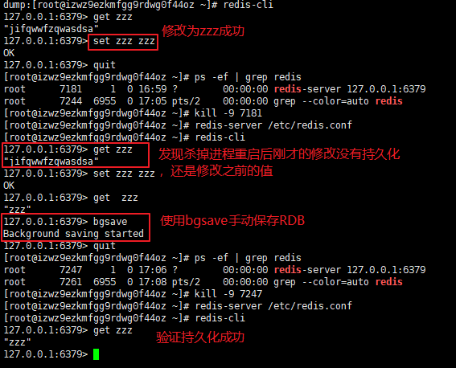

也可以通过达到`save <seconds> <changes>`的配置来验证了RDB持久化按频率触发规则：

快照的默认满足条件频率：

```shell
#	Will save the DB if both the given number of seconds and the given
#   number of write operations against the DB occurred.
#	当时间秒数和变更操作数两者都达到给定数字时才会触发save DB

save 900 1
save 300 10
save 60 10000
```


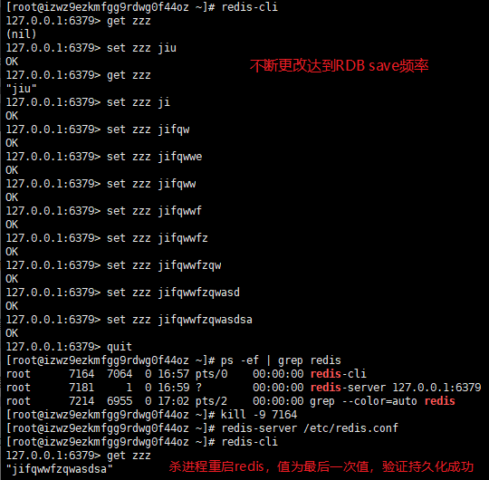


### AOF 持久化方式测试验证

启用AOF持久化策略，重新尝试前面失败的持久化

```
# appendfsync always 每次都同步(最安全但是最慢)

appendfsync everysec 每秒同步(默认的同步策略)

# appendfsync no 不主动同步,由操作系统来决定(最快但是不安全)
```


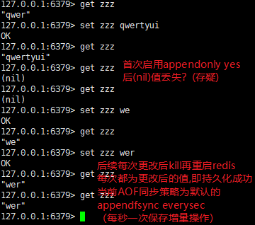

如果此时修改为`appendfsync no`即把AOF策略停用后，再进行更改，则断开后恢复持久化数据时将用对应目录下的rdb备份文件来恢复，如果启用AOF策略启用，将用AOF文件来恢复数据

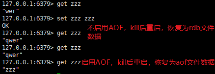

```shell
[root@izwz9ezkmfgg9rdwg0f44oz redis]# ll /var/lib/redis
total 8
-rw-r--r-- 1 root root 161 Sep 16 18:15 appendonly.aof
-rw-r--r-- 1 root root 107 Sep 16 17:54 dump.rdb
```

***

- 2019.09.19   **Redis的AOF详细过程**

***

### hashCode：

OpenJDK8 默认hashCode的计算方法是通过和当前线程有关的一个随机数+三个确定值，运用Marsaglia's xorshift scheme随机数算法得到的一个随机数。和对象内存地址无关

***

- 2019.09.20  **TCC分布式事务**

参考文章链接：[TCC分布式事务](https://www.cnblogs.com/jajian/p/10014145.html)

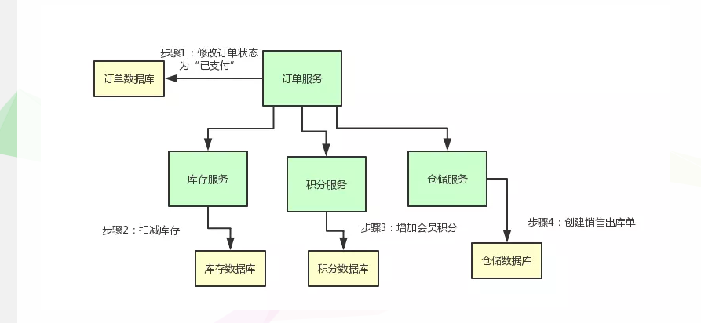


***

- 2019.09.21  **JVM的锁机制与CAS**

JVM内部实现了很多种锁机制，有偏向锁、轻量级锁和互斥锁。除了偏向锁，JVM实现锁的方式都用了循环
CAS，即当一个线程想进入同步块的时候使用循环CAS的方式来获取锁，当它退出同步块的时候使用循环CAS释放锁。

***

volatile写/读的内存语义如下：

当写一个volatile变量时，JMM会把该线程对应的本地内存中的共享变量值刷新到主内
存。

当读一个volatile变量时，JMM会把该线程对应的本地内存置为无效。线程接下来将从主
内存中读取共享变量。

volatile修饰变量时使用 i++并不能保证原子性

volatile关键字：

- 能够保证volatile变量的**可见性**；
- **不能保证**volatile变量复合操作的**原子性**。

volatile如何实现内存可见性：深入来说，通过加入内存屏障和禁止重排序优化来实现的。

- 对volatile变量执行写操作时，会在写操作后加入一条**store屏障指令**（写后强制刷新到主内存中去）；
- 对volatile变量执行读操作时，会在读操作前加入一条**load屏障指令**（强制使工作内存中的变量拷贝失效）。

***

- 2019.09.23   

CopyOnWriteArrayList适合使用在读操作远远大于写操作的场景里。


***

- 2019.09.25  **HashMap的hash() 和 tableSizeFor()方法**

hash()代码：

```java

```

在JDK1.8的实现中，优化了高位运算的算法，通过hashCode()的高16位异或低16位实现的：(h = k.hashCode()) ^ (h >>> 16)，主要是从速度、功效、质量来考虑的。以上方法得到的int的hash值，然后再通过`h & (table.length -1)`来得到该对象在数据中保存的位置。

方法代码如下，

```java
    /**
     * Returns a power of two size for the given target capacity.
     */
    static final int tableSizeFor(int cap) {
        int n = cap - 1;
        n |= n >>> 1;
        n |= n >>> 2;
        n |= n >>> 4;
        n |= n >>> 8;
        n |= n >>> 16;
        return (n < 0) ? 1 : (n >= MAXIMUM_CAPACITY) ? MAXIMUM_CAPACITY : n + 1;
    }
```

作用是返回一个大于等于当前数且最接近的2的n次幂

参考链接：[HashMap源码注解 之 静态工具方法hash()、tableSizeFor()](https://blog.csdn.net/fan2012huan/article/details/51097331)

***

- 2019.09.26   **Redis的过期失效清理算法**

### 过期数据清理算法

Redis过期Key清理的机制对清理的频率和最大时间都有限制，在尽量不影响正常服务的情况下，进行过期Key的清理，以达到长时间服务的性能最优.

Redis会周期性的随机测试一批设置了过期时间的key并进行处理。测试到的已过期的key将被删除。具体的算法如下:

1. Redis配置项hz定义了serverCron任务的执行周期，默认为10，即CPU空闲时每秒执行10次;
2. 每次过期key清理的时间不超过CPU时间的25%，即若hz=1，则一次清理时间最大为250ms，若hz=10，则一次清理时间最大为25ms;
3. 清理时依次遍历所有的db;
4. 从db中随机取20个key，判断是否过期，若过期，则逐出;
5. 若有5个以上key过期，则重复步骤4，否则遍历下一个db;
6. 在清理过程中，若达到了25%CPU时间，退出清理过程;


相关参考链接：**Redis数据过期和淘汰策略详解**：https://yq.aliyun.com/articles/257459

***

- 2019.09.26   **MySQL聚集索引和为什么一定要要有主键(InnoDB)**

什么叫聚集索引，(InnoDB)索引文件和数据文件放在一起，按照主键聚集，所以使用聚集索引的必须要有主键，因为本身按照主键索引聚集。

MyIsam引擎 索引文件和数据文件分开存储，索引文件中只保存数据的内存地址。

***

- 2019.10.14  **ReenTrantLock可重入锁（和synchronized的区别）总结**

锁的实现：

Synchronized是依赖于JVM实现的，而ReenTrantLock是JDK实现的，有什么区别，说白了就类似于操作系统来控制实现和用户自己敲代码实现的区别。前者的实现是比较难见到的，后者有直接的源码可供阅读。

 

性能的区别：

在Synchronized优化以前，synchronized的性能是比ReenTrantLock差很多的，但是自从Synchronized引入了偏向锁，轻量级锁（自旋锁）后，两者的性能就差不多了，在两种方法都可用的情况下，官方甚至建议使用synchronized，其实synchronized的优化我感觉就借鉴了ReenTrantLock中的CAS技术。都是试图在用户态就把加锁问题解决，避免进入内核态的线程阻塞。

 

功能区别：

便利性：很明显Synchronized的使用比较方便简洁，并且由编译器去保证锁的加锁和释放，而ReenTrantLock需要手工声明来加锁和释放锁，为了避免忘记手工释放锁造成死锁，所以最好在finally中声明释放锁。

锁的细粒度和灵活度：很明显ReenTrantLock优于Synchronized

 

ReenTrantLock独有的能力：

1.      ReenTrantLock可以指定是公平锁还是非公平锁。而synchronized只能是非公平锁。所谓的公平锁就是先等待的线程先获得锁。

2.      ReenTrantLock提供了一个Condition（条件）类，用来实现分组唤醒需要唤醒的线程们，而不是像synchronized要么随机唤醒一个线程要么唤醒全部线程。

3.      ReenTrantLock提供了一种能够中断等待锁的线程的机制，通过lock.lockInterruptibly()来实现这个机制。

 

ReenTrantLock实现的原理：

ReenTrantLock的实现是一种自旋锁，通过循环调用CAS操作来实现加锁。它的性能比较好也是因为避免了使线程进入内核态的阻塞状态。想尽办法避免线程进入内核的阻塞状态是我们去分析和理解锁设计的关键钥匙。

 

什么情况下使用ReenTrantLock：

答案是，如果你需要实现ReenTrantLock的三个独有功能时。

***

- 2019.10.22  **红黑树性质**

1. 节点是红色或黑色。
2. 根是黑色。
3. 所有叶子都是黑色（叶子是NIL节点）。
4. 每个红色节点必须有两个黑色的子节点。（从每个叶子到根的所有路径上不能有两个连续的红色节点。）
5. 从任一节点到其每个叶子的所有[简单路径](https://zh.wikipedia.org/wiki/道路_(图论))都包含相同数目的黑色节点。

  

有了上面的几个性质作为限制，即可避免二叉查找树退化成单链表的情况 

红黑树的关键特性：从根到叶子的最长的可能路径不多于最短的可能路径的两倍长。 

***

- 2019.10.24  **MESI缓存一致性协议**

## MESI 缓存一致性协议

关于CAS指令最著名的传闻是CAS需要锁总线，因此CAS指令不但慢而且会严重影响系统并发度，即使没有冲突是也一样。不过在较新的CPU中（对于Intel CPU来说是486之后），事实并非如此。目前的CPU一般都采用了很好的缓存一致性协议，在很多情况下能够防止锁总线的发生，这其中最著名的就是Intel CPU中使用的MESI缓存一致性协议。

先来说说缓存一致性问题。为了提高数据访问效率，每个CPU上都有一个容量很小（现在一般是1M这个数量级），速度很快的缓存，用于缓存最常访问的那些数据。由于操作内存的速度实在太慢，数据被修改时也只更新缓存，并不直接写出到内存中去，这一来就造成了缓存中的数据与内存不一致。如果系统中只有一个CPU，所有线程看到的都是缓存中的最新数据，当然没问题。但如果系统中有多个CPU，同一份内存可能会被缓存到多个CPU中，如果在不同CPU中运行的不同线程看到同一份内存的缓存值不一样就麻烦了，因此有必要维护这多种缓存的一致性。当然要做到这一点只要一有修改操作，就通知所有CPU更新缓存，或者放弃缓存下次访问的时候再重新从内存中读取。但这 Stupid 的实现显然不会有好的性能，为解决这一问题，产生了很多维护缓存一致性的协议，MESI就是其中一种。

**MESI协议的名称由来是指这一协议为缓存的每个数据单位（称为cache line，在Intel CPU上一般是64字节）维护两个状态位，使得每个数据单位可能处于M、E、S或I这四种状态之一。各种状态含义如下：**

- **M: 被修改的。处于这一状态的数据只在本CPU中有缓存，且其数据已被修改，没有更新到内存中**
- **E: 独占的。处于这一状态的数据只在本CPU中有缓存，且其数据没有被修改，与内存一致**
- **S: 共享的。处于这一状态的数据在多个CPU中有缓存**
- **I: 无效的。本CPU中的这份缓存已经无效了。**

**当CPU要读取数据时，只要缓存的状态不是I都可以从缓存中读，否则就要从主存中读。这一读操作可能会被某个处于M或E状态的CPU截获，该CPU将修改的数据写出到内存，并将自己设为S状态后这一读操作才继续进行。只有缓存状态是E或M时，CPU才可以修改其中的数据，修改后缓存即处于M状态。如果CPU要修改数据时发现其缓存不处于E或M状态，则需要发出特殊的RFO指令（Read For Ownership），将其它CPU的缓存设为I状态。**

**因此，如果一个变量在某段时间内只被一个线程频繁修改，则对应的缓存早就处于M状态，这时CAS操作就不会涉及到总线操作。所以频繁的加锁并不一定会影响系统并发度，关键是看锁冲突的情况严重不严重，如果经常出现冲突，即缓存一会被这个CPU独占，一会被那个CPU独占，这时才会不断产生RFO，影响到并发性能。**

***

- 2019.10.28  **响应式编程**

 **Reactive Programming **作为观察者模式（[Observer](https://en.wikipedia.org/wiki/Observer_pattern)） 的延伸，不同于传统的命令编程方式（ [Imperative programming](https://en.wikipedia.org/wiki/Imperative_programming)）同步拉取数据的方式，如迭代器模式（[Iterator](https://en.wikipedia.org/wiki/Iterator_pattern)） 。而是采用数据发布者同步或异步地推送到数据流（Data Streams）的方案。当该数据流（Data Steams）订阅者监听到传播变化时，立即作出响应动作。在实现层面上，Reactive Programming 可结合函数式编程简化面向对象语言语法的臃肿性，屏蔽并发实现的复杂细节，提供数据流的有序操作，从而达到提升代码的可读性，以及减少 Bugs 出现的目的。同时，Reactive Programming 结合背压（Backpressure）的技术解决发布端生成数据的速率高于订阅端消费的问题。 

***

- 2019.11.04  **建议用ThreadPoolExecutor()手动创建线程池**

线程池不允许使用Executors去创建，而是通过ThreadPoolExecutor的方式，这样的处理方式让写的同学更加明确线程池的运行规则，规避资源耗尽的风险。 说明：Executors返回的线程池对象的弊端如下：
1）FixedThreadPool和SingleThreadPool:
  允许的请求队列长度为Integer.MAX_VALUE，可能会堆积大量的请求，从而导致OOM。
2）CachedThreadPool:
  允许的创建线程数量为Integer.MAX_VALUE，可能会创建大量的线程，从而导致OOM。
            
Positive example 1：
    //org.apache.commons.lang3.concurrent.BasicThreadFactory
    ScheduledExecutorService executorService = new ScheduledThreadPoolExecutor(1,
        new BasicThreadFactory.Builder().namingPattern("example-schedule-pool-%d").daemon(true).build());
       
        
            
Positive example 2：
    ThreadFactory namedThreadFactory = new ThreadFactoryBuilder()
        .setNameFormat("demo-pool-%d").build();

    //Common Thread Pool
    ExecutorService pool = new ThreadPoolExecutor(5, 200,
        0L, TimeUnit.MILLISECONDS,
        new LinkedBlockingQueue<Runnable>(1024), namedThreadFactory, new ThreadPoolExecutor.AbortPolicy());
    
    pool.execute(()-> System.out.println(Thread.currentThread().getName()));
    pool.shutdown();//gracefully shutdown


​        
​            
Positive example 3：
​    <bean id="userThreadPool"
​        class="org.springframework.scheduling.concurrent.ThreadPoolTaskExecutor">
​        <property name="corePoolSize" value="10" />
​        <property name="maxPoolSize" value="100" />
​        <property name="queueCapacity" value="2000" />

    <property name="threadFactory" value= threadFactory />
        <property name="rejectedExecutionHandler">
            <ref local="rejectedExecutionHandler" />
        </property>
    </bean>
    //in code
    userThreadPool.execute(thread);


​        

***

- 2019.11.06  **区块链概念**   

**什么是区块链**：区块链就是一个参与者可以记账、查账，并且账务记录几乎不可被篡改的数据库。最本质上来讲，区块链就是一个特殊的数据库。 

****

- 2019.11.07  **代码审计常见漏洞**

1. 平行越权

举例：通过id或编号直接SQL查询数据没有做权限限制，则有可能通过遍历id编号等获取其他用户的信息

 平行越权：权限类型不变，权限ID改变；如：同是普通用户，其中一个用户可查看其它用户信息。常见的就是通过修改某一个ID参数来查看其他用户的信息，比如你查看自己的信息时，发现URL连接中，或者http请求头中有一个userID的参数，然后你修改这个参数就可以查看那个人信息了 

***

- 2019.11.08  **并发计数器CountDownLatch**

作用：多线程下的并发计数器，用CountDownLatch阻塞一个线程，当new CountDownLatch(n)的计数通过其countDown()方法递减至0时，执行被阻塞的线程，并不一定要执行完其他线程，只要计数count递减至0就取消阻塞了。

用法举例：

```java
    public void countDownLatchDemo() throws InterruptedException {
        System.out.println("主线程开始执行，即将阻塞");
        CountDownLatch latch = new CountDownLatch(3);

        //依次创建并启动3个线程
        new Thread(new Task(latch),"Thread1").start();
        new Thread(new Task(latch),"Thread2").start();
        new Thread(new Task(latch),"Thread3").start();
        latch.await();
        System.out.println("所有线程已到达，主线程继续执行");
    }

    static class Task implements Runnable{

        CountDownLatch countDownLatch;
        public Task(CountDownLatch countDownLatch){
            this.countDownLatch = countDownLatch;
        }

        @Override
        public void run() {
            System.out.println("当前线程 "+Thread.currentThread().getName()+"正在执行...");
            countDownLatch.countDown();
        }
    }
```

结果：

> 主线程开始执行，即将阻塞
> 当前线程 Thread1正在执行...
> 当前线程 Thread2正在执行...
> 当前线程 Thread3正在执行...
> 所有线程已到达，主线程继续执行

弊端：一般n必须小于等于要异步执行的线程数，如果n取值大于线程数（准确来说是大于所有线程执行中countDown()执行次数），就会因为计数无法递减为0一直阻塞线程


用一个继承AQS的内部类Sync类作为并发计数的实现

```
 * <p>Memory consistency effects: Until the count reaches
 * zero, actions in a thread prior to calling
 * {@code countDown()}

Sync类：Synchronization control For CountDownLatch.* Uses AQS state to represent count.
private static final class Sync extends AbstractQueuedSynchronizer {}
```


***

- 2019.11.11  **Mybatis默认返回类型**

对于SQL中的SUM查询，默认返回BigDecimal类型，对于COUNT，默认返回Long类型


慢查询优化：eventProcessing 事件处理统计接口响应时间较长：响应时长1.6s 慢查询SQL优化   ，优化后响应时长 400多ms 也就是0.4s，查询效率提高了75%

原因：数据较多 20w条，查库次数较多，索引

该接口总查库次数8次  优化各状态事件查询，整合SQL逻辑8次变一次全表扫描查询

优化前：

未处理处理中已完成事件数 查询时长：408ms
事件完成率 查询时长：163ms
平均响应时长 查询时长：175ms
平均处理时长 查询时长：171ms
超过15分钟未响应 查询时长：441ms
超过1天未完成 查询时长：207ms

优化后：

未处理处理中已完成事件数 查询时长：456ms
事件完成率 查询时长：0ms
平均响应时长 查询时长：0ms
平均处理时长 查询时长：0ms
超过15分钟未响应 查询时长：0ms
超过1天未完成 查询时长：0ms

***

- 2019.11.22  **双重检查锁定** 和 **Class对象的初始化锁**

*双重检查锁定*：

```java
public class DoubleCheckedLocking { // 1
	private static Instance instance; // 2
	public static Instance getInstance() { // 3
		if (instance == null) { // 4:第一次检查
			synchronized (DoubleCheckedLocking.class) { // 5:加锁
				if (instance == null) // 6:第二次检查
					instance = new Instance(); // 7:问题的根源出在这里
			} // 8
		} // 9
		return instance; // 10
	} // 11
}

```

 编译器重排序引起的问题

前面的双重检查锁定示例代码的第7行（instance=new Singleton();）创建了一个对象。这一 行代码可以分解为如下的3行伪代码。 

memory = allocate(); // 1：分配对象的内存空间 

ctorInstance(memory); // 2：初始化对象 instance = memory; 

// 3：设置instance指向刚分配的内存地址 

上面3行伪代码中的2和3之间，可能会被重排序（在一些JIT编译器上，这种重排序是真实 发生的，详情见参考文献1的“Out-of-order writes”部分）。2和3之间重排序之后的执行时序如 下。 

memory = allocate(); // 1：分配对象的内存空间 

instance = memory; // 3：设置instance指向刚分配的内存地址 

// 注意，此时对象还没有被初始化！ 

ctorInstance(memory); // 2：初始化对象  

**可以通过加上volatile关键字修饰来解决 ，本质上是禁止初始化对象和设置instance指向刚分配的内存地址 的重排序**

*Class对象的初始化锁*：

 初始化一个类，包括执行这个类的静态初始化和初始化在这个类中声明的静态字段。根 据Java语言规范，在首次发生下列任意一种情况时，一个类或接口类型T将被立即初始化。 

 1）T是一个类，而且一个T类型的实例被创建。

 2）T是一个类，且T中声明的一个静态方法被调用。

 3）T中声明的一个静态字段被赋值。

 4）T中声明的一个静态字段被使用，而且这个字段不是一个常量字段。 

 基于这个特性，可以实现另一种线程安全的延迟初始化方案（这个方案被称之为 Initialization On Demand Holder idiom）。 

```java
    public class InstanceFactory {
        private static class InstanceHolder {
            public static Instance instance = new Instance();
        }

        public static Instance getInstance() {
            return InstanceHolder.instance; // 这里将导致InstanceHolder类被初始化 
        }
    }
```


***

- 2019.11.25   **wait / notify**

获取锁 ，当条件不满足时 ，Object.wait() 释放对象的锁，该线程移入到对象的等待队列WaitQueue 线程状态变为`WAITING`，另一个线程获取到对象的锁之后Object.notify()，等待队列中的线程被移入到对象的同步队列SynchronizedQueue中，此时状态变为阻塞`BLOCKED`，等到另一线程释放锁之后等待线程再次获取到锁后从wait()方法返回继续执行。

```java
//等待方
synchronized(对象) {
while(条件不满足) {
对象.wait();
}
对应的处理逻辑
}

//通知方
synchronized(对象) {
改变条件
对象.notifyAll();
}
```

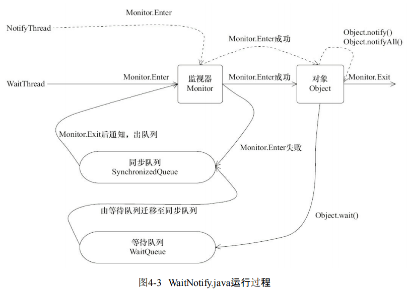

join关键字也用到了wait()原理，JDK中join源码示意如下：

```java
// 加锁当前线程对象
public final synchronized void join() throws InterruptedException {
// 条件不满足，继续等待
while (isAlive()) {
wait(0);
}
// 条件符合，方法返回
}
```

 当线程终止时，会调用线程自身的notifyAll()方法，会通知所有等待在该线程对象上的线程

***

- 2019.11.26    **线程池**

​        线程池的本质就是使用了一个线程安全的工作队列连接工作者线程和客户端 线程，客户端线程将任务放入工作队列后便返回，而工作者线程则不断地从工作队列上取出 工作并执行。当工作队列为空时，所有的工作者线程均等待在工作队列上，当有客户端提交了 一个任务之后会通知任意一个工作者线程，随着大量的任务被提交，更多的工作者线程会被 唤醒。 

***

同步列表Collections.synchronizedCollection(c)原理图，将要同步的集合和另一个对象mutex再封装成一个对象，操作集合时给mutex加锁同步来实现封装对象的同步。

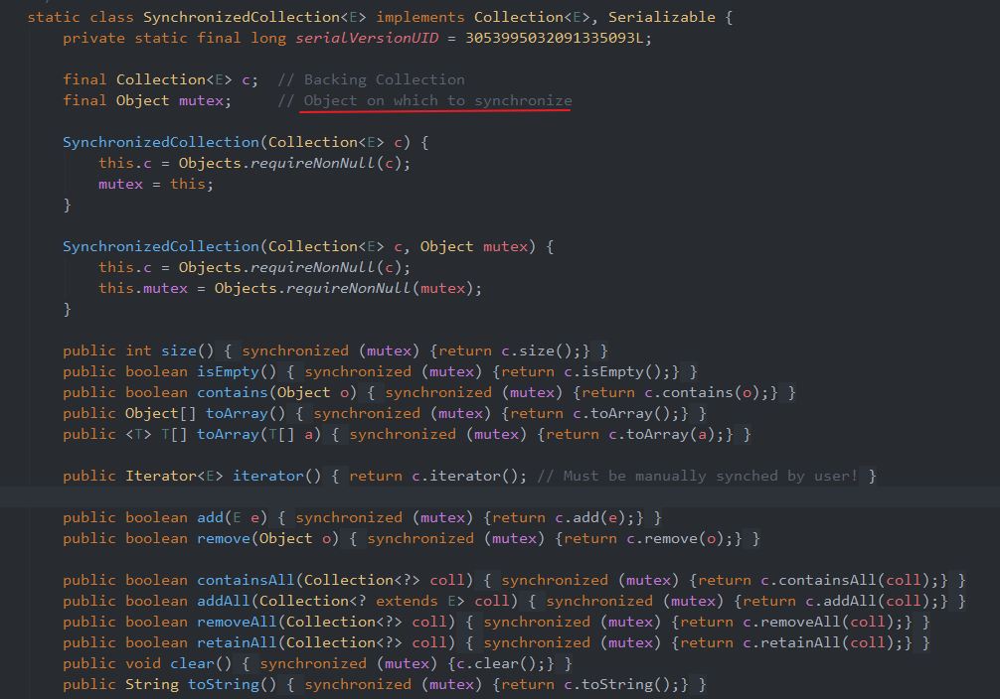

***

  Lock接口（以及相关实现类） 提供了与synchronized关键字类似的同步功 能，只是在使用时需要显式地获取和释放锁。虽然它缺少了（通过synchronized块或者方法所提 供的）隐式获取释放锁的便捷性，但是却拥有了锁获取与释放的可操作性、可中断的获取锁以 及超时获取锁等多种synchronized关键字所不具备的同步特性。 

 例如，针对一个场景，手把手进行锁获取和释放，先获得锁A，然后再获取锁B，当锁B获得 后，释放锁A同时获取锁C，当锁C获得后，再释放B同时获取锁D，以此类推。这种场景下， synchronized关键字就不那么容易实现了，而使用Lock却容易许多。 

  via 《Java并发编程的艺术》

```java
Lock lock = new ReentrantLock();
lock.lock();
try {
} finally {
lock.unlock();
}
```


 在finally块中释放锁，目的是保证在获取到锁之后，最终能够被释放。 不要将获取锁的过程写在try块中，因为如果在获取锁（自定义锁的实现）时发生了异常， 异常抛出的同时，也会导致锁无故释放。 

***

- 2019.11.28  **接上**

 分析了独占式同步状态获取和释放过程后，适当做个总结：在获取同步状态时，同步器维 护一个同步队列，获取状态失败的线程都会被加入到队列中并在队列中进行自旋；移出队列 （或停止自旋）的条件是前驱节点为头节点且成功获取了同步状态。在释放同步状态时，同步 器调用tryRelease(int arg)方法释放同步状态，然后唤醒头节点的后继节点。  

  via 《Java并发编程的艺术》

***

- 2019.11.29 **接上** **ReentrantLock**

ReentrantLock 公平锁的` tryAcquire ` 方法与nonfairTryAcquire(int acquires)比较，唯一不同的位置为判断条件多了 hasQueuedPredecessors()方法，即加入了同步队列中当前节点是否有前驱节点的判断，如果该 方法返回true，则表示有线程比当前线程更早地请求获取锁，因此需要等待前驱线程获取并释 放锁之后才能继续获取锁。 

***

- 2019.12.03  **读写锁和锁降级**

Q：锁降级中读锁的获取是否必要呢？

答案是必要的。主要是为了保证数据的可见性，如果 当前线程不获取读锁而是直接释放写锁，假设此刻另一个线程（记作线程T）获取了写锁并修 改了数据，那么当前线程无法感知线程T的数据更新。如果当前线程获取读锁，即遵循锁降级 的步骤，则线程T将会被阻塞，直到当前线程使用数据并释放读锁之后，线程T才能获取写锁进 行数据更新。

锁降级指的是写锁降级成为读锁。如果当前线程拥有写锁，然后将其释放，最后再获取读锁，这种分段完成的过程不能称之为锁降级。**锁降级是指线程先持有写锁，再获取到读锁，随后释放（先前拥有的）写锁的过程；**

锁降级的必要性1：

锁降级中读锁的获取是否必要呢？答案是必要的。主要是为了**保证数据的可见性**，如果当前线程不获取读锁而是直接释放写锁， 假设此刻另一个线程（记作线程T）获取了写锁并修改了数据，那么**当前线程无法感知线程T的数据更新**。如果当前线程获取读锁，即遵循锁降级的步骤，则线程T将会被阻塞，直到当前线程使用数据并释放读锁之后，线程T才能获取写锁进行数据更新。

部分人读完上述话可能有些疑惑，针对上面黑体字那句话，为什么无法感知线程T的数据更新？我当前线程再次获取读锁的时候不是可以察觉到数据在主存中的变化吗？ 我参考了一些资料，对该 “”数据可见性“” 有了另一种理解，理解是 当前线程为了保证数据的可见性，这是指线程自己更改了数据，自己应该要察觉到数据的变化，如果没有读锁，更改完数据之后线程T获取到了写锁并更改了数据，则当前线程读到的数据是线程T更改的，并不是自己更改的，当前线程并不知道是线程T修改了自己要读的（原来自己改的）数据，所以可能导致当前线程在执行后续代码的时候结果出错，**这时就导致了数据的不可见，即当前线程并无法察觉到自己修改的值！**

锁降级的必要性2：
为了提高程序执行性能，可能存在一个事务线程不希望自己的操作被别的线程中断，而这个事务操作可能分成多部分操作更新不同的数据（或表）甚至非常耗时。如果长时间用写锁独占，显然对于某些高响应的应用是不允许的，所以在完成部分写操作后，退而使用读锁降级，来允许响应其他进程的读操作。只有当全部事务完成后才真正释放锁。

via [《JAVA 读写锁中锁降级的必要性》](https://www.twblogs.net/a/5d660866bd9eee541c330af5/zh-cn)

***

- 2019.12.07  **git代码统计**

### 查看git上的个人代码量(替换username)：

```bash
git log --author="username" --pretty=tformat: --numstat | awk '{ add += $1; subs += $2; loc+= $1 - $2 } END { printf "added lines: %s, removed lines: %s, total lines: %s\n", add, subs, loc }' -
```
***

- 2019.12.10   **MySQL计算时间差函数**

**MySql计算两个日期的时间差函数TIMESTAMPDIFF用法:**

**语法： 
TIMESTAMPDIFF(interval,datetime_expr1,datetime_expr2)** 
interval可以是：

1. SECOND 秒 SECONDS
2. MINUTE 分钟 MINUTES
3. HOUR 时间 HOURS
4. DAY 天 DAYS
5. MONTH 月 MONTHS
6. YEAR 年 YEARS

***

- 2019.12.11  **RedisEvalsha命令执行lua脚本**

为什么要用lua脚本

redis-cli提供了`EVAL`与`EVALSHA`命令执行Lua脚本:

- EVAL 
  `EVAL script numkeys key [key ...] arg [arg ...]` 
  *key*和*arg*两类参数用于向脚本传递数据, 他们的值可在脚本中使用`KEYS`和`ARGV`两个table访问: `KEYS`表示要操作的键名, `ARGV`表示非键名参数(并非强制).
- EVALSHA 
  `EVALSHA`命令允许通过脚本的**SHA1**来执行(节省带宽), Redis在执行`EVAL`/`SCRIPT LOAD`后会计算脚本**SHA1**缓存, `EVALSHA`根据**SHA1**取出缓存脚本执行.

### 语法

redis Evalsha 命令基本语法如下：

```
redis 127.0.0.1:6379> EVALSHA sha1 numkeys key [key ...] arg [arg ...] 
```

参数说明：

- **sha1** ： 通过 SCRIPT LOAD 生成的 sha1 校验码。
- **numkeys**： 用于指定键名参数的个数。
- **key [key ...]**： 从 EVAL 的第三个参数开始算起，表示在脚本中所用到的那些 Redis 键(key)，这些键名参数可以在 Lua 中通过全局变量 KEYS 数组，用 1 为基址的形式访问( KEYS[1] ， KEYS[2] ，以此类推)。
- **arg [arg ...]**： 附加参数，在 Lua 中通过全局变量 ARGV 数组访问，访问的形式和 KEYS 变量类似( ARGV[1] 、 ARGV[2] ，诸如此类)。

### 举例：

通过数据控制模块提前将库存存入 Redis，将每个秒杀商品在 Redis 中用一个 hash 结构表示。

```json
"goodsId" : {
    "Total": 100
    "Booked": 100
}
```

扣量时，服务器通过请求 Redis 获取下单资格，通过以下 lua 脚本实现，由于 Redis 是**单线程**模型，lua 可以保证多个命令的原子性。

```lua
local n = tonumber(ARGV[1])
if not n  or n == 0 then
    return 0
end
local vals = redis.call("HMGET", KEYS[1], "Total", "Booked");
local total = tonumber(vals[1])
local blocked = tonumber(vals[2])
if not total or not blocked then
    return 0
end
if blocked + n <= total then
    redis.call("HINCRBY", KEYS[1], "Booked", n)
    return n;
end
return 0
```

先使用`SCRIPT LOAD`将 lua 脚本提前缓存在 Redis，然后调用`EVALSHA`调用脚本，比直接调用`EVAL`节省网络带宽：

```shell
redis 127.0.0.1:6379>SCRIPT LOAD "lua code"
"438dd755f3fe0d32771753eb57f075b18fed7716"
redis 127.0.0.1:6379>EVAL 438dd755f3fe0d32771753eb57f075b18fed7716 1 goodsId 1
```

秒杀服务通过判断 Redis 是否返回抢购个数 n，即可知道此次请求是否扣量成功。

***

- 2019.12.12  		**Devops**

**一个 DevOps 开发环境需要满足以下 8 点需求。**

1、环境一致性：在本地开发出来的功能，无论在什么环境下部署都应该能得到一致的结果。
2、代码自动检查：为了尽早发现问题，每一次代码提交后，系统都应该自动对代码进行检查，及早发现潜在的问题，并运行自动化测试。
3、持续集成：每次代码提交后系统可以自动进行代码的编译和打包，无需运维人员手动进行。
4、持续部署：代码集成完毕后，系统可以自动将运行环境中的旧版本应用更新成新版本的应用并且整个过程中不会让系统不可用。
5、持续反馈：在代码自动检查、持续集成、持续部署的过程中，一旦出现问题，要能及时将问题反馈给开发人员以及运维人员。开发和运维人员收到反馈后对问题及时进行修复。
6、快速回滚：当发现本次部署的版本出现问题时，系统应能快速回退到上一个可用版本。
7、弹性伸缩：当某个服务访问量增大时，系统应可以对这个服务快速进行扩容，保证用户的访问。当访问量回归正常时，系统能将扩容的资源释放回去，实现根据访问情况对系统进行弹性伸缩。
8、可视化运维：提供可视化的页面，可实时监控应用、集群、硬件的各种状态。
为了满足以上 8 点要求，设计出的 DevOps 开发环境如下图所示。


**整个环境主要由 6 部分组成：**

1、代码仓库 Gitlab 。
2、容器技术 Docker 。
3、持续集成工具 Jenkins 。
4、代码质量检测平台 SonarQube 。
5、镜像仓库 Harbor 。
6、容器集群管理系统 Kubernetes 。

**整个环境的运行流程主要分为以下 6 步：**

1、开发人员在本地开发并验证好功能后，将代码提交到代码仓库。
2、通过事先配置好的 Webhook 通知方式，当开发人员提交完代码后，部署在云端的持续集成工具 Jenkins 会实时感知，并从代码仓库中获取最新的代码。
3、获取到最新代码后，Jenkins 会启动测试平台 SonarQube 对最新的代码进行代码检查以及执行单元测试，执行完成后在 SonarQube 平台上生成测试报告。如果测试没通过，则以邮件的方式通知研发人员进行修改，终止整个流程。若测试通过，将结果反馈给 Jenkins 并进行下一步。
4、代码检查以及单元测试通过后， Jenkins 会将代码发送到持续集成服务器中，在服务器上对代码进行编译、构建然后打包成能在容器环境上运行的镜像文件。如果中间有步骤出现问题，则通过邮件的方式通知开发人员和运维人员进行处理，并终止整个流程。
5、将镜像文件上传到私有镜像仓库 Harbor 中保存。
6、镜像上传完成后， Jenkins 会启动持续交付服务器，对云环境中运行的应用进行版本更新，整个更新过程会确保服务的访问不中断。持续交付服务器会将最新的镜像文件拉取到 Kubernetes 集群中，并采用逐步替换容器的方式进行对应用进行更新，在服务不中断的前提下完成更新。

通过上述几步，我们就可以简单实现一个 DevOps 开发环境，实现代码从提交到最终部署的全流程自动化。


****

线程安全的日期格式化工具类：`DateTimeFormatter` 代替 SimpleDateFormat

***

### 使用Pair类实现成对结果的返回

Pair主要有两种用途：

1. 把key和value放在一起成对处理，主要用于Map中返回名值对，比如Map中的Entry类；
2. 当一个函数需要返回两个结果时，可以使用Pair来避免定义过多的数据模型类。

在JDK中，没有提供原生的Pair数据结构，也可以使用Map::Entry代替。不过，Apache的commons-lang3包中的Pair类更为好用，下面便以Pair类进行举例说明。

```java

Point point = ...;
Point[] points = ...;
Pair<Point, Double> pair = getNearestPointAndDistance(point, points);
if (Objects.nonNull(pair)) {
    Point point = pair.getLeft();
    Double distance = pair.getRight();
    ...
}

/** 获取最近点和距离 */
public static Pair<Point, Double> getNearestPointAndDistance(Point point, Point[] points) {
    // 检查点数组为空
    if (ArrayUtils.isEmpty(points)) {
        return null;
    }

    // 获取最近点和距离
    Point nearestPoint = points[0];
    double nearestDistance = getDistance(point, points[0]);
    for (int i = 1; i < points.length; i++) {
        double distance = getDistance(point, point[i]);
        if (distance < nearestDistance) {
            nearestDistance = distance;
            nearestPoint = point[i];
        }
    }

    // 返回最近点和距离
    return Pair.of(nearestPoint, nearestDistance);
}

```


***

聚集索引和非聚集索引区别：

“聚集”、“非聚集”描述的时数据在磁盘页中的位置是否是按照数据索引的顺序。

***聚集索引*表记录的排列顺序与索引的排列顺序一致**，

优点是查询速度快，因为一旦具有第一个索引值的纪录被找到，具有连续索引值的记录也一定物理的紧跟其后。

缺点是对表进行修改速度较慢，这是为了保持表中的记录的物理顺序与索引的顺序一致，而把记录插入到数据页的相应位置，必须在数据页中进行**数据重排**， 降低了执行速度。建议使用聚集索引的场合为：
 a. 此列包含有限数目的不同值；
 b. 查询的结果返回一个区间的值；
 c. 查询的结果返回某值相同的大量结果集。

***非聚集索引*指定了表中记录的逻辑顺序，但记录的物理顺序和索引的顺序不一致**，聚集索引和非聚集索引都采用了B+树的结构，但非聚集索引的叶子层并不与实际的数据页相重叠，而采用叶子层包含一个指向表中的记录在数据页中的指针的方式。

非聚集索引比聚集索引层次多，添加记录不会引起数据顺序的重组。
 建议使用非聚集索引的场合为：
 a. 此列包含了大量数目不同的值  ；
 b. 查询的结束返回的是少量的结果集；
 c. order by 子句中使用了该列。

InnoDB的数据文件本身就是索引文件。MyISAM索引文件和数据文件是分离的，索引文件仅保存数据记录的地址

聚集索引图示：


非聚集索引图示：


聚集索引确定表中数据的物理顺序。聚集索引类似于电话簿，后者按姓氏排列数据。由于聚集索引规定数据在表中的物理存储顺序，因此一个表只能包含一个聚集索引。但该索引可以包含多个列（组合索引），就像电话簿按姓氏和名字进行组织一样。


***

- 2019.12.13  **类加载过程学习记录**

类加载过程的五个阶段：加载、验证、准备、解析、初始化

各阶段分别主要做了什么事，我的理解：

### 1. 加载

通过类的全限定名能够获取到这个类的二进制字节流

在方法区中创建class对象

加载过程中开发人员可以通过用户自定义的类加载器重写loadClass()方法来加载

！！数组是通过虚拟机直接加载的

### 2. 验证

主要做了由外到内，由浅及深的验证。

1.  文件格式层面。验证是否符合class文件格式的规范
2. 语言规范层面。文件的内容是否符合Java语言规范，比如继承的父类是否为final，实现接口的时候有没有将全部的方法都实现
3. 语义层面。检查验证字节码是否有可能危害虚拟机运行的代码存在，比如不能把父类对象赋值给子类数据类型，不能赋值给另一个毫无关联的数据类型
4. 符号引用验证。验证引用的常量和类是否能找到

### 3.准备

准备阶段为类变量赋初始值，即为static变量赋零值，false,0,0.0f,0.0d,null等。为static final常量ConstantValue直接赋值，不再等到初始化阶段

### 4.解析

解析动作主要针对类或接口、字段、类方法、接口方法、方法类型、方法句柄和调用点 限定符7类符号引用进行，分别对应于常量池的CONSTANT_Class_info、 CONSTANT_Fieldref_info、CONSTANT_Methodref_info、 CONSTANT_InterfaceMethodref_info、CONSTANT_MethodType_info、 CONSTANT_MethodHandle_info和CONSTANT_InvokeDynamic_info  等 class文件中的符号引用转化为直接引用。

1. 类或接口的解析
2. 字段解析
3. 类方法解析
4. 接口方法解析

### 5.初始化

通过程序制定的主观计划去初始化类变量和其他资源，或者说 初始化阶段是执行类构造器＜clinit＞（）方法的过程。

类构造器方法<clinit>方法是由编译器自动收集类中的类变量的赋值动作和静态语句块中的语句（static{}）按语句顺序合并产生的。虚拟机保证先执行父类的<clinit>方法，也就意味着父类中定义的静态语句块要优先于子 类的变量赋值操作。不同的是，父接口的初始化要等到父接口变量使用时。

虚拟机会保证一个类的＜clinit＞（）方法在多线程环境中被正确地加锁、同步，如果多 个线程同时去初始化一个类，那么只会有一个线程去执行这个类的＜clinit＞（）方法，阻塞其他线程。

```java
//由于父类先执行完<clinit>，所以A的值为2而不是1
static class Parent{
public static int A=1；
static{
A=2；
}
}
static class Sub extends Parent{
public static int B=A；
}
public static void main（String[]args）{
System.out.println（Sub.B）；
}
```

参考自《Java并发编程的艺术》 虚拟机类加载机制 - 类加载过程

***

AQS中**head节点不参与排队队列**，并且Node.thread置为null，因为Node中的线程正在执行。

初次获取锁不需要排队直接CAS尝试获取。

```java
            if (c == 0) {
                if (!hasQueuedPredecessors() &&
                    compareAndSetState(0, acquires)) {
                    setExclusiveOwnerThread(current);
                    return true;
                }
            }
```

hasQueuedPredecessors()返回是否有已经入队的前置节点们，如果没有返回false，取反之后直接尝试用CAS替换state加锁。

返回false的情况（尝试CAS）：

- 1. 当前节点为head节点
- 2. 队列为空（！注意，此处的队列不包括head节点，因为head节点线程持有锁不参与排队）

当Node是head节点的next时会尝试用CAS操作获取锁，原因是这时候有可能处于持有锁的线程已经释放了锁但还没有通知唤醒它，在并发情况下时间片调度可能在通知过程中为了提高效率直接CAS尝试修改state获取锁。

当队列中只有一个节点时都不需要排队，比如队列中还未

当Node节点为第一次加锁时不需要排队

**重入**表示的是当前尝试获取锁的线程和head的后一个节点中的线程一样，即	s = h.next ，s.thread == Thread.currentThread()

```java
    public final void acquire(int arg) {
        if (!tryAcquire(arg) &&
            acquireQueued(addWaiter(Node.EXCLUSIVE), arg))
            selfInterrupt();
    }
```

当tryAcquire()返回false 即 获取锁失败时执行加入队列，加入队列后中断当前线程。

加入队列过程addWaiter(node)，将当前node设置赋值为尾节点tail发现队列还未初始化（tail==null）时会进行队列初始化initializeSyncQueue()

acquireQueued()队列循环获取锁方法，当前一节点为head时尝试获取锁，获取锁成功后设置node为head并且head.thread=null，head.prev=null，赋值线程为空、前驱结点为空，head头结点不参与排队

***

- 2019.12.16  **lambda表达式重新赋值**

```java
    public static void main(String[] args) {
        List<Integer> list = Arrays.asList(3,2,4);
        list.stream().sorted(Integer::compare).collect(Collectors.toList());
        System.out.println(list);//list未改变，打印输出 [3, 2, 4]
        list = list.stream().sorted(Integer::compare).collect(Collectors.toList());
        System.out.println(list);//重新赋值，打印输出 [2, 3, 4]
    }
```

***

- 2019.12.18   **MQ消息积压临时扩容**

所以如果积压几百万到上千万的数据，即使消费者恢复了，也需要大概1小时的时间才能恢复过来

操作临时紧急扩容，具体操作步骤和思路如下：

1. 先修复consumer的问题，确保其恢复消费速度，然后将现有consumer都停掉
2. 新建一个topic，partition是原来的10倍，临时建立好原先10倍或者20倍的queue数量
3. 然后写一个临时的分发数据的consumer程序，这个程序部署上去消费积压的数据，消费之后不做耗时的处理，直接均匀轮询写入临时建立好的10倍数量的queue
4. 接着临时征用10倍的机器来部署consumer，每一批consumer消费一个临时queue的数据
5. 这种做法相当于是临时将queue资源和consumer资源扩大10倍，以正常的10倍速度来消费数据
6. 等快速消费完积压数据之后，得恢复原先部署架构，重新用原先的consumer机器来消费消息

***

- 2019.12.30  **双亲委派模型过程和好处**

**好处：**

1. **避免类的重复加载**，当父亲已经加载了该类时，就没有必要子ClassLoader再加载一次
2. 主要是为了安全性，**避免Java核心api库的类被替换**，比如 String、Integer等。用户自己编写或从网络传递无法篡改。假设通过网络传递一个名为java.lang.Integer的类，通过双亲委托模式传递到启动类加载器，而启动类加载器在核心Java API发现这个类全限定名一样名字的类已被加载，会直接返回已加载过的Integer.class，这样便可以防止核心API库被随意篡改。

**工作过程：**

（1）当前类加载器从自己已经加载的类中查询是否此类已经加载，如果已经加载则直接返回原来已经加载的类。

（2）如果没有找到，就去委托父类加载器去加载（如代码c = parent.loadClass(name, false)所示）。父类加载器也会采用同样的策略，查看自己已经加载过的类中是否包含这个类，有就返回，没有就委托父类的父类去加载，一直到启动类加载器。因为如果父加载器为空了，就代表使用启动类加载器作为父加载器去加载。

（3）如果启动类加载器加载失败（例如在$JAVA_HOME/jre/lib里未查找到该class），则会抛出一个异常ClassNotFoundException，然后再调用当前加载器的findClass()方法进行加载。

***

- 2020.01.06  **线程池大小配置**

一般需要根据任务类型来配置线程池大小：

1、如果是 CPU 密集型任务，就需要尽量压榨 CPU，参考值可以设为 *NCPU* + 1

2、如果是 IO 密集型任务，参考值可以设置为 2 * *NCPU*

通过 Runtime.getRuntime().availableProcessors() 获得当前 CPU 个数（实际为JVM可用核心数 例如4c8t CPU 结果可能为8）

***

- 2020.01.09  **Mybatis返回内部类写法**

1. 注意事项

（1）内部类必须是静态内部类。
（2）`xml`中内部类连接使用`$`。

定义内部类(注意内部类需用static静态修饰)：

```java
@Data
@ApiModel("园区设备分布 外层为设备类型列表 子列表为单种设备园区分布列表")
public class DeviceProjectDistributionDTO extends BaseDTO {

    @ApiModelProperty("设备类型编号")
    private String deviceType;
    @ApiModelProperty("设备类型名称")
    private String deviceTypeName;
    @ApiModelProperty("分布情况")
    private List<Distribute> distributes;


    //内部类
    @Data
    @NoArgsConstructor
    @AllArgsConstructor
    @ApiModel("单种设备园区分布")
    public static class Distribute {
        //为了Mybatis查询完映射对应字段的构造函数 No constructor found in com.greentown.provider.device.model.dto.DeviceProjectDistributionDTO$Distribute matching [java.lang.Long, java.lang.String, java.lang.Long]

        @ApiModelProperty(value = "园区id")
        private Long projectId;
        @ApiModelProperty(value = "园区名称")
        private String projectName;
        @ApiModelProperty(value = "设备类型编号",hidden = true)
        private String deviceType;
        @ApiModelProperty(value = "设备数量")
        private Long count;
    }

}
```

mapper(注意内外部类之间连接是 $ 而不是.)

```xml
    <select id="deviceProjectDistribution" resultType="com.greentown.provider.device.model.dto.DeviceProjectDistributionDTO$Distribute">
    </select>
```


***

- 2020.01.13   **@TransactionalEventListener处理数据库事务提交成功后再执行操作**

Spring事务监听机制---使用@TransactionalEventListener处理数据库事务提交成功后再执行操作（附：Spring4.2新特性讲解）

```java
@Slf4j
@Service
public class HelloServiceImpl implements HelloService {

    @Autowired
    private JdbcTemplate jdbcTemplate;
    @Autowired
    private ApplicationEventPublisher applicationEventPublisher;

    @Transactional
    @Override
    public Object hello(Integer id) {
        // 向数据库插入一条记录
        String sql = "insert into user (id,name,age) values (" + id + ",'fsx',21)";
        jdbcTemplate.update(sql);

        // 发布一个自定义的事件~~~
        applicationEventPublisher.publishEvent(new MyAfterTransactionEvent("我是和事务相关的事件，请事务提交后执行我~~~", id));
        return "service hello";
    }

    @Slf4j
    @Component
    private static class MyTransactionListener {
        @Autowired
        private JdbcTemplate jdbcTemplate;

        @TransactionalEventListener(phase = TransactionPhase.AFTER_COMMIT)
        private void onHelloEvent(HelloServiceImpl.MyAfterTransactionEvent event) {
            Object source = event.getSource();
            Integer id = event.getId();

            String query = "select count(1) from user where id = " + id;
            Integer count = jdbcTemplate.queryForObject(query, Integer.class);
            
            // 可以看到 这里的count是1  它肯定是在上面事务提交之后才会执行的
            log.info(source + ":" + count.toString()); //我是和事务相关的事件，请事务提交后执行我~~~:1
        }
    }


    // 定一个事件，继承自ApplicationEvent 
    private static class MyAfterTransactionEvent extends ApplicationEvent {

        private Integer id;

        public MyAfterTransactionEvent(Object source, Integer id) {
            super(source);
            this.id = id;
        }

        public Integer getId() {
            return id;
        }
    }
}
```

- 2020.01.17   **Jenkins多环境打包后设置spring.profiles.active=dev参数 & 读取spring环境配置 & Jenkins swagger -> Yapi**

Jenkins打包完之后命令

多台服务器，用到了远程拷贝命令scp

```shell
cd /ioc_dev

scp -P 9034 -r sc-admin.jar 10.0.2.14:/app/sc-admin
scp -P 9034 -r sc-admin.jar 10.0.2.15:/app/sc-admin 

ssh -t 10.0.2.15 -p 9034  "/app/scripts/jar.sh sc-admin prod"
```

打包脚本 jar.sh

```sh
export JAVA_HOME=/usr/local/jdk1.8.0_111
export JRE_HOME=$JAVA_HOME/jre
export PATH=$PATH:$JAVA_HOME/bin:$JRE_HOME/lib
export CLASSPATH=./:$JAVA_HOME/lib/dt.jar:$JAVA_HOME/lib/tools.jar:$JRE_HOME/lib/rt.jar

JAVA_OPTS=""

BOOT_OPTS="-Dspring.profiles.active=dev"

APP_NAME=$1
#APP_PORT=$2
ACTIVE_NAME=$2
if  [ -n "${ACTIVE_NAME}" ] ;then
  BOOT_OPTS="-Dspring.profiles.active=${ACTIVE_NAME}"
fi
echo "${BOOT_OPTS}"


tpid=`ps -ef|grep "${APP_NAME}.jar" |grep -v grep|grep -v kill| wc -l`
if [ ${tpid} -gt 0 ]; then
    for i in `ps -ef|grep "${APP_NAME}.jar"| grep -v grep| grep -v '^sh$' | grep -v kill | awk '{print $2}'`; do kill -9 $i;echo "Kill Process: $i"; done
else
    echo 'Stop Success!'
fi

rm -f /app/${APP_NAME}/${APP_NAME}.pid

#nohup java ${JAVA_OPTS} -jar ${BOOT_OPTS} /app/${APP_NAME}/${APP_NAME}.jar --server.port=${APP_PORT} > /app/${APP_NAME}/logs/${APP_NAME}.log 2>&1 &
#nohup java -javaagent:/app/${APP_NAME}/agent/skywalking-agent.jar  -DSW_AGENT_NAMESPACE=IOC -DSW_AGENT_COLLECTOR_BACKEND_SERVICES=10.0.2.15:11800 -DSW_AGENT_NAME=${APP_NAME}   ${JAVA_OPTS} -jar ${BOOT_OPTS} /app/${APP_NAME}/${APP_NAME}.jar > /app/${APP_NAME}/logs/${APP_NAME}.log 2>&1 &
nohup java -XX:MetaspaceSize=256m -XX:MaxMetaspaceSize=256m -Xms1024m -Xmx1024m -Xmn256m -Xss256k -XX:SurvivorRatio=8 -XX:+UseConcMarkSweepGC ${JAVA_OPTS} -jar ${BOOT_OPTS} /app/${APP_NAME}/${APP_NAME}.jar > /app/${APP_NAME}/logs/${APP_NAME}.log 2>&1 &


echo $! > /app/${APP_NAME}/${APP_NAME}.pid

echo Start Success
```

可以看到最后 - jar执行jar包 `java xxx -jar ${BOOT_OPTS}`   ,`${BOOT_OPTS}`其实就是在前面定义的变量，初始化 `BOOT_OPTS="-Dspring.profiles.active=dev"`,环境参数默认值为dev，即Jenkins命令中`ssh -t 10.0.2.15 -p 9034  "/app/scripts/jar.sh sc-admin prod"`的prod不传默认为dev，如果传了，在shell脚本中 `ACTIVE_NAME=$2
if  [ -n "${ACTIVE_NAME}" ] ;then
  BOOT_OPTS="-Dspring.profiles.active=${ACTIVE_NAME}"
fi` 

环境参数`spring.profiles.active`设置为后面的参数值。并且由于java -jar xx后面的参数优先于配置文件，

所以会将下面的 spring配置文件中的active运行时值改为相应的环境，比如如上的prod,uat,dev等等。

```yml
#config服务自身配置
spring:
  #应用名称
  application:
    name: sc-admin
  profiles: 
    active: local
```


### Java中获取当前环境

接上，

可以通过Spring中的`Environment`配置读取到`spring.profiles.active`值（ex: dev,prod,test），也就是通过Jenkins打包的当前环境。代码示例如下：

```java
import org.apache.commons.lang.ArrayUtils;
import org.springframework.beans.BeansException;
import org.springframework.context.ApplicationContext;
import org.springframework.context.ApplicationContextAware;
import org.springframework.stereotype.Component;

@Component
public class ActiveProfile implements ApplicationContextAware {

    private static ApplicationContext context = null;

    @Override
    public void setApplicationContext(ApplicationContext applicationContext)
            throws BeansException {
        ActiveProfile.context = applicationContext;
    }

    /**
     * 获取当前环境参数  exp: dev,prod,test
     *
     * @return
     */
    public String getActiveProfile() {
        String[] profiles = context.getEnvironment().getActiveProfiles();
        if (!ArrayUtils.isEmpty(profiles)) {
            return profiles[0];
        }
        return "";
    }

}
```


### 打包后Swagger上的内容同步到Yapi

同样来看打包完之后Jenkins的命令如下：

**Post-build Actions**

```shell
export NODE_HOME=/usr/local/node-v8.12.0-linux-x64
export PATH=$NODE_HOME/bin:$PATH
export NODE_PATH=$NODE_HOME/lib/node_modules:$PATH
/app/scripts/jar.sh sc-ioc-api
cd /app/scripts/ioc && sleep 1m && /usr/bin/yapi import
```


前面是node的打包命令，执行启动sh命令完成后，进入路径下查看有一json文件`yapi-import.json`，和jenkins命令结合起来就是执行  `/usr/bin/yapi import  yapi-import.json`导入，里面是导入的一些参数，如导入类型swagger、`file` = swagger上的接口列表请求地址（可通过F12查看）、`merge` = 合并接口时是否选择覆盖body，文件内容如下：

```json
{
  "type": "swagger",
  "token": "2ee50a85210fd99dd3d3",
  "file": "https://smart-dev.gtdreamlife.com:18762/api/ioc/v2/api-docs?group=sc-ioc-api",
  "merge": "good_not_update_req_body_other",
  "server": "https://work.gtdreamlife.com:13000"
}
```

- 2019.2.8   **虚拟机栈栈帧结构**


- 2019.02.15    **volatile和双重检查锁定（DCL）单例**

双重检查锁构造单例的代码：

```java
public class Singleton {
    private volatile static Singleton singleton;

    private Singleton() {}

    public static Singleton getInstance() {
        if (singleton == null) { // 1 第一次检查 
            synchronized(Singleton.class) {
                if (singleton == null) {     //第二次检查 加了为了防止多个线程第一次检查通过后先后进入同步块
                    singleton = new Singleton(); //  用volatile修饰 对创建对象时二三步初始化和引用赋值禁止指令重排序
                }
            }
        }
        return singleton;
    }
} 
```

实际上当程序执行到2处的时候，如果我们没有使用volatile关键字修饰变量singleton，就可能会造成错误。这是因为使用new关键字初始化一个对象的过程并不是一个原子的操作，它分成下面三个步骤进行：

a. 给 singleton 分配内存
 b. 执行初始化，调用 Singleton 的构造函数来初始化成员变量
 c. 将对象引用赋值给变量，将 singleton 对象指向分配的内存空间（执行完这步 singleton 就为非 null 了）


如果虚拟机存在指令重排序优化，则步骤b和c的顺序是无法确定的。如果A线程率先进入同步代码块并先执行了c而没有执行b，此时因为singleton已经非null。这时候线程B到了1处，判断singleton非null并将其返回使用，因为此时Singleton实际上还未初始化，自然就会出错。synchronized可以解决内存可见性，但是不能解决重排序问题。

**所以可以使用volatile关键字禁止创建对象过程中的第二三步重排序**

但是特别注意在jdk 1.5以前的版本使用了volatile的双检锁还是有问题的。其原因是Java 5以前的JMM（Java 内存模型）是存在缺陷的，即时将变量声明成volatile也不能完全避免重排序，主要是volatile变量前后的代码仍然存在重排序问题。这个volatile屏蔽重排序的问题在jdk 1.5 (JSR-133)中才得以修复，这时候jdk对volatile增强了语义，**对volatile对象都会加入读写的内存屏障，以此来保证可见性，这时候2-3就变成了代码序而不会被CPU重排**，所以在这之后才可以放心使用volatile。

***

### **PS:指令重排序**：

在执行程序时，为了提高性能，编译器和处理器常常会对指令做重排序。重排序分3种类型：

**（1）编译器优化的重排序。编译器在不改变单线程程序语义的前提下，可以重新安排语句的执行顺序。**

编译期重排序的典型就是通过调整指令顺序，做到在不改变程序语义的前提下，`尽可能减少寄存器的读取、存储次数，充分复用寄存器的存储值`。

**（2）指令级并行的重排序。现代处理器采用了指令级并行技术（Instruction-Level Parallelism，ILP）来将多条指令重叠执行。如果不存在数据依赖性，处理器可以改变语句对应机器指令的执行顺序。**

**（3）内存系统的重排序。由于处理器使用缓存和读/写缓冲区，这使得加载和存储操作看上去可能是在乱序执行。**

***

- 2020.3.9  **从volatile的可见性到多核CPU的缓存架构**

volatile变量不会被缓存在寄存器或者其他处理器不可见的地方。


CPU缓存- 维基百科，自由的百科全书
zh.wikipedia.org › zh-hans › CPU缓存   也有相应描述。

***

**Object.wait() 和 Object.notify()**

```java
    private static void waitAndNotify() {

        Thread waitThread = new Thread(() -> {
            synchronized (waitAndNotify) {
                System.out.println("I'm wait thread.");
                try {
                    System.out.println("waiting...");
                    waitAndNotify.wait();
                } catch (InterruptedException e) {
                    e.printStackTrace();
                }
                System.out.println("notified.");
            }
        }, "waitThread");

        Thread notifyThread = new Thread(() -> {
            synchronized (waitAndNotify) {
                System.out.println("I'm notified thread.");
                waitAndNotify.notify();
                System.out.println("notify wait thread.");
                try {
                    Thread.sleep(1000);
                } catch (InterruptedException e) {
                    e.printStackTrace();
                }
                System.out.println("after sleep 1 second.");
            }
        }, "notifyThread");

        waitThread.start();
        try {
            Thread.sleep(20);// 确保 waitThread 在 notifyThread 之前执行
        } catch (InterruptedException e) {
            e.printStackTrace();
        }
        notifyThread.start();
    }


```

输出：

```
I'm wait thread.
waiting...
I'm notified thread.
notify wait thread.
after sleep 1 second.
notified.
```

关于 Object.wait() 和 Object.notify() 补充几点：

（1）当前线程必须是 waitAndNotify monitor 的持有者，如果不是会抛 IllegalMonitorStateException；

（2）调用 waitAndNotify.wait() 方法会将当前线程放入 waitAndNotify 对象的 `wait set` 中等待被唤醒；并且释放其持有的所有锁；

（3）调用 waitAndNotify.notify() 方法会从 waitAndNotify 对象的 `wait set` 中唤醒一个线程（此例中的 waitThread），不过** waitThread 不会马上执行，它必须等待 notifyThread 释放 waitAndNotify 锁**；当 waitThread 再次获得 waitAndNotify 锁，才可以再次执行。也就解释了为什么 `notified.` 会在最后输出。

***

- 2020.03.16    **MySQL 索引B+树杂记**

1、为什么选择B+树作为索引存储结构而不是B-树或者红黑树？

> A：   1. 为什么不是红黑树，因为第一索引文件一般也较大，数据存储在磁盘上需要进行磁盘IO。红黑树也是二叉树，虽然可以有效防止退化成链表，但是同样数据下节点出度（degree）较小只有2，所以树的高度（对应检索次数）h明显要深的多。由于逻辑上很近的节点（父子）物理上可能很远，无法利用局部性，所以红黑树的I/O渐进复杂度也为O(h)，效率明显比B-Tree差很多。      2.为什么不是B-Tree，因为主要B+树非叶子节点去掉了data域，出度更大，一次磁盘IO读取的数据更多，因此也拥有更好的性能。B+Tree更适合外存索引，原因和内节点出度d有关。从上面分析可以看到，d越大索引的性能越好，而出度的上限取决于节点内key和data的大小：
>
> dmax=floor(pagesize/(keysize+datasize+pointsize))dmax=floor(pagesize/(keysize+datasize+pointsize))
>
> floor表示向下取整。由于B+Tree内节点去掉了data域，因此可以拥有更大的出度，拥有更好的性能。

2、为什么InnoDB一定要求表有主键？

> A：因为InnoDB本身数据文件要按照主键聚集。InnoDB使用聚集索引，数据记录本身被存于主索引（一颗B+Tree）的叶子节点上。这就要求同一个叶子节点内（大小为一个内存页或磁盘页）的各条数据记录按主键顺序存放

3、为什么不建议使用过长的字段作为主键？

> A：因为所有辅助索引都引用主索引，过长的主索引会令辅助索引变得过大

4、为什么在InnoDB中推荐自增（单调）列作为主键列？

> A：因为InnoDB数据文件本身是一颗B+Tree，非单调的主键会造成在插入新记录时数据文件为了维持B+Tree的特性而频繁的分裂调整，十分低效，而使用自增字段作为主键则是一个很好的选择。


5、explain命令时常看哪几列

> A：首先关注rows扫描行数，这是最直观的。其实看key 和possible_keys的使用情况

***

- 2020.03.17   **限流算法 - 漏桶和令牌桶**

- 缓存：说白了，就是让数据尽早进入缓存，离程序近一点，不要大量频繁的访问DB。
- 降级：如果不是核心链路，那么就把这个服务降级掉。打个比喻，现在的APP都讲究千人千面，拿到数据后，做个性化排序展示，如果在大流量下，这个排序就可以降级掉！
- 限流：大家都知道，北京地铁早高峰，地铁站都会做一件事情，就是限流了！想法很直接，就是想在一定时间内把请求限制在一定范围内，保证系统不被冲垮，同时尽可能提升系统的吞吐量

### 漏桶

如图所示,漏桶就是一个固定的桶,桶底有个漏洞,进水速率不用管不用管,有多少水不用管,反正就这个孔里漏出去! 标准来说,就是不管多少请求,最后给服务的请求数量的速率是恒定的!多余的请求将 “抛弃掉”(抛弃并不代表直接丢掉不处理..)

[](http://go-blog.iphpt.com/e7afad0707d78ae63450d21fc29a09aa.jpg)

伪代码:

```php
class LeakyDemo{

    private  $timeStamp;
    public  $capacity;// 桶的容量
    public  $rate; // 水漏出的速度
    public  $water;// 当前水量(当前累积请求数)


    public function __construct()
    {
        $this->timeStamp = time();
    }
    public function grant(){
        $now = time();
        $this->water = max(0,$this->water - ($now-$this->timeStamp)*$this->rate);// 先执行漏水，计算剩余水量
        $this->timeStamp = $now;
        if(($this->water+1) < $this->capacity){
            // 尝试加水,并且水还未满
            $this->water+=1;
            return true;
        }else{
            // 水满，拒绝加水
            return false;
        }

    }

}
```

### 令牌桶

开始看图,没有仔细看,没懂..后来看了概念,明白了!

其实是这样的!先以一个恒定的速率生成令牌,把令牌放到桶里!然后每进来一个请求,每个请求去桶里找,有没有令牌,如果有令牌,则”拿着”令牌,继续下一步处理!如果桶里没有令牌了,则这个处理可以”抛弃掉”

令牌桶的好处就是,可以允许匀速,也允许范围内的突发处理!

类似于 我桶容量是100! 这时候1s一个请求,令牌速度也是1s一个!那么速率是恒定的, 突然,来了100个请求,发现桶里有100个令牌,那么这100个可以立即处理了!这时速率是100!

[](http://go-blog.iphpt.com/7c7493ad5bb7f56a2ebec871ca90bb20.jpg)

伪代码:

```php
class TokenBucketDemo{
    private  $timeStamp;
    public  $capacity;// 桶的容量
    public  $rate; // 令牌放入的速度
    public  $tokens;// 当前令牌的数量


    public function __construct()
    {
        $this->timeStamp = time();
    }
    public  function grant(){
        $now=time();
        $this->tokens=min(0,$this->tokens+($now-$this->timeStamp)*$this->rate);
        $this->timeStamp=$now;
        if($this->tokens<1){
            // 若不到1个令牌,则拒绝
            return false;
        }else{
            // 还有令牌，领取令牌
            $this->tokens -= 1;
            return true;
        }

    }

}
```

***

- 2020.03.18   **B树定义**

### 维基百科定义B树：

根据 Knuth 的定义，一个 *m* 阶的B树是一个有以下属性的树：

1. 每一个节点最多有 *m* 个子节点
2. 每一个非叶子节点（除根节点）最少有 ⌈*m*/2⌉ 个子节点
3. 如果根节点不是叶子节点，那么它至少有两个子节点
4. 有 *k* 个子节点的非叶子节点拥有 *k* − 1 个键
5. 所有的叶子节点都在同一层

每一个内部节点的键将节点的子树分开。例如，如果一个内部节点有3个子节点（子树），那么它就必须有两个键： *a*1 和 *a*2 。左边子树的所有值都必须小于 *a*1 ，中间子树的所有值都必须在 *a*1 和*a*2 之间，右边子树的所有值都必须大于 *a*2 。


**Q：为什么B树的每一个非叶子节点（除根节点）最少有 ⌈*m*/2⌉ 个子节点，即key数量为什么至少为ceil(m/2)-1？ ceil 向上取整**

**A**：一半的限制一是为了保证存储密度，二是避免树结构退化，保证其在磁盘存储器中的存储优势。

正因为 b 树是一个稳定的多叉结构，每一个节点有多个 key 和分支。在磁盘存储器这样的 查找速度慢(硬件条件限制)，以存储块(一个相对较大的块)为单位读取的 硬件结构中，才有了明显的优势。

B-Tree核心特征是实现**平衡**, **多路** **查找树**

这三个词每个词都是重点, 需要理解其内涵. 平衡意味着, 树的所有路径高度都要一致, 多路意味着结点的出度>=2(实际上往往是成百上千的), 查找树意味着结点之间, 结点内部是有序的(类似二分查找树)

一切设计的目的都是为了功能服务, 这里B树的唯一功能就是提高访问磁盘的效率.

***

- 2020.03.20     **Java相关资料/学习网站**

[**JavaFamily**](https://github.com/AobingJava/JavaFamily)：由一个在互联网苟且偷生的男人维护的GitHub

**[CodeGym](https://link.zhihu.com/?target=https%3A//codegym.cc/)** ：一个在线Java编程课程，80%的内容是练习，适合一窍不通的入门者。

**[Wibit Online Java Courses](https://link.zhihu.com/?target=https%3A//www.wibit.net/course/Java)** ：一个非常有趣的编程学习网站，各种生动的动画形象能让人忘记学习的枯燥。在线视频学习，非常适合零基础。

**[stanford CS106A: Programming Methodology](https://link.zhihu.com/?target=https%3A//see.stanford.edu/Course/CS106A)** ：斯坦福经典课程系列，完全没有编程经验，想学Java语言的，可以看看这个课程。

**[Bloombenc](https://link.zhihu.com/?target=https%3A//bloombench.com/app/course/details/java-programming)** ：一个在线交互式学习平台，老师可以根据你的学习能力和节奏修改他们的教学方法，还可以在平台上编码。

[**Imooc**](https://www.imooc.com/article)：慕课网，我大学的C语言就是在这里看的

**[CodeAcademy](https://link.zhihu.com/?target=https%3A//www.codecademy.com/)** ：比较实用的Java在线课程，注重的是在找工作时非常有用的技术能力。

**[PLURALSIGHT](https://link.zhihu.com/?target=https%3A//www.pluralsight.com/browse/software-development/java)**：整合了很多Java的视频课程，部分免费，部分付费，可以根据自己的需要挑选。

**[Lynda Online Java Training Videos](https://link.zhihu.com/?target=http%3A//www.lynda.com/Java-training-tutorials/1077-0.html)**：Java进阶课程，包括如何使用JDBC来集成MySQL数据库，Reflection API，管理文件和目录等。

**[九章基础算法班（Java）](https://link.zhihu.com/?target=https%3A//www.jiuzhang.com/course/23/%3Fsource%3Dzhihuanswer)**：中文在线互动课，随时开始学习。

**[BeginnersBook](https://link.zhihu.com/?target=https%3A//beginnersbook.com/java-tutorial-for-beginners-with-examples/)**：Java初学者免费教程，有稍微一些编程基础之后，可以跟着文档里的代码练习。

**[docs.oracle.com/javase/tuto…](https://link.zhihu.com/?target=https%3A//docs.oracle.com/javase/tutorial/)**：官方Java指南，对了解几乎所有的java技术特性都非常有帮助。

**[JournalDev](https://link.zhihu.com/?target=https%3A//www.journaldev.com/java)**：Java相关教程及问答

**[JavaWorld](https://link.zhihu.com/?target=http%3A//www.javaworld.com/)**：最早的一个Java站点，每周更新Java技术文章。

**[developer.com/java](https://link.zhihu.com/?target=http%3A//www.developer.com/java)** ：由[Gamelan.com](https://link.zhihu.com/?target=http%3A//Gamelan.com) 维护的Java技术文章网站。

**[IBM Developerworks技术网站](https://link.zhihu.com/?target=http%3A//www.ibm.com/developerworks/java)**：IBM的Develperworks技术网站，这是其中的Java技术主页

***

**值传递OR引用传递？**

Java中只有值传递，并没有引用传递。值传递，不论传递的参数类型是值类型还是引用类型，都会在调用**栈**上创建一个形参的副本。不同的是，对于值类型来说，复制的就是整个原始值的复制。而对于引用类型来说，由于在调用栈中只存储对象的引用，因此复制的只是这个引用，而不是原始对象。


***

- 2020.04.01   **乐观锁和悲观锁**

**悲观锁**，比如数据库中的行锁(select xx from table1 where id =101 for update)，表锁 (mysql低版本的默认引擎为MyISAM，在现在版本中默认的引擎都是innodb)，再例如写文件就会有读锁和写锁，这些都是在操作之前先上锁，属于悲观锁。java中使用悲观锁的场景有synchronized和ReentrantLock。

**乐观锁**，大多数都体现在应用层面和高吞吐业务中，比较典型的案例就是版本号控制，在数据表中加上一个数据版本号version字段，表示数据被修改的次数，当数据被修改时，version值会加一。当线程A要更新数据值时，在读取数据的同时也会读取version值，在提交更新时，若刚才读取到的version值为当前数据库中的version值相等时才更新，否则重试更新操作，直到更新成功。java中java.util.concurrent.atomic包下面的原子变量类就是使用了乐观锁的一种实现方式CAS（compare and swap）实现的。

事务的调优原则

事务的调优的思路是在不影响业务应用的前提下：

第一，尽可能减少锁的覆盖范围，例如Myisam表锁到Innodb的行锁就是一个减少锁覆盖范围的过程；对于原位锁（排他锁、读写锁等）可变为MVCC多版本（本质仍然是减少锁的范围）。

第二，增加锁上可并行的线程数，例如读锁和写锁的分离，允许并行读取数据。

第三，选择正确锁类型，其中悲观锁适合并发争抢比较严重的场景；乐观锁适合并发争抢不太严重的场景。


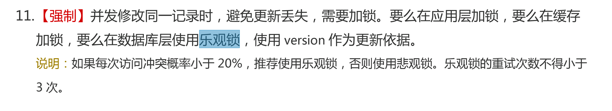

***

2020.4.2     **多项目共用微服务的测试和发版问题**


***

- 2020.4.10   **跨表更新  UPDATE JOIN**

类似于跨表查询

```sql
## 跨表更新
UPDATE T1, T2,
[INNER JOIN | LEFT JOIN] T1 ON T1.C1 = T2. C1
SET T1.C2 = T2.C2,
    T2.C3 = expr
WHERE condition
```

等同于

```sql
UPDATE T1, T2
SET T1.c2 = T2.c2,
      T2.c3 = expr
WHERE T1.c1 = T2.c1 AND condition
```


***

- 2020.4.13   **MySQL主从同步**

主从同步原理


***

- 2020.4.15    **rpc调用一直进Hystrix熔断问题排查**

Q：rpc一直熔断，但在熔断切面HystrixAOP类日志看到方法有正确调用并返回结果

R：返回的类没有无参构造函数无法通过反射创建对象。Hystrix、Spring、Mybatis等框架都用反射调用无参构造方法创建对象。即Class类的newInstance方法 `Class.forName("className").getDeclaredConstructor().newInstance();` 这个方法就是通过调用默认构造方法来创建实例对象的 

***

- 2020.4.16   **MVCC实现**

`InnoDB` 中 `MVCC` 的实现方式为：每一行记录都有两个隐藏列：`DATA_TRX_ID`、`DATA_ROLL_PTR`（如果没有主键，则还会多一个隐藏的主键列）。


整个MVCC的机制都是通过`DB_TRX_ID`,`DB_ROLL_PTR`这2个隐藏字段来实现的

#### RC事务隔离和RR事务隔离下ReadView的区别

- 在RC事务隔离级别下,每次语句执行都关闭ReadView,然后重新创建一份ReadView
- 在RR下,事务开始创建ReadView,一直到事务结束关闭

***

- 2020.4.17   **MVCC和undo log**

## Undo log

Undo log可以用来做事务的回滚操作，保证事务的原子性。同时可以用来构建数据修改之前的版本，支持多版本读。

InnoDB表数据组织方式是主键聚簇索引。二级索引通过索引键值加主键值组合来唯一确定一条记录。聚簇索引和二级索引都包含了DELETED BIT标记位来标识记录是否被删除，真正的删除在事务commit之后且没有读会引用该版本数据的时候。在聚簇索引上还有一些额外信息会存储，6字节的DB_TRX_ID字段，表示最近一次插入或者更新该记录的事务ID。7字节的DB_ROLL_PTR字段，指向该记录的rollback segment的undo log记录。6字节的DB_ROW_ID，当有新数据插入的时候会自动递增。当表上没有用户主键的时候，InnoDB会自动产生聚集索引，包含DB_ROW_ID字段。

对于聚簇索引，更新是在原记录位置更新，通过记录指向undo log的隐藏列来重构早期版本的数据。但对于二级索引，是没有聚簇索引上的这些隐藏列的，因此无法在原记录位置更新。当二级索引更新的时候，需要将原记录标记为删除，再插入新的数据记录。当快照读通过二级索引读取数据发现deleted标识或者更新的时候，如果二级索引页上无法判断可见性，InnoDB会查看聚簇索引上的记录行，通过行上的DB_TRX_ID判断可见性，找到正确的可见版本数据。

当用mvcc读取的时候（row_search_mvcc），对于聚簇索引，当拿到一条记录后，会先通过函数lock_clust_rec_cons_read_sees判断可见性，如果不可见会再构建老版本数据row_vers_build_for_consistent_read。


参考资料：

MySQL · 引擎特性 · InnoDB MVCC 相关实现：http://mysql.taobao.org/monthly/2018/11/04/


***

- 2020.4.21  **mysql锁表处理语句**

show OPEN TABLES where In_use > 0; -- 查询是否锁表
show processlist; -- 查询到相对应的进程===然后killid
SELECT * FROM INFORMATION_SCHEMA.innodb_trx; -- 当前运行的所有事务
SELECT * FROM INFORMATION_SCHEMA.INNODB_LOCKS; -- 查看正在锁的事务
SELECT * FROM INFORMATION_SCHEMA.INNODB_LOCK_WAITS; -- 查看等待锁的事务

```sql
START TRANSACTION;

UPDATE sys_user SET username='AA' WHERE id = 199;

SELECT * FROM information_schema.innodb_trx;

SELECT * FROM information_schema.innodb_locks;

SELECT * FROM information_schema.innodb_lock_waits;

SHOW VARIABLES LIKE '%innodb_lock_wait%';

UPDATE sys_user SET username='zzz' WHERE id = 199;

# — 查看当前会话show global variables like ‘innodb_lock_w%’; — 查看全局设置
show variables like 'innodb_lock_wait_timeout'; 

set innodb_lock_wait_timeout=1000; 
```


```sql
START TRANSACTION;
UPDATE sys_user SET username='zzz' WHERE id = 199;

SELECT * FROM information_schema.innodb_trx;

SHOW PROCESSLIST;

show OPEN TABLES where In_use > 0;

```

```sql
找到一直未提交事务导致后来进程死锁等待的进程，并杀掉

根据锁等待表中的拥有锁的事务id(blocking_trx_id)，从innodb_trx表中找到trx_mysql_thread_id值，kill掉。

如 这里杀掉 进程235：
select trx_mysql_thread_id from information_schema.innodb_trx it 
JOIN information_schema.INNODB_LOCK_WAITS ilw 
on ilw.blocking_trx_id = it.trx_id;

##trx_mysql_thread_id: 235

kill 235

```

Java的锁表异常：

```java
Cause: java.sql.SQLException: Lock wait timeout exceeded; 
try restarting transaction
```

show OPEN TABLES where In_use > 0; -- 查询是否锁表

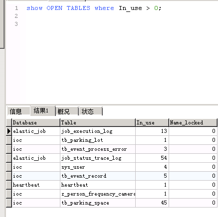

information_schema.innodb_locks  正在锁的事务 信息表

37716056:724:3:76	37716056	X	RECORD	`ioc`.`sys_user`	PRIMARY	724	3	76	193
37716055:724:3:76	37716055	X	RECORD	`ioc`.`sys_user`	PRIMARY	724	3	76	193
37716054:724:3:76	37716054	X	RECORD	`ioc`.`sys_user`	PRIMARY	724	3	76	193
37716053:724:3:76	37716053	X	RECORD	`ioc`.`sys_user`	PRIMARY	724	3	76	193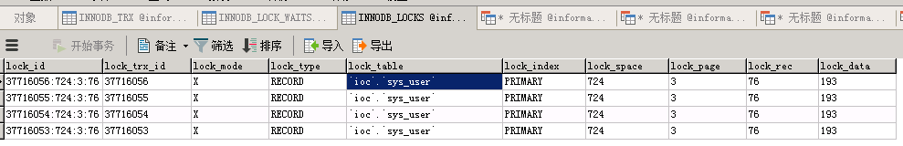

INFORMATION_SCHEMA.INNODB_LOCK_WAITS; -- 查看等待锁的事务

37716056	37716056:724:3:76	37716055	37716055:724:3:76
37716056	37716056:724:3:76	37716054	37716054:724:3:76
37716056	37716056:724:3:76	37716053	37716053:724:3:76
37716055	37716055:724:3:76	37716054	37716054:724:3:76
37716055	37716055:724:3:76	37716053	37716053:724:3:76
37716054	37716054:724:3:76	37716053	37716053:724:3:76

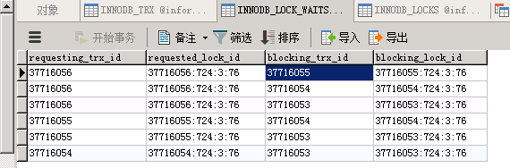

根据block

| 37716056 | LOCK WAIT | 2020-04-27 10:02:53 | 37716056:724:3:76 | 2020-04-27 10:02:53 | 2      | 124370                                                       | UPDATE sys_user SET username = 'zzz',status =  0,login_status = 1 WHERE id = 193 | starting index read | 1    | 1    | 2    | 1136 | 1    | 0    | 0               | REPEATABLE READ | 1    | 1    |      | 0    | 0    | 0    | 0    |
| -------- | --------- | ------------------- | ----------------- | ------------------- | ------ | ------------------------------------------------------------ | ------------------------------------------------------------ | ------------------- | ---- | ---- | ---- | ---- | ---- | ---- | --------------- | --------------- | ---- | ---- | ---- | ---- | ---- | ---- | ---- |
| 37716055 | LOCK WAIT | 2020-04-27 10:02:52 | 37716055:724:3:76 | 2020-04-27 10:02:52 | 2      | 124369                                                       | UPDATE sys_user SET  username = 'zzz',status = 0,login_status = 1 WHERE id = 193 | starting index read | 1    | 1    | 2    | 1136 | 1    | 0    | 0               | REPEATABLE READ | 1    | 1    |      | 0    | 0    | 0    | 0    |
| 37716054 | LOCK WAIT | 2020-04-27 10:02:42 | 37716054:724:3:76 | 2020-04-27 10:02:42 | 2      | 124366                                                       | UPDATE sys_user SET  username = 'zzz',status = 0,login_status = 1 WHERE id = 193 | starting index read | 1    | 1    | 2    | 1136 | 1    | 0    | 0               | REPEATABLE READ | 1    | 1    |      | 0    | 0    | 0    | 0    |
| 37716053 | RUNNING   | 2020-04-27 10:02:38 |                   | 2                   | 124365 | UPDATE sys_user SET  username = 'zzz',login_status = 0 WHERE   id = 193 | updating or deleting                                         | 1                   | 1    | 2    | 1136 | 1    | 0    | 0    | REPEATABLE READ | 1               | 1    |      | 0    | 0    | 0    | 0    |      |

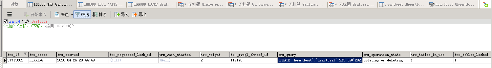


正在运行中的事务表，可以看到共有153个事务正在运行：

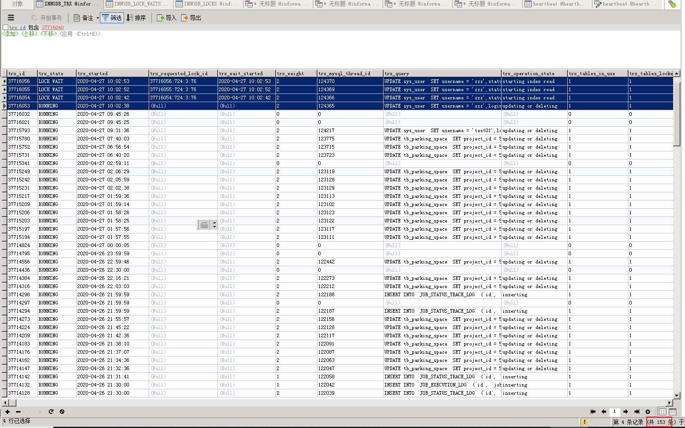


最早开始的事务 为13个小时多前：

2020-04-26 20:44:49


### **查看死锁日志**

设计`InnoDB`的大叔给我们提供了`SHOW ENGINE INNODB STATUS`命令来查看关于InnoDB存储引擎的一些状态信息，其中就包括了系统最近一次发生死锁时的加锁情况。在上边例子中的死锁发生时，我们运行一下这个命令：

```
mysql> SHOW ENGINE INNODB STATUS\G
...省略了好多其他信息
```

***

- 2020.4.30    **AQS中获取操作和释放操作的标准形式**

```java
boolean acquire() throws InterruptedException{
    while(当前状态不允许获取操作){
        if (需要阻塞获取请求) {
            如果当前线程不在队列中。则将其插入队列
            阻塞当前线程
        }else{
            返回失败
        }
    }
    可能更新同步器的状态
    如果线程位于队列中，则将其移除队列
    返回成功
}
void release(){
    更新同步器的状态
    if (新的状态允许某个被阻塞的线程获取成功) {
        解除队列中一个或多个线程的阻塞状态
    }
}
```


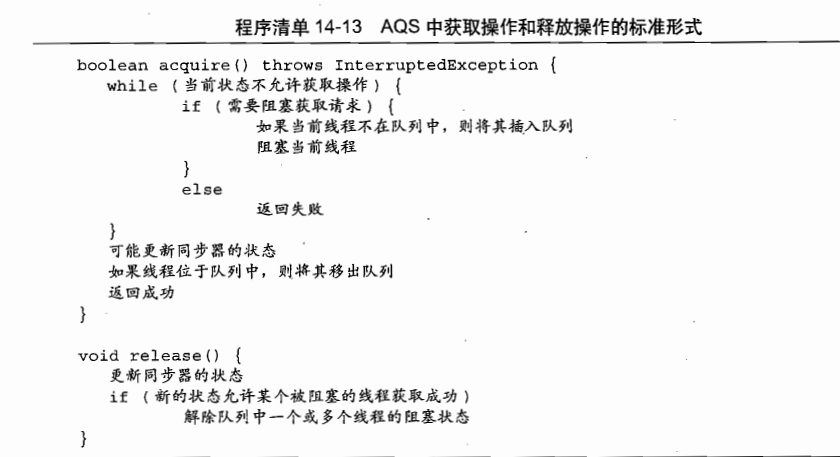

***

- 2020.5.14    ** annotation processing in IntelliJ IDEA **

Preferences > Project Settings > Compiler > Annotation Processors

勾选  annotation processing 开启编译时注解处理，用Lombok等插件时会用到

***

- 2020.5.26  **源码阅读**

来源于公众号：彤哥读源码

标星是建议必看的部分


### GC 日志查看：

先开启几个jvm配置参数（本地IDEA的话可以在 EditConfigurations... -> VM options中添加）：

> -XX:+PrintGCDetails 输出GC的详细日志
> -XX:+PrintGCTimeStamps 输出GC的时间戳（以基准时间的形式）
> -XX:+PrintGCDateStamps 输出GC的时间戳（以日期的形式，如 2013-05-04T21:53:59.234+0800）
> -XX:+PrintHeapAtGC 在进行GC的前后打印出堆的信息

```shell
//GC信息
2020-05-26T16:46:11.017+0800: [GC (Allocation Failure) [PSYoungGen: 647288K->10731K(613376K)] 725778K->102966K(845824K), 0.0103918 secs] [Times: user=0.11 sys=0.02, real=0.01 secs]


//包含GC前后heap信息的日志
{Heap before GC invocations=27 (full 3):
 PSYoungGen      total 648192K, used 647288K [0x000000076b200000, 0x0000000795480000, 0x00000007c0000000)
  eden space 626688K, 99% used [0x000000076b200000,0x0000000791595548,0x0000000791600000)
  from space 21504K, 97% used [0x0000000793500000,0x0000000794988b80,0x0000000794a00000)
  to   space 10752K, 0% used [0x0000000794a00000,0x0000000794a00000,0x0000000795480000)
 ParOldGen       total 232448K, used 78490K [0x00000006c1600000, 0x00000006cf900000, 0x000000076b200000)
  object space 232448K, 33% used [0x00000006c1600000,0x00000006c62a68d8,0x00000006cf900000)
 Metaspace       used 76461K, capacity 78012K, committed 78232K, reserved 1118208K
  class space    used 10004K, capacity 10288K, committed 10408K, reserved 1048576K
2020-05-26T16:46:11.017+0800: [GC (Allocation Failure) [PSYoungGen: 647288K->10731K(613376K)] 725778K->102966K(845824K), 0.0103918 secs] [Times: user=0.11 sys=0.02, real=0.01 secs] 
Heap after GC invocations=27 (full 3):
 PSYoungGen      total 613376K, used 10731K [0x000000076b200000, 0x0000000795480000, 0x00000007c0000000)
  eden space 602624K, 0% used [0x000000076b200000,0x000000076b200000,0x000000078fe80000)
  from space 10752K, 99% used [0x0000000794a00000,0x000000079547ae60,0x0000000795480000)
  to   space 28672K, 0% used [0x0000000791c80000,0x0000000791c80000,0x0000000793880000)
 ParOldGen       total 232448K, used 92234K [0x00000006c1600000, 0x00000006cf900000, 0x000000076b200000)
  object space 232448K, 39% used [0x00000006c1600000,0x00000006c7012b48,0x00000006cf900000)
 Metaspace       used 76461K, capacity 78012K, committed 78232K, reserved 1118208K
  class space    used 10004K, capacity 10288K, committed 10408K, reserved 1048576K
}
```

选这一条进行分析

> GC：
>
> 表明进行了一次垃圾回收，前面没有Full修饰，表明这是一次Minor GC ,注意它不表示只GC新生代，并且现有的不管是新生代还是老年代都会STW。
>
> Allocation Failure：
>
> 表明本次引起GC的原因是因为在年轻代中没有足够的空间能够存储新的数据了。
>
> ParNew：
>
>     表明本次GC发生在年轻代并且使用的是ParNew垃圾收集器。ParNew是一个Serial收集器的多线程版本，会使用多个CPU和线程完成垃圾收集工作（默认使用的线程数和CPU数相同，可以使用-XX：ParallelGCThreads参数限制）。该收集器采用复制算法回收内存，期间会停止其他工作线程，即Stop The World。
>
> 647288K->10731K(613376K)：单位是KB
>
> 三个参数分别为：GC前该内存区域(这里是年轻代)使用容量，GC后该内存区域使用容量，该内存区域总容量。
>
> 0.0103918 secs：
>
>     该内存区域GC耗时，单位是秒
>
> 522739K->156516K(1322496K)：
>
> 三个参数分别为：堆区垃圾回收前的大小，堆区垃圾回收后的大小，堆区总大小。
>
> 0.0025301 secs：
>
> 该内存区域GC耗时，单位是秒
>
> [Times: user=0.04 sys=0.00, real=0.01 secs]：
>
>     分别表示用户态耗时，内核态耗时和总耗时
> ————————————————


***

- 2020.5.27    **对象头中mark word小端存储**

Intel 系列CPU 采用小端存储，二进制数的**字节**需要反一下顺序，注意是只调换一下字节的顺序，字节里面的位不用逆序而是整体迁移，所以 

00000001 01010010 11011101 10001001 

00010001 00000000 00000000 00000000

其实应该是

00000000 00000000 00000000 0 0010001 

10001001 11011101 01010010 00000001 

可以看到64位mark word 

 00000000 00000000 00000000 0(unused) 0010001 10001001 11011101 01010010(hashcode) 0(unused)000 0(age) 0(biased_lock) 01(lock) 

unused:25 | identity_hashcode:31 | unused:1 | age:4 | biased_lock:1 | lock:2

>  OFFSET  SIZE                                TYPE DESCRIPTION                               VALUE
>       0     4                                     (object header)                           01 52 dd 89 (00000001 01010010 11011101 10001001) (-1981984255)
>       4     4                                     (object header)                           11 00 00 00 (00010001 00000000 00000000 00000000) (17)
>       8     4                                     (object header)                           8e 30 17 00 (10001110 00110000 00010111 00000000) (1519758)
>      12     4                                     (object header)                           06 00 00 00 (00000110 00000000 00000000 00000000) (6)
>      16    24   com.cheelou.base.concurrent.Demoo Demoo;.<elements>                         N/A
> Instance size: 40 bytes
> Space losses: 0 bytes internal + 0 bytes external = 0 bytes total

```ruby
|------------------------------------------------------------------------------|--------------------|
|                                  Mark Word (64 bits)                         |       State        |
|------------------------------------------------------------------------------|--------------------|
| unused:25 | identity_hashcode:31 | unused:1 | age:4 | biased_lock:1 | lock:2 |       Normal       |
|------------------------------------------------------------------------------|--------------------|
| thread:54 |       epoch:2        | unused:1 | age:4 | biased_lock:1 | lock:2 |       Biased       |
|------------------------------------------------------------------------------|--------------------|
|                       ptr_to_lock_record:62                         | lock:2 | Lightweight Locked |
|------------------------------------------------------------------------------|--------------------|
|                     ptr_to_heavyweight_monitor:62                   | lock:2 | Heavyweight Locked |
|------------------------------------------------------------------------------|--------------------|
|                                                                     | lock:2 |    Marked for GC   |
|------------------------------------------------------------------------------|--------------------|
```

***

- 2020.5.31   **CMS的CMSInitiatingOccupancyFraction**

`-XX:CMSInitiatingOccupancyFraction`这个参数是指在使用CMS收集器的情况下，老年代使用了该指定阈值的内存时，触发FullGC。

其默认值 

1、CMSInitiatingOccupancyFraction默认值是-1，并不是许多人说的68、92之类的。MinHeapFreeRatio在JDK1.8是40，根据公式_initiating_occupancy计算得到的值是92%。

2、CMSInitiatingOccupancyFraction是用来计算老年代最大使用率（_initiating_occupancy）的。大于等于0则直接取百分号，小于0则根据公式来计算。这个_initiating_occupancy需要配合-XX:+UseCMSInitiatingOccupancyOnly来使用。

3、不同版本最终得到的_initiating_occupancy不同，归根结底应该是不同版本下的MinHeapFreeRatio值不同。

>Tips:
>
>查看JVM配置参数 用法：jinfo -flag <name>  PID
> 例如：
> jinfo -flag MaxMetaspaceSize 18348，得到结果-XX:MaxMetaspaceSize=536870912，即MaxMetaspaceSize为512M

***

- 2020.6.2   **ThreadLocal的内存泄漏**

当一个线程调用ThreadLocal的set方法设置变量时候，当前线程的ThreadLocalMap里面就会存放一个记录，这个记录的key为ThreadLocal的引用，value则为设置的值。如果当前线程一直存在而没有调用ThreadLocal的remove方法，并且这时候其它地方还是有对ThreadLocal的引用，则当前线程的ThreadLocalMap变量里面会存在ThreadLocal变量的引用和value对象的引用是不会被释放的，这就会造成内存泄露的。但是考虑如果这个ThreadLocal变量没有了其他强依赖，而当前线程还存在的情况下，由于线程的ThreadLocalMap里面的key是弱依赖，则当前线程的ThreadLocalMap里面的ThreadLocal变量的弱引用会被在gc的时候回收，但是对应value还是会造成内存泄露，这时候ThreadLocalMap里面就会存在key为null但是value不为null的entry项。其实在ThreadLocal的set和get和remove方法里面有一些时机是会对这些key为null的entry进行清理的，但是这是不及时的，也不是每次都会执行的，所以一些情况下还是会发生内存泄露，所以在使用完毕后即使调用remove方法才是解决内存泄露的王道。

由于Thread中包含变量ThreadLocalMap，因此ThreadLocalMap与Thread的生命周期是一样长，如果都没有手动删除对应key，都会导致内存泄漏。

但是使用**弱引用**可以多一层保障：弱引用ThreadLocal不会内存泄漏，对应的value在下一次ThreadLocalMap调用set(),get(),remove()的时候会被清除。

因此，ThreadLocal内存泄漏的根源是：由于ThreadLocalMap的生命周期跟Thread一样长，如果没有手动删除对应key就会导致内存泄漏，而不是因为弱引用。

另外线程池中的ThreadLocal不清理也会造成内存泄漏

***

- 2020.6.5   **本地StackOverflow阈值测试**

```java
public class main {

    static int a = 0;

    public static void main(String[] args) {
        a();
    }

    private static void a() {
        a++;
        System.out.println(a);
        a();
    }
}
```

1

2

...

20065
20066
*** java.lang.instrument ASSERTION FAILED ***: "!errorOutstanding" with message transform method call failed at JPLISAgent.c line: 873
*** java.lang.instrument ASSERTION FAILED ***: "!errorOutstanding" with message transform method call failed at JPLISAgent.c line: 873
*** java.lang.instrument ASSERTION FAILED ***: "!errorOutstanding" with message transform method call failed at JPLISAgent.c line: 873
Exception in thread "main" java.lang.StackOverflowError

大概20000多一点就会报StackOverflowError栈溢出

***

- 2020.6.7   ****


查看JVM参数 

`java -XX:+PrintFlagsFinal -version | grep Meta`

```shell

[root@ecs-55a5 ~]# java -XX:+PrintFlagsFinal -version | grep Meta
    uintx InitialBootClassLoaderMetaspaceSize       = 4194304                             {product}
    uintx MaxMetaspaceExpansion                     = 5451776                             {product}
    uintx MaxMetaspaceFreeRatio                     = 70                                  {product}
    uintx MaxMetaspaceSize                          = 18446744073709547520                    {product}
    uintx MetaspaceSize                             = 21807104                            {pd product}
    uintx MinMetaspaceExpansion                     = 339968                              {product}
    uintx MinMetaspaceFreeRatio                     = 40                                  {product}
     bool TraceMetadataHumongousAllocation          = false                               {product}
     bool UseLargePagesInMetaspace                  = false                               {product}
java version "1.8.0_111"
Java(TM) SE Runtime Environment (build 1.8.0_111-b14)
Java HotSpot(TM) 64-Bit Server VM (build 25.111-b14, mixed mode)
```

***

jclasslib  查看java字节码 IDEA插件

局部变量表等

***

2020.6.9   ** GC空间分配担保**

**正式 Minor GC 前的检查**

在正式 Minor GC 前，JVM 会先检查新生代中对象，是比老年代中剩余空间大还是小。**为什么要做这样的检查呢？**原因很简单，假如 Minor GC 之后 Survivor 区放不下剩余对象，这些对象就要进入到老年代，所以要提前检查老年代是不是够用。这样就有两种情况：

1. 老年代剩余空间大于新生代中的对象大小，那就直接 Minor GC，GC 完 survivor 不够放，老年代也绝对够放
2. 老年代剩余空间小于新生代中的对象大小，这个时候就要查看是否启用了「老年代空间分配担保规则」，具体来说就是看`-XX:-HandlePromotionFailure`参数是否设置了（一般都会设置）

老年代空间分配担保规则是这样的。如果老年代中剩余空间大小，大于历次 Minor GC 之后剩余对象的大小，那就允许进行 Minor GC。因为从概率上来说，以前的放的下，这次的也应该放的下。那就有两种情况：

1. 老年代中剩余空间大小，大于历次 Minor GC 之后剩余对象的大小，进行 Minor GC
2. 老年代中剩余空间大小，小于历次 Minor GC 之后剩余对象的大小，进行 Full GC，把老年代空出来再检查

**Minor GC 后的处境**

前面说了，开启**老年代空间分配担保规则**只能说是大概率上来说，Minor GC 剩余后的对象够放到老年代，所以当然也会有万一，Minor GC 后会有这样三种情况：

1. Minor GC 之后的对象足够放到 Survivor 区，皆大欢喜，GC 结束
2. Minor GC 之后的对象不够放到 Survivor 区，接着进入到老年代，老年代能放下，那也可以，GC 结束
3. Minor GC 之后的对象不够放到 Survivor 区，老年代也放不下，那就只能 Full GC


参考：《深入理解Java虚拟机(第3版)》 3.8 实战：内存分配与回收策略

***


- 2020.6.10   **GC**

CMS GC日志

```shell
{Heap before GC invocations=1954 (full 3):
 par new generation   total 235968K, used 233367K [0x00000000c0000000, 0x00000000d0000000, 0x00000000d0000000)
  eden space 209792K,  98% used [0x00000000c0000000, 0x00000000cca55ee8, 0x00000000ccce0000)
  from space 26176K, 100% used [0x00000000ce670000, 0x00000000d0000000, 0x00000000d0000000)
  to   space 26176K,   0% used [0x00000000ccce0000, 0x00000000ccce0000, 0x00000000ce670000)
 concurrent mark-sweep generation total 786432K, used 716477K [0x00000000d0000000, 0x0000000100000000, 0x0000000100000000)
 Metaspace       used 90998K, capacity 92466K, committed 93440K, reserved 1130496K
  class space    used 11004K, capacity 11303K, committed 11520K, reserved 1048576K
2020-06-10T09:59:55.734+0800: [GC (Allocation Failure) 2020-06-10T09:59:55.734+0800: [ParNew: 233367K->26176K(235968K), 0.0084851 secs] 949844K->759781K(1022400K), 0.0086097 secs] [Times: user=0.04 sys=0.00, real=0.00 secs] 
Heap after GC invocations=1955 (full 3):
 par new generation   total 235968K, used 26176K [0x00000000c0000000, 0x00000000d0000000, 0x00000000d0000000)
  eden space 209792K,   0% used [0x00000000c0000000, 0x00000000c0000000, 0x00000000ccce0000)
  from space 26176K, 100% used [0x00000000ccce0000, 0x00000000ce670000, 0x00000000ce670000)
  to   space 26176K,   0% used [0x00000000ce670000, 0x00000000ce670000, 0x00000000d0000000)
 concurrent mark-sweep generation total 786432K, used 733605K [0x00000000d0000000, 0x0000000100000000, 0x0000000100000000)
 Metaspace       used 90998K, capacity 92466K, committed 93440K, reserved 1130496K
  class space    used 11004K, capacity 11303K, committed 11520K, reserved 1048576K
}
2020-06-10T09:59:55.745+0800: [GC (CMS Initial Mark) [1 CMS-initial-mark: 733605K(786432K)] 766437K(1022400K), 0.0023996 secs] [Times: user=0.01 sys=0.00, real=0.00 secs] 
2020-06-10T09:59:55.747+0800: [CMS-concurrent-mark-start]
2020-06-10T09:59:55.864+0800: [CMS-concurrent-mark: 0.117/0.117 secs] [Times: user=0.25 sys=0.00, real=0.12 secs] 
2020-06-10T09:59:55.864+0800: [CMS-concurrent-preclean-start]
2020-06-10T09:59:55.867+0800: [CMS-concurrent-preclean: 0.003/0.003 secs] [Times: user=0.00 sys=0.00, real=0.00 secs] 
2020-06-10T09:59:55.867+0800: [CMS-concurrent-abortable-preclean-start]
 CMS: abort preclean due to time 2020-06-10T10:00:00.885+0800: [CMS-concurrent-abortable-preclean: 0.934/5.018 secs] [Times: user=0.94 sys=0.00, real=5.02 secs] 
2020-06-10T10:00:00.886+0800: [GC (CMS Final Remark) [YG occupancy: 56767 K (235968 K)]2020-06-10T10:00:00.886+0800: [Rescan (parallel) , 0.0032350 secs]2020-06-10T10:00:00.889+0800: [weak refs processing, 0.0065645 secs]2020-06-10T10:00:00.896+0800: [class unloading, 0.0365772 secs]2020-06-10T10:00:00.933+0800: [scrub symbol table, 0.0112388 secs]2020-06-10T10:00:00.944+0800: [scrub string table, 0.0016610 secs][1 CMS-remark: 733605K(786432K)] 790373K(1022400K), 0.0742753 secs] [Times: user=0.10 sys=0.00, real=0.07 secs] 
2020-06-10T10:00:00.961+0800: [CMS-concurrent-sweep-start]
2020-06-10T10:00:01.075+0800: [CMS-concurrent-sweep: 0.108/0.115 secs] [Times: user=0.12 sys=0.00, real=0.12 secs] 
2020-06-10T10:00:01.076+0800: [CMS-concurrent-reset-start]
2020-06-10T10:00:01.077+0800: [CMS-concurrent-reset: 0.002/0.002 secs] [Times: user=0.00 sys=0.00, real=0.00 secs]
```


***

- 2020.6.14    **JVM一些面试问题**


***

- 2020.7.21   **Optional踩坑经验**

of()或者ofNullable()括号里面不能用xx.getYy().getZz()


***

- 2020.7.31   **Spring静态注入**

业务中有一处SDK的请求需要从缓存中获取token，要注入redisTemplate，但直接写注解@Autowired

```java
@Autowired
private static RedisTemplate<String, Object> redisTemplate;
```

并不能注入该静态变量，会报空指针异常。查阅资料得知**spring支持set方法注入，可以利用非静态setter 方法注入静态变量**。

一种是加入@Component注解和非静态set方法，set方法上加@Autowired，服务启动时会注入静态依赖

```java
@Component
public class ClassZZ {

    private static RedisTemplate<String, Object> redisTemplate;

    @Autowired
    public void setRedisTemplate(RedisTemplate<String, Object> redisTemplate) {
        ClassZZ.redisTemplate = redisTemplate;
    }
```


还可以用@PostConstruct  init()注入静态

***

FutureTask进行并发异步改造提高多次查询性能

```java
    /**
     * FutureTask异步并发获取查询结果多个园区设备的模拟量值,响应时长几乎等于只请求一次
     * 结合整合同一园区的设备列表、缓存更新token等优化，将原来2~6s的单页查询时间优化至稳定200ms
     * @param detectorIdUniqueIdMap 探测器和设备uniqueId映射
     * @param resultsMap 园区和该园区下设备列表映射
     */
    public static List<DeviceAnalog> getDeviceAnalogsByFutureTask(Map<String, String> detectorIdUniqueIdMap, Map<Long, List<DeviceDetailInfoVO>> resultsMap) {
        List<DaHuaFireRomaSDK.DeviceAnalog> deviceAnalogs = new ArrayList<>();
        //创建线程池
        ExecutorService executor = Executors.newCachedThreadPool();
        //结果future列表
        List<Future<List<DaHuaFireRomaSDK.DeviceAnalog>>> futureList = new ArrayList<>();
        resultsMap.forEach((projectId,deviceVOs)->{
            //同一个园区的一批 查询一次模拟量结果
            List<String> uniqueIds = deviceVOs.stream().map(DeviceDetailInfoVO::getUniqueId).collect(Collectors.toList());
            List<String> deviceIds = uniqueIds.stream().map(e->detectorIdUniqueIdMap.get(e)).collect(Collectors.toList());
            //构造task
            DaHuaFireRomaSDK.Task task = new DaHuaFireRomaSDK.Task(StrUtil.join(",", deviceIds.toArray()), projectId);
            //提交task
            Future<List<DeviceAnalog>> result = executor.submit(task);
            futureList.add(result);
        });
        executor.shutdown();
        futureList.forEach(e->{
            List<DeviceAnalog> deviceAnalogs1 = null;
            try {
                deviceAnalogs1 = e.get();//获取查询结果get()
            } catch (InterruptedException e1) {
                e1.printStackTrace();
            } catch (ExecutionException e1) {
                e1.printStackTrace();
            }
            deviceAnalogs.addAll(deviceAnalogs1);
        });
        return deviceAnalogs;
    }

    @Data
    @NoArgsConstructor
    public static class Task implements Callable<List<DeviceAnalog>> {
        String deviceIds;//探测器ids,逗号拼接
        Long projectId;//园区id

        public Task(String deviceIds, Long projectId) {
            this.deviceIds = deviceIds;
            this.projectId = projectId;
        }

        @Override
        public List<DeviceAnalog> call() {
//            System.out.println("子线程在进行请求，参数deviceIds = ");
            if(log.isDebugEnabled()){
                log.debug("子线程在进行请求，参数deviceIds = {},projectId = {}",deviceIds,projectId);
            }
            List<DeviceAnalog> deviceAnalogs = deviceAnalogJava(deviceIds, projectId);
            return deviceAnalogs;
        }
    }
```


***

- 2020.8.7  **@JsonFormat和JsonField**

1、JsonFormat来源于**jackson**，Jackson是一个简单基于Java应用库，Jackson可以轻松的将Java对象转换成json对象和xml文档，同样也可以将json、xml转换成Java对象。Jackson所依赖的jar包较少，简单易用并且性能也要相对高些，并且Jackson社区相对比较活跃，更新速度也比较快。
2、JSONField来源于**fastjson**，是阿里巴巴的开源框架，主要进行JSON解析和序列化。
3、DateTimeFormat是spring自带的处理框架，主要用于将时间格式化。

***

- 2020.8.10   ****

Klass继承体系图：

```c++
// hotspot/src/share/vm/oops/oopsHierarchy.hpp
...
class Klass;  // Klass继承体系的最高父类
class   InstanceKlass;  // 表示一个Java普通类，包含了一个类运行时的所有信息
class     InstanceMirrorKlass;  // 表示java.lang.Class
class     InstanceClassLoaderKlass; // 主要用于遍历ClassLoader继承体系
class     InstanceRefKlass;  // 表示java.lang.ref.Reference及其子类
class   ArrayKlass;  // 表示一个Java数组类
class     ObjArrayKlass;  // 普通对象的数组类
class     TypeArrayKlass;  // 基础类型的数组类
...
复制代码
```

不同于Oop，Klass在`InstanceKlass`下又设计了3个子类，其中`InstanceMirrorKlass`用于表示java.lang.Class类型，该类型对应的oop特别之处在于其包含了`static field`，因此计算`oop`大小时需要把`static field`也考虑进来；`InstanceClassLoaderKlass`主要提供了遍历当前`ClassLoader`的继承体系；`InstanceRefKlass`用于表示`java.lang.ref.Reference`及其子类。


HotSpot的Oop-Klass对象模型，其中**Oop表示对象的实例，存储在堆中；Klass表示对象的类型，存储在方法区中**


***

- 2020.08.21    **CMS触发条件foreground collector background collector**

## CMS触发GC的条件

CMS GC 在实现上分成 **foreground collector** 和 **background collector**。foreground collector 相对比较简单，background collector 比较复杂，情况比较多。

**foreground collector**
foreground collector 触发条件比较简单，一般是如下：

- 老年代没有足够的连续空间分配给晋升的对象（即使总可用内存足够大）。
- 新生代没有足够的空间分配对象。
- 老年代没有足够的剩余空间来容纳新的大对象。

**background collector**


***

- 2020.8.31    **适配器模式**

要点：适配器Adapter实现目标接口


***

Optional的flatMap和map的区别，flatMap的入参需要一个返回Optional的方法

***

- 2020.09.07    **Optional连续判空**

```java
String analogValue = Optional.ofNullable(deviceAnalog).map(e->e.getAnalog()).orElse("0");
```

***

- 2020.09.08   **ConvertUtils.convert()**

ConvertUtils.convert(value,targetType)

```java
//值类型转换 如 Double 转 String
Object convertedValue = ConvertUtils.convert(value, targetPd.getPropertyType());
```

BeanUtils 将source中不为空的字段，拷贝(覆盖)到target中

```java
public abstract class BeanUtil extends org.springframework.beans.BeanUtils {
    /**
     * 将source中不为空的字段，拷贝(覆盖)到target中
     * @param source
     * @param target
     * @throws BeansException
     */
    public static void copyProperties(Object source, Object target) throws BeansException {
        Assert.notNull(source, "Source must not be null");
        Assert.notNull(target, "Target must not be null");
        Class<?> actualEditable = target.getClass();
        PropertyDescriptor[] targetPds = getPropertyDescriptors(actualEditable);
        for (PropertyDescriptor targetPd : targetPds) {
            if (targetPd.getWriteMethod() != null) {
                PropertyDescriptor sourcePd = getPropertyDescriptor(source.getClass(), targetPd.getName());
                if (sourcePd != null && sourcePd.getReadMethod() != null) {
                    try {
                        Method readMethod = sourcePd.getReadMethod();
                        if (!Modifier.isPublic(readMethod.getDeclaringClass().getModifiers())) {
                            readMethod.setAccessible(true);
                        }
                        Object value = readMethod.invoke(source);
                        // 这里判断以下value是否为空 当然这里也能进行一些特殊要求的处理 例如绑定时格式转换等等
                        if (value != null) {
                            Method writeMethod = targetPd.getWriteMethod();
                            if (!Modifier.isPublic(writeMethod.getDeclaringClass().getModifiers())) {
                                writeMethod.setAccessible(true);
                            }
                            //值类型转换 如 Double 转 String
                            Object convertedValue = ConvertUtils.convert(value, targetPd.getPropertyType());
                            writeMethod.invoke(target, convertedValue);
                        }
                    } catch (Throwable ex) {
                        throw new FatalBeanException("Could not copy properties from source to target,"+"sourcePd.name = "+sourcePd.getName()+",", ex);
                    }
                }
            }
        }
    }
}
```

***

- 2020.9.21  **REST**

#### REST是什么

`REST`即表述性状态传递（英文：`Representational State Transfer`，简称`REST`）是`Roy Fielding`博士在2000年他的博士论文中提出来的一种软件架构风格。表述性状态转移是一组架构约束条件和原则
 所以简而言之，`REST`是一种风格
 `REST`通常基于使用`HTTP`，`URI`，和`XML`（标准通用标记语言下的一个子集）以及`HTML`（标准通用标记语言下的一个应用）这些现有的广泛流行的协议和标准。`REST` 通常使用 `JSON` 数据格式。

#### RESTful是什么

那么既然`REST`是一种风格，`RESTful`又是什么呢？
 `RESTful`是满足这些约束条件和原则的应用程序或设计

主要是从三个方面来看

- 资源
   资源就是一个实体，你可以用一个`URI`（统一资源定位符）指向它，每种资源对应一个特定的`URI`。要获取这个资源，访问它的`URI`就可以，因此`URI`就成了每一个资源的地址或独一无二的识别符
- 表现层
   把资源呈现出来的形式叫表现层，可以用`HTML`格式、`XML`格式、`JSON`格式表现，`REST`中常用的是`JSON`格式
- 状态转化
   访问一个网站，就代表了客户端和服务器的一个互动过程。在这个过程中，势必涉及到数据和状态的变化。
   `HTTP`协议，是一个无状态协议。这意味着，所有的状态都保存在服务器端。因此，如果客户端想要操作服务器，必须通过某种手段，让服务器端发生"状态转化"。而这种转化是建立在表现层之上的，所以就是"表现层状态转化"。
   客户端用到的手段，只能是HTTP协议。
   1.**GET**用来获取资源
   2.**POST**用来新建资源（也可以用于更新资源）
   3.**PUT**用来更新资源
   4.**DELETE**用来删除资源。

综合上面的解释，我们总结一下什么是`RESTful`架构：
 （1）每一个`URI`代表一种资源；
 （2）客户端和服务器之间，传递这种资源的某种表现层；
 （3）客户端通过四个`HTTP`动词，对服务器端资源进行操作，实现"表现层状态转化"。

#### 设计误区

- `URI`不应该包含动词，因为它是一个资源，动词应该放在`HTTP`协议中
- `URI`不应该包含版本号，因为不同的版本，可以理解成同一种资源的不同表现形式，所以应该采用同一个`URI`

#### REST的优点

- `URI`具有很强可读性的，具有自描述性
- 充分利用 `HTTP` 协议本身语义
- 无状态，在调用一个接口（访问、操作资源）的时候，可以不用考虑上下文，不用考虑当前状态，极大的降低了复杂度
- `HTTP` 本身提供了丰富的内容协商手段，无论是缓存，还是资源修改的乐观并发控制，都可以以业务无关的中间件来实现


参考链接：https://www.jianshu.com/p/c85baf7e12a8

***

管道、管线化：pipe、pipelining，不用等待响应发送后续

请求

***

- 2020.9.28   **http/https与websocket的ws/wss的关系**

> http -> new WebSocket('ws://xxx')
>
> https -> new WebSocket('wss://xxx')


***

- 2020.10.20   **maven本地jar包部署到私服**

deploy

```shell
mvn deploy:deploy-file -DgroupId=com.holley -DartifactId=holley-sdk  -Dversion=0.0.1 -Dpacckaging=jar -Dfile=holley-sdk-0.0.1.jar -DrepositoryId=releases -Durl=https://work.gtdreamlife.com:18081/repository/maven-releases/
```

***

网关解决跨域问题配置：

```java
/**
 * 跨域
 */
@Configuration
public class GlobalCorsConfiguration   {

    @Bean
    public FilterRegistrationBean corsFilter() {
        final UrlBasedCorsConfigurationSource source = new UrlBasedCorsConfigurationSource();
        final CorsConfiguration corsConfiguration = new CorsConfiguration();
        corsConfiguration.setAllowCredentials(true);
        corsConfiguration.addAllowedOrigin("*");
        corsConfiguration.addAllowedHeader("*");
        corsConfiguration.addAllowedMethod("*");
        source.registerCorsConfiguration("/**", corsConfiguration);
        FilterRegistrationBean bean = new FilterRegistrationBean(new CorsFilter(source));
        bean.setOrder(Ordered.HIGHEST_PRECEDENCE);
        return bean;
    }
}
```

- 2020.10.22   **海量数据处理问题算法**

**8、怎么在海量数据中找出重复次数最多的一个？** 
  方案1：先做hash，然后求模映射为小文件，求出每个小文件中重复次数最多的一个，并记录重复次数。然后找出上一步求出的数据中重复次数最多的一个就是所求（具体参考前面的题）。


参考：

 [十道海量数据处理面试题与十个方法大总结](https://blog.csdn.net/v_JULY_v/article/details/6279498)

[程序员编程艺术：第十章、如何给10^7个数据量的磁盘文件排序](https://blog.csdn.net/v_JULY_v/article/details/6451990)

***

- 2020.11.16   ** META-INF/spring.factories添加依赖类 **

spring.fatories 自动配置（AutoConfiguration）格式如下

```properties
org.springframework.boot.autoconfigure.EnableAutoConfiguration=\
  com.zzz.common.feign.xxxClass
```


- 2020.11.26    **线程池大小**

线程池大小 = NCPU *UCPU(1+W/C)](https://www.cnblogs.com/yueruijie/p/11357938.html)

 

如何选择线程池数量

线程池的大小决定着系统的性能，过大或者过小的线程池数量都无法发挥最优的系统性能。

当然线程池的大小也不需要做的太过于精确，只需要避免过大和过小的情况。一般来说，

确定线程池的大小需要考虑CPU的数量，内存大小，任务是计算密集型还是IO密集型等因素

 

NCPU = CPU的数量

UCPU = 期望对CPU的使用率 0 ≤ UCPU ≤ 1

W/C = 等待时间与计算时间的比率

如果希望处理器达到理想的使用率，那么线程池的最优大小为：

**线程池大小=NCPU \*UCPU(1+W/C)**

***

- 2020.11.27    **RabbitMQ消费**

queue名称为随机的必须是autodelete=true，不然会堆一堆消息没人消费。


其他参数：

durable： 是否持久化, 队列的声明默认是存放到内存中的，如果rabbitmq重启会丢失，如果想重启之后还存在就要使队列持久化，保存到Erlang自带的Mnesia数据库中，当rabbitmq重启之后会读取该数据库

exclusive：是否排外的，有两个作用，一：当连接关闭时connection.close()该队列是否会自动删除；二：该队列是否是私有的private，如果不是排外的，可以使用两个消费者都访问同一个队列，没有任何问题，如果是排外的，会对当前队列加锁，其他通道channel是不能访问的，如果强制访问会报异常，一般等于true的话用于一个队列只能有一个消费者来消费的场景

autodelete：当没有任何消费者使用时，自动删除该队列


autodelete  服务宕机停止后就删除队列，会丢失宕机期间的数据，但可以用于本地调试时配合队列名为空queue = ""，autodelete=true，达到收到调试消息的目的

***
- 2020.12.8     **@FunctionalInterface注解**


ObjectFactory函数表达式作参数，getObject()方法执行时执行表达式，并返回getObject方法定义的返回参数。匿名函数不同实现，使用匿名内部类来实例化函数式接口的对象

.png)

JAVA8新特性：函数式接口@FunctionalInterface的使用说明  http://www.manongjc.com/article/46188.html  


***

- 2020.12.18     **MySQL字符串字段乘除法运算**

`CAST( @x / @y AS DECIMAL(m,n) )`

@x和@y就是除数和被除数

n的值是整数部分加小数部分的总长度，m值的是小数部分的位数

***

- 2020.12.28    **同步互斥**

互斥是实现同步的一种手段，临界区、互斥量（Mutex）和信号量（Semaphore）都是主要互斥方式。互斥是因，同步是果。

监视器锁（Monitor 另一个名字叫管程）本质是依赖于底层的操作系统的 Mutex Lock（互斥锁）来实现的。每个对象都存在着一个 monitor 与之关联，对象与其 monitor 之间的关系有存在多种实现方式，如 monitor 可以与对象一起创建销毁或当线程试图获取对象锁时自动生成，但当一个 monitor 被某个线程持有后，它便处于锁定状态。


***

- 2020.12.29   **RPC调用和HTTP调用的区别**

最本质的区别，就是RPC主要是基于TCP/IP协议的，而HTTP服务主要是基于HTTP协议的，我们都知道HTTP协议是在传输层协议TCP之上的，所以效率上RPC更胜一筹


***

之所以 JDK 的动态代理只能通过接口实现，原因是因为运行时 newProxyInstance 内部会缓存形式先通过字节码生成一个代理类，这个代理类默认已经继承了 Proxy 类，同时实现了我们传入的一堆接口；由于 Java 是单继承的，所以 JDK 动态代理只能代理接口，接口可以实现多个，但是类只能继承实现一个。

譬如我们使用动态代理样例如下：

```java
// Foo 为接口
InvocationHandler handler = new MyInvocationHandler(...);
Class<?> proxyClass = Proxy.getProxyClass(Foo.class.getClassLoader(), Foo.class);
Foo f = (Foo) Proxy.newProxyInstance(Foo.class.getClassLoader(), new Class<?>[] { Foo.class }, handler);
```

上面代码运行时会在内存中默认通过字节码生成一个动态代理类，大致样子如下：

```java
public class $Proxy1 extends Proxy implements Foo {
    ......
}
```

这就是为什么 JDK 动态代理只能通过接口实现的原因。


***

- 2020.12.30     **DDD领域驱动设计**

**两顶帽子：**

- 在不添加新功能的前提下，重构代码，调整原有程序结构，以适应新功能；
- 实现新的功能。


以往当拿到需求时，开发人员往往草草设计以后就开始编码，设计质量也就不高。

而采用领域驱动的方式，在拿到新需求以后，应当先进行需求分析，设计领域模型。

自己笔记：从面向流程开发转为面向领域模型，类比面向过程编程和面向对象编程，映射到微服务中。涉及到的设计原则有**开闭原则**、**单一职责原则**

https://mp.weixin.qq.com/s/53I1t-QiJGliNq-NxGYpCg

***

- 2021.1.3    **interrupt()中断**

   要中断一个Java线程，可调用线程类（Thread）对象的实例方法：interrupte()；然而interrupte()方法并不会立即执行中断操作；具体而言，这个方法只会给线程设置一个为true的中断标志（**中断标志只是一个布尔类型的变量**），而设置之后，则根据线程当前的状态进行不同的后续操作。如果，线程的当前状态处于非阻塞状态，那么仅仅是线程的中断标志被修改为true而已；如果线程的当前状态处于阻塞状态，那么在将中断标志设置为true后，还会有如下三种情况之一的操作：

 

- 如果是wait、sleep以及jion三个方法引起的阻塞，那么会将线程的中断标志**重新设置为false**，并抛出一个InterruptedException；
- 如果是java.nio.channels.InterruptibleChannel进行的io操作引起的阻塞，则会对线程抛出一个ClosedByInterruptedException；（待验证）
- 如果是轮询（java.nio.channels.Selectors）引起的线程阻塞，则立即返回，不会抛出异常。（待验证）

  如果在中断时，线程正处于非阻塞状态，则将中断标志修改为true,而在此基础上，一旦进入阻塞状态，则按照阻塞状态的情况来进行处理；例如，**一个线程在运行状态中，其中断标志被设置为true,则此后，一旦线程调用了wait、join、sleep方法中的一种，立马抛出一个InterruptedException，且中断标志被清除，重新设置为false。**

  通过上面的分析，我们可以总结，**调用线程类的interrupted方法，其本质只是设置该线程的中断标志，将中断标志设置为true，并根据线程状态决定是否抛出异常**。因此，通过interrupted方法真正实现线程的中断原理是：**开发人员根据中断标志的具体值，来决定如何退出线程。**

```java
public void run() {
            try {
                while (true){
                    Thread.sleep(1000l);//阻塞状态，线程被调用了interrupte（）方法，清除中断标志，抛出InterruptedException
                    //dosomething
                    boolean isIn = this.isInterrupted();
                    //运行状态，线程被调用了interrupte（）方法，中断标志被设置为true
                    //非阻塞状态中进行中断线程操作
                    if(isInterrupted()) break;//退出循环，中断进程
                }
            }catch (InterruptedException e){//阻塞状态中进行中断线程操作
                boolean isIn = this.isInterrupted();//退出阻塞状态，且中断标志被清除，重新设置为false，所以此处的isIn为false
                return;//退出run方法，中断进程
            }
        }
```
***

- 2021.1.5   **[coobird](https://github.com/coobird)/[thumbnailator](https://github.com/coobird/thumbnailator) OOM  YGC FGC**

[coobird](https://github.com/coobird)/**[thumbnailator](https://github.com/coobird/thumbnailator)**  java缩略图开源框架

上传图片压缩时，出现内存溢出，`Exception in thread "main" java.lang.OutOfMemoryError: Java heap space`，

用MAT分析heap dump文件和gc情况(1s内多次YGC和CMS FGC)  定位到 `Thumbnails.of(inputStream).scale(rate).toFile(tempFile);` 用thumbnailator框架压缩图片这一句


以下为作者最终解答：

占用堆内存大小和图片分辨率有关，最小为 两倍的图片 宽 * 高 * 4 字节，15000 x 15000的图片约要占用2* 15000 *15000 *4 B = 900MB的堆内存，

