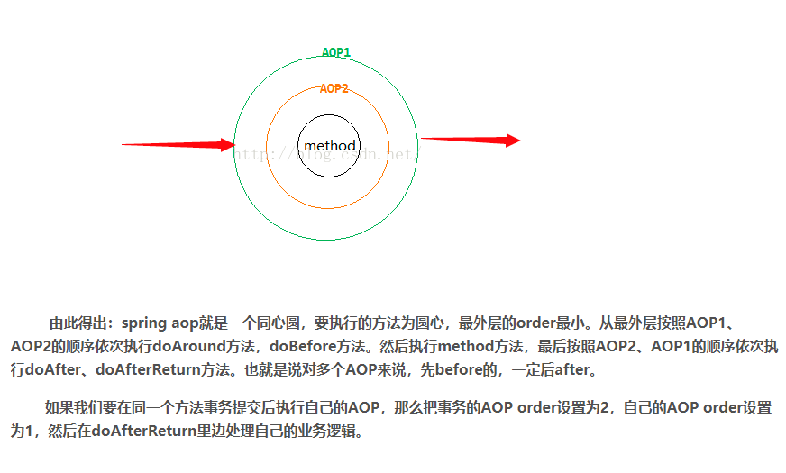
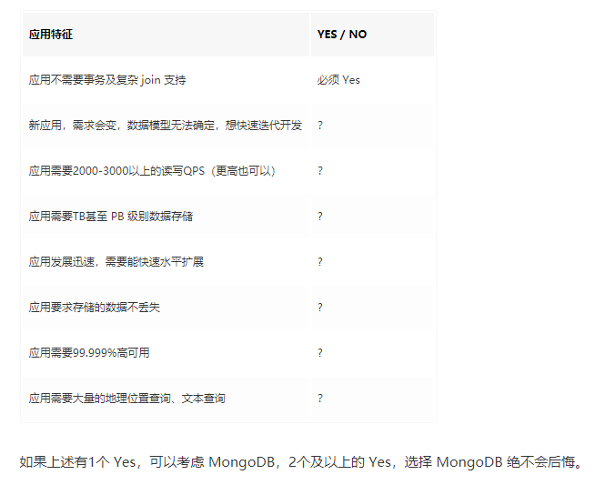
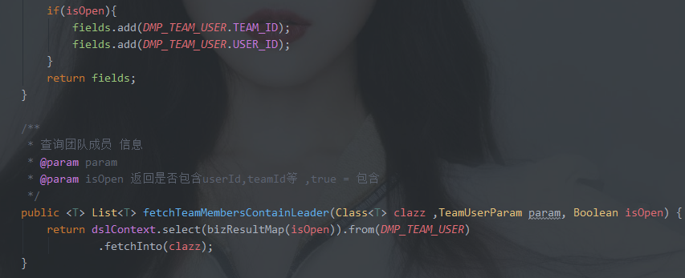
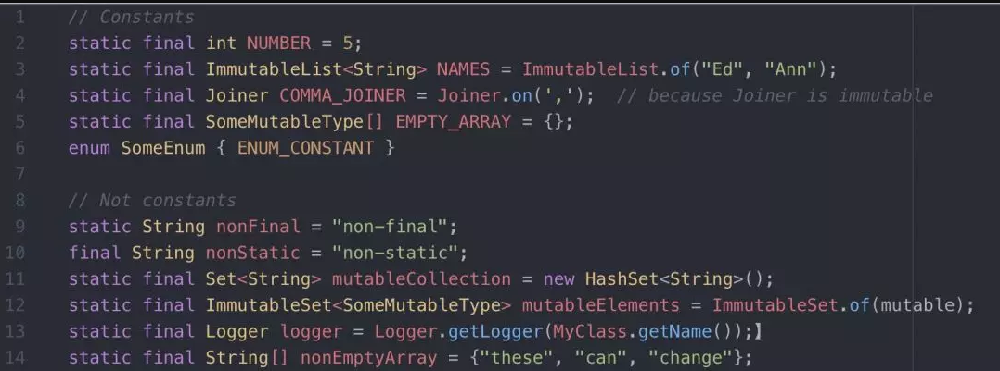
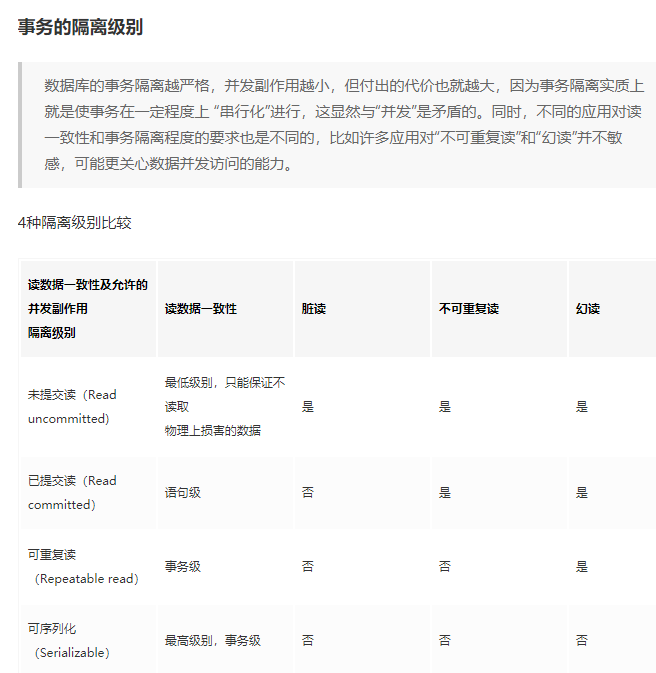

## 程序员随想

***
 - 2016.5.30杂谈
    今天先记录几个关键词吧(Android学习方面)，也很迟了zzz: 多线程、反编译（dex2jar和jdgui）、okhttp、retrofit（对okhttp进行封装）、学习网站：CSDN、Github、appxcode、博客园（cnblogs）、极客学院、CSDN学院、Android官网、Segmentfault、cnbeta（资讯类）。

    <!--more-->
------

- 2016.5.31随想

  今天还是主要在学习之前下好安装好的IntelliJ IDEA的使用，上手也不算难，也试了一个web项目和一个用了SSH框架的web项目，很爽 \(≧▽≦)/和Eclipse、Myeclipse相比较只能用四个字形容感受：相见恨晚！╮(╯▽╰)╭ 1.8的JDK环境加Tomcat8的本地服务器，不知道是IDE优化了还是各种加成，重新部署项目很快,点一下Run汤姆猫6,7秒就Redeploy好了，这可真是比用Myeclipse+JDK1.6+Tomcat7快的多了。还有一个必须提的就是代码提示很强大，快键键也很多（因为和Android Studio是同平台产品的所以快捷键完全一样）。说说遇到的问题吧，最令我印象深刻的是，这Spring的applicationContext.xml里面配的数据库连接改了之后还是原来那个数据库，很怪，用IDEA自带的Database管理工具改变了连接的数据库参数好像也是没有什么变化，后台的Hibernate的DAO还是会到原来那个数据库那里去访问数据，甚至我把applicationContext.xml数据库的连接信息的		

```
	 <property name="url"value="jdbc:mysql://localhost:3306/xyb"></property>
```

去掉最后的数据库名字（xyb）变成 "jdbc:mysql://localhost:3306/" 这样居然也能对数据访问和操作，而且还是最初的那个数据库（xyb），这真是日了鬼了，确实是没怎么想明白——6月2日补充：是可以在hbm.xml中更改连接的数据库名字的，疏忽了

```
//Account.hbm.xml
<hibernate-mapping>
	<class name="com.po.Account" table="account" catalog="xyb">
	……
</hibernate-mapping>
```

，对了，IDEA里用SQL语句也有代码提示，，挺方便的吧。还有Android Studio里菜单栏下面有一排工具栏，怎么IDEA里一个都没了，嗯，原来是要手动显示菜单栏中的View->Toolbar，打上勾就出来了。


	然后今天还更熟悉了foreach遍历集合，发现（对于我算是发现了）当集合中没有元素时（不为NULL）用foreach去遍历并且在遍历中使用遍历的对象并不会报出异常，这就很明显了，当遇到不为NULL的空集合时foreach一次也不会循环，这真是奈斯。
	

------

- 2016.6.1记录

```
	IDEA关闭重复代码检测：Settings->搜索Duplicated code，把勾取消。
	 
SSH框架下的用JUnit和Spring-test进行单元测试（直接在单元测试类中操作和验证数据库中的数据）。参看文章《SSH框架下用JUnit+spring-test单元测试》。
今天还熟悉了Map用entrySet遍历的方法，并且将Map对象作为List集合的元素。entry就相当于Map中的一个实体。通过entry.getKey( )和entry.getValue( )方法可以很方便地得到这个实体的键和值。上代码了。
```

```
       List<Map<String,String>> list1=new ArrayList<Map<String,String>>();
        Map<String,String> map1=new HashMap<String, String>();
        map1.put("heihei", "heihei");
        map1.put("haha", "haha");
        Map<String,String> map2=new HashMap<String, String>();
        map2.put("lel", "lele");
        map2.put("nunu", "nunu");

        list1.add(map1);
        list1.add(map2);
        String ke;
        String va;
        for(Map.Entry entry2:map2.entrySet()){
            ke=entry2.getKey().toString();
            va=entry2.getValue().toString();
            System.out.println("key:"+ke+", "+"value:"+va);
        }
```

输出：
key:lel, value:lele
key:nunu, value:nunu

遍历以Map为集合元素的List：

```
        for(Map<String, String> map3:list1){
            Iterator iterator2=map3.entrySet().iterator();
            while(iterator2.hasNext()){
                Map.Entry entry=(Map.Entry)iterator2.next();
                ke=entry.getKey().toString();
                va=entry.getValue().toString();
                System.out.println("key:"+ke+", "+"value:"+va);
                System.out.println("");
            }
```

输出：
key:haha, value:haha

key:heihei, value:heihei

key:lel, value:lele

key:nunu, value:nunu

------

- 2016.6.4记录
  Java判断字符串内容是否为数字方法之一：利用正则表达式

```
String str="64738";
boolean result=str.matches("[0-9]+");//result为true或false
//matches方法判断是否匹配所给的正则表达式
```

判断是否为浮点数：

```
  public static boolean isDouble(String str) {    
    Pattern pattern = Pattern.compile("^[-\\+]?[.\\d]*$");    
    return pattern.matcher(str).matches();    
  }  
```

final关键字修饰**类**时该类**不能被继承**，
final关键字修饰**方法**时该方法**不能被其子类方法覆盖**(覆盖表示子类方法中参数类型、或参数个数、或参数顺序不同)
final关键字修饰**变量**时该变量的**值不能改变**，该变量不能再去指向别的对象，一旦初始化后无法改变。但其指向的对象的值可以改变，如：

```
static String b="222";
final static String a=b;
System.out.println(a);//输出"222"
b="3333";  
System.out.println(b); //输出"3333"
System.out.println(a);//还是输出"222"，因为前面已经初始化赋值了b的值"222"，值不再更改
```

------

- 2016.6.9随想
  Java中一个方法中的匿名内部类调用该方法中的局部变量时，该变量必须在方法中声明为final，如

```
        final TextView tvtopkymn=(TextView)popupView.findViewById(R.id.tvtopktmn);
        tvtopkymn.setOnClickListener(new View.OnClickListener() {
            @Override
            public void onClick(View v) {
                tvtopkymn.setText("我是调用final变量");
            }
        });

```

这是为了克服局部变量和内部类之间生命周期的不一致性，内部类的生命周期比方法（等同于局部变量的生命周期）要长。设想一下：方法f被调用,从而在它的调用栈中生成了变量i,此时产生了一个局部内部类对象 inner_object,它访问了该局部变量i .当方法f()运行结束后,局部变量i就已死亡了,不存在了.但:局部内部类对象 inner_object还可能一直存在(只能没有人再引用该对象时,它才会死亡),它不会随着方法f()运行结束死亡.这时:出现了一个"荒唐"结果:局部内部类对象 inner_object要访问一个已不存在的局部变量i!	
	

------

- 2016.6.16记录
  java.lang.String中的**split方法**，实现方法为
   **`public String[] split(String regex)`**根据给定正则表达式的匹配拆分此字符串，将所有符合条件的都拆分完全，相当于下面一种的limit参数为0。
   或者
   **`public String[] split(String regex,int limit)`**根据匹配给定的正则表达式来拆分此字符串，limit参数限制目标数组中的元素个数，即该模式最多应用（limit-1）次就不再继续往下拆分；如果limit为0，则拆完为止，和不带这个limit参数结果一样。
   举个栗子

```
public class Test{
   public static void main(String args[]){
      String Str = new String("Welcome-to-cheetahlou-cheetah.com");

      for (String retval: Str.split("-", 2)){
         System.out.println(retval);
      }
      System.out.println("");

      for (String retval: Str.split("-", 3)){
         System.out.println(retval);
      }
      System.out.println("");

//limit参数为0
      for (String retval: Str.split("-", 0)){
         System.out.println(retval);
      }
      System.out.println("");
//无limit参数，其实就是limit参数为0
      for (String retval: Str.split("-")){
         System.out.println(retval);
      }
   }
}

```

输出结果将是：

Welcome
to-cheetahlou-cheetah.com

Welcome
to
cheetahlou-cheetah.com

Welcome
to
cheetahlou
cheetah.com

Welcome
to
cheetahlou
cheetah.com

另外，
1、如果用“.”作为分隔的话，必须是如下写法：`String.split("\\.")`,这样才能正确的分隔开，不能用`String.split(".")`;
2、如果用“|”作为分隔的话，必须是如下写法：`String.split("\\|")`,这样才能正确的分隔开，不能用`String.split("|")`;
“.”和“|”都是转义字符，必须得加"\\";
3、如果在一个字符串中有多个分隔符，可以用“|”作为连字符，比如：“a=1 and b =2 or c=3”,把三个都分隔出来，可以用`String.split("and|or")`; 再比如：`String str="Java string-split#test"`,可以用`Str.split(" |-|#")`把每个字符串分开。

------

- 2016.6.19记录
  CSS中margin和padding的区别用图表示为
   

------

 -2016.6.24感想
 没什么具体的代码方面的想说，只是想到今天考完了可能是大学最后一门考试，也是有些感慨，感慨里夹杂着一丝丝害怕，一丝丝莫名的害怕，也许是我的内心不够强大，还是会有对未知未来的不确定，有时候还真是会想未来啊你来的慢一点，But，the only thing we can do is KEEP GOING! 

------

- 2016.7.6记录
  用shiro框架验证登录：根据url过滤用户，设计用户组和权限，密码加密，记住密码登录

------

- 2016.8.6记录 
  对于 Android 深入的点会问一些自定义组件、性能优化，屏幕适配，IPC、Binder的理解，插件化，常用开源库以及原理等等。

------

- 2016.10.6记录
  回调方法，另见摘录的博文《Java中的回调（摘录）》。

------

- 2016.11.7记录
  jQuery是一个类数组对象，而DOM对象就是一个单独的DOM元素。

------

- 2017.1.2记录
  好的命名相当于给代码加了一段有用的注释

------

- 2017.2.13记录
  **jQuery的常用功能总结**
  - 在 DOM 树中进行查询
  - 修改 DOM 树及 DOM 相关操作
  - 事件处理
  - Ajax
  - Deferred 和 Promise
  - 对象和数组处理
  - 还有一个一直在用却很难在列清单时想到的——跨浏览器

------

- 2017.3.5记录
  **Java中String的拆箱装箱**
   先看个例子：

```
	String str1 ="abc";
	String str2 ="abc";
	System.out.println(str2==str1);  //输出为 true 
	System.out.println(str2.equals(str1));  //输出为 true 
            
	String str3 =new String("abc");
	String str4 =new String("abc"); 
	System.out.println(str3==str4);  //输出为 false 
	System.out.println(str3.equals(str4));  //输出为 true

```

再看个例子：

```
	String d ="2"; 
	String e ="23";
	e = e.substring(0, 1);
	System.out.println(e.equals(d)); //输出为 true 
	System.out.println(e==d); //输出为 false

```

第二个例子中，e的初始值与d并不同，因此e与d是各自创建了个对象，（e==d）为false 。
同理可知，第一个例子中的str3与str4也是各自new了个对象，而str1与str2却是引用了同一个对象。
**补充**：obj1==obj2 判断是obj1,obj2这两个引用变量是否相等，即它们所指向的对象是否为同一个对象。言外之意就是要求两个变量所指内存地址相等的时候，才能返回true，每个对象都有自己的一块内存，因此必须指向同一个对象才返回ture。

------

- 2017.3.10记录
  **Java跳出多重循环**
  在Java中，如何跳出当前的多重嵌套循环？
  答：在最外层循环前加一个标记如A，然后用break A;可以跳出多重循环。（Java中支持带标签的break和continue语句，作用有点类似于C和C++中的goto语句，但是就像要避免使用goto一样，应该避免使用带标签的break和continue，因为它不会让你的程序变得更优雅，很多时候甚至有相反的作用，所以这种语法其实不知道更好）

------

- 2017.3.19记录
  **类加载器工作机制**

  1.装载：将Java二进制代码导入jvm中，生成Class文件。

  2.连接：a）校验：检查载入Class文件数据的正确性 b）准备：给类的静态变量分配存储空间 c）解析：将符号引用转成直接引用

  3：初始化：对类的静态变量，静态方法和静态代码块执行初始化工作。

  双亲委派模型：类加载器收到类加载请求，首先将请求委派给父类加载器完成

  用户自定义加载器->应用程序加载器->扩展类加载器->启动类加载器。

------

2017.4.20记录
**Android Studio 项目push到GitHub报错**

```
Can't finish GitHub sharing process
		Successfully created project 'CareU' on GitHub, but initial push failed:
		unable to access 'https://github.com/cheetahlou/CareU.git/': error setting certificate verify locations:

```

找了很久没有发现原因，后来发现是CA证书的问题，电脑重装过一次Git没有重新安装过，CA证书没有导入，在Git安装目录中安装证书（有好几个，我装了其中的一两个，举例如下路径），然后再在Android Studiopush一次，会跳出windows证书提示你输入github的账户密码，success后就可以正常使用了。

```
	"G:\Android\Git\mingw64\ssl\certs\ca-bundle.crt"

```

------

- 2017.5.4一点记录
  **GroupId、ArtifactId**

  ```
  Maven项目的GroupId相当于公司和部门名，ArtifactId相当于项目名
  
  ```

------

- 2017.6.17记录
  **Socket连接建立流程**

1. 服务端实例化ServerSocket
2. 服务端执行accept()监听指定端口
3. 客户端实例化Socket尝试连接服务器（IP,port）
4. TCP三次握手成功，服务端的accept()返回Socket实例，同时客户端的Socket实例创建成功。

------

- 2017.6.20记录
  **不同变量默认值**
  · 对基本数据类型来说，对于类变量（static）和全局变量，如果不显式地对其赋值而直接使用，则系统会为其赋予默认的零值，而对于局部变量来说，在使用前必须显式地为其赋值，否则编译时不通过。
  · 对于同时被static和final修饰的常量，必须在声明的时候就为其显式地赋值，否则编译时不通过；而只被final修饰的常量则既可以在声明时显式地为其赋值，也可以在类初始化时显式地为其赋值，总之，在使用前必须为其显式地赋值，系统不会为其赋予默认零值。
  · 对于引用数据类型reference来说，如数组引用、对象引用等，如果没有对其进行显式地赋值而直接使用，系统都会为其赋予默认的零值，即null。
  · 如果在数组初始化时没有对数组中的各元素赋值，那么其中的元素将根据对应的数据类型而被赋予默认的零值。

------

- 2017.6.30记录
  **Java取模运算**
  Java中取模运算%的结果的正负符号和被除数一致。
  如：
  	

  ```
  17 % 10 = 7；
  -17 % 10 = -7；
  -17 % (-10) = -7；
  
  ```

------

- 2017.8.4记录
  **count(1),count(*)和count(column)**
  <code>如果你的数据表没有主键，那么count(1)比count(*)快 
  如果有主键的话，那主键（联合主键）作为count的条件也比count(*)要快 
  如果你的表只有一个字段的话那count(*)就是最快的啦 
  count(*) count(1) 两者比较。主要还是要count(1)所相对应的数据字段。 
  如果count(1)是聚索引,id,那肯定是count(1)快。但是差的很小的。 
  因为count(*),自动会优化指定到那一个字段。所以没必要去count(1)，用count(*),sql会帮你完成优化的 
  因此：count(1)和count(*)基本没有差别！
  count(*)和count(column)比较时，和选取的column有关，越靠后越慢，column有索引时，如果索引可以为null则count(column)较快，如果索引要求不为null则两者一样快。
      综合来看，大多数场景可以大胆地使用count(*)。
      <code>

------

- 2017.8.7记录
  Mybatis中如果使用**ResultType**而不是**ResultMap**的话,以实体类为接收对象举例，默认实体类中的属性名要和数据库中的字段名相同才能得到数据，也可以和别名相同。如属性名是userName，则select t.user_name as userName,也能接收成功。

  SpringMVC中如果要接收多个参数可以用(HttpServletRequest request)获取，然后用request.getParameter("参数名")获取参数值。

  **@RestController注解**

> A convenience annotation that is itself annotated with @Controller and @ResponseBody. Types that carry this annotation are treated as controllers where @RequestMapping methods assume @ResponseBody semantics by default.  
> 注解本身使用@Controller和@ResponseBody注解。使用了这个注解的类会被看作一个controller-使用@RequestMapping的方法有一个默认的@ResponseBody注解。  
> @ResponseBody – As of version 4.0 this annotation can also be added on the type level in which case is inherited and does not need to be added on the method level.  
> @ResponseBody也可以加到类一级，通过继承方法一级不需要添加。 

------

- 2017.8.10记录
  **sql中用union all或in代替or**

应尽量避免在 where 子句中使用 or 来连接条件，否则将导致引擎放弃使用索引而进行**全表扫描**。而改用union之后，性能就大大提高了。
使用"union all"的性能比"union"更高一些。因为当SQL 语句需要UNION两个查询结果集合时，这两个结果集合会以UNION-ALL的方式被合并， 然后在输出最终结果前进行排序。 如果用UNION ALL替代UNION， 这样排序就不是必要了，效率就会因此得到提高。

```sql
select * from Member where MemberName = '张三' 
union all
select * from Member where MemberName = '李四'
或
select * from Member where MemberName in ('张三','李四')

```

来代替or
~~select * from Member where MemberName = '张三' or MemberName = '李四'~~
相关链接：[避免全表扫描，提高sql查询效率](http://panyi5202.iteye.com/blog/612414)

- **MySQl的全表扫描情况**

```
 在以下几种条件下，MySQL就会做全表扫描： 
1)  数据表是在太小了，做一次全表扫描比做索引键的查找来得快多了。当表的记录总数小于10且记录长度比较短时通常这么做。 
2)  没有合适用于 ON 或 WHERE 分句的索引字段。 
3)  让索引字段和常量值比较，MySQL已经计算（基于索引树）到常量覆盖了数据表的很大部分，因此做全表扫描应该会来得更快。 
4)  通过其他字段使用了一个基数很小（很多记录匹配索引键值）的索引键。这种情况下，MySQL认为使用索引键需要大量查找，还不如全表扫描来得更快。

 对于小表来说，全表扫描通常更合适。但是对大表来说，尝试使用以下技术来避免让优化程序错误地选择全表扫描： 
 1)  执行 ANALYZE TABLE tbl_name 更新要扫描的表的索引键分布。 
 2)  使用 FORCE INDEX 告诉MySQL，做全表扫描的话会比利用给定的索引更浪费资源。 
 SELECT * FROM t1, t2 FORCE INDEX (index_for_column) 
 WHERE t1.col_name=t2.col_name; 
 3)  启动 mysqld 时使用参数 --max-seeks-for-key=1000 或者执行 SET max_seeks_for_key=1000 来告诉优化程序，所有的索引都不会导致超过1000次的索引搜索

```

------

- 2017.8.11记录
  **ajax跨域处理**

1.在response的头文件添加

```java
httpServletResponse.setHeader("Access-Control-Allow-Origin","*");

```

2.SpringMVC解决跨域问题的注解

```java
@CrossOrigin("http://test.com")
@CrossOrigin(origins="http://test.com",maxAge=3600)

```

 **Ajax请求SpringMVC返回到浏览器中文乱码**
 原因：Spring在处理`@ResponseBody`这个annotation的时候，org.springframework.web.servlet.mvc.annotation.AnnotationMethodHandlerAdapter使用了org.springframework.http.converter.StringHttpMessageConverter进行处理，而StringHttpMessageConverter默认了字符编码为`ISO-8859-1`（如下）：

```java
 public static final Charset DEFAULT_CHARSET = Charset.forName("ISO-8859-1");

```

- 解决办法一
  使用SpringMVC提供的在@RequestMapping中加入produces注解

```
@RequestMapping(value = "/xxx", method = RequestMethod.GET,produces = "text/plain;charset=UTF-8")

```

- 解决办法二(自行验证)
  链接：
   [解决Spring MVC @ResponseBody返回中文字符串乱码问题](http://www.cnblogs.com/dyllove98/p/3180158.html)
   [Who sets response content-type in Spring MVC (@ResponseBody)](https://stackoverflow.com/questions/3616359/who-sets-response-content-type-in-spring-mvc-responsebody)

------

------

- 2017.9.23记录 **linux服务器能ping通ip不能ping通域名**
  做的电商项目调用物流网站的API时服务器一直请求不到，而本地电脑可以，还以为时json解析的问题，排查了好久发现是服务器解析域名的问题
   问题：`ping: unknown host www.kuaidi100.com`
   先查看
   ` # cat /etc/resolv.conf`
   修改DNS服务
   ` # vi /etc/resolv.conf`
   添加nameserver(公共DNS服务器)，如

> nameserver 8.8.8.8
> nameserver 223.5.5.5

------

- 2017.9.26记录 **Java中Date加一天,和Calendar转化**

```java
	 Calendar curCal= Calendar.getInstance();
     curCal.setTime(new Date());
     curCal.add(Calendar.DATE,-1);
     Date newDate=curCal.getTime();

```

------

转自[老D博客](https://laod.cn/design/page/javascript-texiao.html)：
一、添加鼠标点击特效：
添加鼠标点击特效，("富强", "民主", "文明", "和谐", "自由", "平等", "公正" ,"法治", "爱国", "敬业", "诚信", "友善")等。

```js
<script type="text/javascript">
/* 鼠标点击特效 */
var a_idx = 0;
jQuery(document).ready(function($) {
    $("body").click(function(e) {
var a = new Array("富强", "民主", "文明", "和谐", "自由", "平等", "公正" ,"法治", "爱国", "敬业", "诚信", "友善");
var $i = $("<span/>").text(a[a_idx]);
        a_idx = (a_idx + 1) % a.length;
var x = e.pageX,
        y = e.pageY;
        $i.css({
"z-index": 999999999999999999999999999999999999999999999999999999999999999999999,
"top": y - 20,
"left": x,
"position": "absolute",
"font-weight": "bold",
"color": "#ff6651"
        });
        $("body").append($i);
        $i.animate({
"top": y - 180,
"opacity": 0
        },
        1500,
function() {
            $i.remove();
        });
    });
});
</script>

```

效果如图：

二、添加评论框输入特效：
添加以下代码到主题尾部调用即可

```js
<script src="activate-power-mode.js"></script>
<script>
POWERMODE.colorful = true; // 控制开启/开启礼花特效  
POWERMODE.shake = false; // 控制开启/关闭屏幕震动特效  
document.body.addEventListener('input', POWERMODE);
</script>

```

在输入框打字时跟随光标弹出烟花很是炫酷（还可以开启屏幕震动哦！）
true 为开启
false 为关闭
效果如图：


------

------

- 2017.12.25 Redis 记录
  Redis keys通配符
   keys的模式支持下面通配符：
  \*通配符。该通配符表示所有的意思。如：keys * 匹配数据库中所有 key 。
  ?通配符。表示一个任意字符。如：keys h?llo 命令匹配 hello ， hallo 和 hxllo 等。
  *通配符。表示任何字符。如：keys h*llo 表示任何一h开头，llo结尾的key，如匹配 hllo 和 heeeeello 等。
  []通配符。这和正则表示中的[]类似，每次可以配其中任何一个字符。如：keys h[ae]llo 匹配 hello 和 hallo ，但不匹配 hillo，因为i不在[ae]中 。

参考Blog：[Redis操作总结](http://blog.csdn.net/LanSeTianKong12/article/details/50148937)

------

- 2018.1.5 集合操作`java.lang.UnsupportedOperationException`
  对于Collections.EMPTY_LIST或Arrays.asList(3, 5)等构建的固定大小的集合不能对其使用add,remove,addAll等方法改变大小，因其没有重写addAll方法，也不需要重写这些不合理（因其大小固定）的方法。同理可以推断以后遇到该异常的时候可以查看其是否支持，尤其是重写该方法了。

------

- 2018.1.24 **分布式和集群**
  分布式：一个业务分拆多个子业务，部署在不同的服务器上，集群：同一个业务，部署在多个服务器上
   集群用在解决高可用、负载均衡等，如redis集群，分布式将核心业务抽取出来单独作为独立服务，一个系统由多个子业务组成，如Dubbo和Git

------

- 2018.2.2  **快递100免费物流查询自用方法(返回物流信息列表json)**

```
    /**
     * 获取订单物流详情
     *
     * @return
     */
    @RequestMapping(value = "/consultLogstics", method = RequestMethod.GET)
    public JsonResp consultLogstics(Long orderId) {
        log.debug("获取订单物流详情");
        if (null == orderId)
            return JsonResp.toFail("订单id不能为空");
        Orders orders = ordersService.selectById(orderId);
        JSONObject jsonObject = new JSONObject();
        if (orders.getIsLogistics() == 0)
            return JsonResp.ok(jsonObject);
        String type = orders.getLogiCom();
        String postid = orders.getLogisticsNumber();
       /* String type="shentong";
        String postid="3333872084245";*/
        String consultUrl = "http://www.kuaidi100.com/query?type=" + type + "&postid=" + postid;
        String result = HttpClientUtil.sendGetSSLRequest(consultUrl, "UTF-8");
        Object obj = JSON.parse(result); 
        return JsonResp.ok(obj);
    }

```

------

- 2018.2.27  **网关Gateway相关摘录**
  网关实质上是一个网络通向其他网络的IP地址。用于两个高层协议不同的网络互连，网关的IP地址是具有路由功能的设备的IP地址，具有路由功能的设备有路由器、启用了路由协议的服务器（实质上相当于一台路由器）、代理服务器（也相当于一台路由器）

------

- 2018.3.15 **幂等性**
  *幂等性*：对同一个系统，使用同样的条件，一次请求和重复的多次请求对系统资源的影响是一致的；在数学中表示为f(x)=f(f(x))；常用于分布式系统设计中，在电商、互联网金融领域尤为重要。以此避免重复地调用接口造成数据被多次修改。
   refer via 简书：[幂等性浅谈](https://www.jianshu.com/p/475589f5cd7b)

------

- 2018.6.6 **SpringMVC中的重定向参数RedirectAttributes的addFlashAttribute()  **
  SpringMVC中的重定向参数RedirectAttributes的addFlashAttribute方法，是将参数的键值存到session中，而在分布式环境中时，如果没有做统一session管理，就会出现重定向以后接不到参数的情况。 

------

- 2018.6.12 **BigDecimal精度丢失**
  有小数点的值（浮点数）用BigDecimal构造函数初始化时，不论加减乘除，如果不添加双引号，会发生丢失精度的情况；
  比如`BigDecimal bd= new BigDecimal(2.48);`
  会变成`2.4799999999999999999999998223`
  所以，用字符串进行初始化`BigDecimal bd= new BigDecimal("2.48");` ，不会出现这个问题，还有记得除不尽时加 *scale* 和 *roundMode* 。

------

```java
response推json:
   /**
     * 将某个对象转换成json格式并发送到客户端
     * @param response
     * @param obj
     * @throws Exception
     */
    public static void sendJsonMessage(HttpServletResponse response, Object obj) throws Exception {
        response.setContentType("application/json; charset=utf-8");
        PrintWriter writer = response.getWriter();
        writer.print(JSONObject.toJSONString(obj, SerializerFeature.WriteMapNullValue,
                SerializerFeature.WriteDateUseDateFormat));
        writer.close();
        response.flushBuffer();
    }

```

------

- 2018.7.2 读取配置文件

```java
    public static String get(String key) {
        if (prop != null)
            return prop.getProperty(key);
        try {
            InputStream file = GlobEnvUtil.class.getClassLoader().getResourceAsStream("globEnv.properties");
            prop = new Properties();
            prop.load(file);
        } catch (Exception e) {
            System.out.println(e.getMessage());
        }
        return prop.getProperty(key);
    }

    static Properties prop = null;
    static {
        try {
            InputStream file = GlobEnvUtil.class.getClassLoader().getResourceAsStream("globEnv.properties");
            Properties prop = new Properties();
            prop.load(file);
        } catch (Exception e) {

            System.out.println(e.getMessage());
        }
    }

```

固定读取相应环境的"globalEnv.properties"文件，
*举个栗子*

> globalEnv.properties配置：
> `server.login.graphCode = https://ip:port/module/path`
> valocity的toolbox.xml配置:
>
> ```<?xml version="1.0" encoding="UTF-8" ?>
> <toolbox>
> <xhtml>true</xhtml>
> <tool>
> 	<key>env</key>
> 	<scope>application</scope>
> 	<class>com.xx.utils.velocity.GlobEnvUtil</class>
> </tool>
> 
> ```
>
> velocity读取：
> `var path = $env.getPath('server.login.graghCode');`

------

- 2018.7.4 **拆箱装箱和==、equals**
  包装类型的自动拆箱和基本类型的自动装箱方便了两者的互换和书写阅读。
  用==可以用于基本类型和包装类型之间的比较，只比较拆装后两者的值是否相等如

```java
       Integer zz = 213;
       System.out.println(zz==(short)213);//结果为true

```

Character、Byte、Short、Integer、Long等包装类型的equals方法，比较相等时先判断比较对象是否是该类型，类型不同直接返回false，类型相同再先强转为包装类，调用intValue()、shortValue()、longValue()等取到其基本类型的值，比较两者基本类型的值是否相等。

这里可以引申因为基本数据类型的存在而讨论Java是否是完全面向对象的语言？

*举栗：Integer类的equals方法*

```java
    /**
     * Compares this object to the specified object.  The result is
     * {@code true} if and only if the argument is not
     * {@code null} and is an {@code Integer} object that
     * contains the same {@code int} value as this object.
     *
     * @param   obj   the object to compare with.
     * @return  {@code true} if the objects are the same;
     *          {@code false} otherwise.
     */
    public boolean equals(Object obj) {
        if (obj instanceof Integer) {
            return value == ((Integer)obj).intValue();
        }
        return false;
    }

```

举栗：

```java
        Integer ez = 13;
        Integer ez1 = new Integer(127);
        Integer ez2 = new Integer(127);
        System.out.println(ez1==ez2);//false
        System.out.println(2.00f==(short)2);//true
        System.out.println(ez.equals((short)13));//false
        System.out.println("233".equals(233));//false

```

------

- 2018.7.16 **MySQL同一事务**
  MySQL同一事务中，后面的读数据会读到前面更新操作后的数据。
    比如原来count=1，更新操作commit后count应为0，那么同一个事务的后续查询会读到count=0，即使它还没有commit。

------

- 2018.7.17 **Linux日志查询**

1. 按关键字查找日志行号：`cat -n test.log | grep 关键字`

2. 找到行号后打印前后某几行日志：用tail和head 打印，`tail -n +行号 文件名 | head -n 20` 或者 用sed `sed -n '23882,24182p' test.log`

3. sed打印某段时间内的日志：`sed -n '/2018-08-01 14:52:00/,/2018-08-01 14:53:00/p' test.log`    

   某段时间内包含关键字翻页查 `sed -n '/2019-04-08 16:59:15/,/2019-04-08 17:30/p' catalina.out |grep exec-7 | more`

4. less打印某关键词所在位置日志，可以按N和n分别查找前后一个关键词的日志，并且高亮该关键词，`less -N +?keyword  test.log` 或者`less -N +/keyword  test.log`，"?" 和"/"的区别是 按n和N不同方向匹配文本。用more不会高亮该关键词。

> less ?keyword　　向上查找
> n    向上匹配下一处匹配文本
> N    向下匹配下一处匹配文本 
>
> less /keyword　　向下查找
> n    向下匹配下一处匹配文本
> N    向上匹配下一处匹配文本


------

- 2018.7.19 **有赞权限系统实现关键点摘录**

```
SAM(Security Access Manager)权限系统模型的实现
在传统的 RBAC 模型中，通常通过一张关系表来保存角色与权限集的对应关系，实现权限与角色相关联。可以预见的是，随着零售业务的不断发展会积累下不计其数的功能点，导致关联表的数据极难维护和使用。SAM 权限系统利用进制转换的策略解决了这个问题 ，同时提高了存储效率以及权限判定效率。一个基本类型为 Long 的十进制数字，它也可以看做是由 64 位 0 或 1 组成的二进制。在 SAM 系统模型设计中，每一个功能点定义为一个权限点，该权限点由 idx 和 pos 两个属性确保是全局唯一的权限点。idx 表示第几个 Long 型空间，pos 表示 Long 型对应的二进制数中所处的位置，64 位长度即可代表 64 个不同能功能点。当 64 位满时无法再容放更多的功能点，这时 idx 属性会自增，重新申请一个 Long 型空间。如此一个 64 位的 Long 数字，通过 0 或 1 的组合，即可表示最多对 64 个不同的功能点所拥有权限的状态描述。
例如：权限集{1}表示拥有 idx=0, pos=0 对应功能点的权限，权限集{-1,1}表示拥有idx=0,pos∈[0,1,2,..,63]与 idx=1,pos=0 对应功能点的权限。
SAM 权限系统将资源与所代表的功能点的关联关系通过进制的方式管理起来，采用计算机进制的思想，抽象出功能集换算公式来完成资源与二进制之间的映射，以及角色与二进制的映射。
权

作者：有赞技术

```

------

- 2018.7.25 **MySQL比较两个时间字段大小，取较大者**
  两个时间字段中有可能有的为NULL，先取时间not null的，都有时间则取较大者。
   思路：用case when配合if语句将取值统一用时间戳比较大小，NULL作为时间戳的0。

```sql
select 
(CASE WHEN IF (time_field_A IS NULL,0,UNIX_TIMESTAMP(time_field_A)) > IF (time_field_B IS NULL,0,UNIX_TIMESTAMP(time_field_B)) THEN time_field_A ELSE time_field_B END) greater_time
from table

```

------

- 2018.7.26 **MySQL通过存储过程批量造数据**

```sql
/*
--  批量新增
*/
DELIMITER //
DROP PROCEDURE
IF EXISTS createTest ; CREATE PROCEDURE createTest ()
BEGIN
	DECLARE
		num INT ;
	SET num = 1 ;
	WHILE num < 1002 DO

	SET @DATE = '2018-07-26' ;
	SET @NAME = concat('名字', num) ; 
INSERT INTO tableName (field1, field2, field3)
	VALUES
		(@DATE, @NAME, '99',) ;
	SET num = num + 1 ;
	END
	WHILE ;
	END ; 
CALL createRemindTest () ;

```

------

- 2018.9.5 **Java List<T>和Set<T>检查重复和去重**

LIst和Set的contains(Object e)方法都用e的equals()方法检查集合中是否存在e对象。和hashCode方法，重写即可

Set的HashSet实现类的的add()方法和addAll()方法实际调用的HashMap的put再调putVal方法，将元素值作为HashMap的put方法的key作检查，可以看到是从hash值和equals方法判断是否已有重复元素，所以要判重或去重时按需重写对象的**equals()和hashCode()** 方法。。

**`HashSet中的add()方法`    **

```
public boolean add(E e) {
        return map.put(e, PRESENT)==null;
    }

```

**`HashMap.java中的put方法`**

```java
    public V put(K key, V value) {
        return putVal(hash(key), key, value, false, true);
    }
    
    final V putVal(int hash, K key, V value, boolean onlyIfAbsent,
                   boolean evict) {
        Node<K,V>[] tab; Node<K,V> p; int n, i;
        if ((tab = table) == null || (n = tab.length) == 0)
            n = (tab = resize()).length;
        if ((p = tab[i = (n - 1) & hash]) == null)
            tab[i] = newNode(hash, key, value, null);
        else {
            Node<K,V> e; K k;
            if (p.hash == hash &&
                ((k = p.key) == key || (key != null && key.equals(k))))
                e = p;
            else if (p instanceof TreeNode)
                e = ((TreeNode<K,V>)p).putTreeVal(this, tab, hash, key, value);
            else {
                for (int binCount = 0; ; ++binCount) {
                    if ((e = p.next) == null) {
                        p.next = newNode(hash, key, value, null);
                        if (binCount >= TREEIFY_THRESHOLD - 1) // -1 for 1st
                            treeifyBin(tab, hash);
                        break;
                    }
                    if (e.hash == hash &&
                        ((k = e.key) == key || (key != null && key.equals(k))))
                        break;
                    p = e;
                }
            }
            if (e != null) { // existing mapping for key
                V oldValue = e.value;
                if (!onlyIfAbsent || oldValue == null)
                    e.value = value;
                afterNodeAccess(e);
                return oldValue;
            }
        }
        ++modCount;
        if (++size > threshold)
            resize();
        afterNodeInsertion(evict);
        return null;
    }

```

------

- 2018.9.6 **集合的Fail-fast机制记录**

> 有两个线程（线程A，线程B），其中线程A负责遍历list、线程B修改list。线程A在遍历list过程的某个时候（此时expectedModCount = modCount=N），线程启动，同时线程B增加一个元素，这是modCount的值发生改变（modCount + 1 = N + 1）。线程A继续遍历执行next方法时，通告checkForComodification方法发现expectedModCount  = N  ，而modCount = N + 1，两者不等，这时就抛出ConcurrentModificationException 异常，从而产生fail-fast机制。

**volatile**关键字：

> Java提供了volatile关键字来保证可见性。
> <br>
> 当一个共享变量被volatile修饰时，它会保证修改的值会立即被更新到主存，当有其他线程需要读取时，它会去内存中读取新值。  
> <br>
> 而普通的共享变量不能保证可见性，因为普通共享变量被修改之后，什么时候被写入主存是不确定的，当其他线程去读取时，此时内存中可能还是原来的旧值，因此无法保证可见性。

------

- 2018.9.10 **volatile关键字相关记录**

***参考:*** [并发编程中的volatile关键字](http://www.techug.com/post/java-volatile-keyword.html)
***相关资料:*** [全面理解Java内存模型(JMM)及volatile关键字](https://blog.csdn.net/javazejian/article/details/72772461)

**volatile特性：**

> 1.保证了不同线程对该变量操作的内存可见性;
> 2.禁止指令重排序

**volatile底层的实现机制**：

> " 如果把加入volatile关键字的代码和未加入volatile关键字的代码都生成汇编代码，会发现加入volatile关键字的代码会多出一个lock前缀指令。 lock前缀指令实际相当于一个内存屏障，内存屏障提供了以下功能： 1.重排序时不能把后面的指令重排序到内存屏障之前的位置 2.使得本CPU的Cache写入内存 ** **3.写入动作也会引起别的CPU或者别的内核无效化其Cache，相当于让新写入的值对别的线程可见 "
>
> > 

但是**volatile**关键字不能保证操作的 原子性 如下程序想得到结果为 `10000`
,实际结果极大概率为`10000` 不到一点，因变量`inc++` 操作实际分为

```java
public class Test {
    public volatile int inc = 0;

    public void increase() {
        inc++;
    }

    public static void main(String[] args) {
        final Test test = new Test();
        for (int i = 0; i < 10; i++) {
            new Thread(() -> {
                for (int j = 0; j < 1000; j++)
                    test.increase();
            }).start();
        }

        while (Thread.activeCount() > 1)  //保证前面的线程都执行完
            Thread.yield();
        System.out.println(test.inc);
    }
}

```

------

- 2018.9.14 **获取当周起讫时间**

```java
    Calendar calendar = Calendar.getInstance();
        calendar.set(Calendar.HOUR_OF_DAY, 0);
        calendar.set(Calendar.MINUTE, 0);
        calendar.set(Calendar.SECOND, 0);
        calendar.set(Calendar.MILLISECOND, 0);
        int dayOfWeek = calendar.get(Calendar.DAY_OF_WEEK);
        //周日——周六 有不同的代表value 1-7
        if (dayOfWeek == 1) {
            dayOfWeek += 7;
        }
        int addOrSub = 2-dayOfWeek;
        //获取当周周一00:00和周日23:59
        Date weekStart = DateUtils.addOrSubDay(calendar.getTime(),addOrSub);
        Date weekEnd = DateUtils.addOrSubDay(weekStart, 6);
        weekEnd = DateUtils.getFinalTimeOfDay(weekEnd);

```

------

- 2018.10.26 **linux获取进程pid，杀进程命令**

```shell
P_ID=`ps -ef | grep -w "$SERVICE_NAME" | grep -v "grep" | awk '{print $2}'`

		if [ "$P_ID" == "" ]; then
            echo "=== $SERVICE_NAME process not exists or stop success"
        else
            echo "=== $SERVICE_NAME process pid is:$P_ID"
            echo "=== begin kill $SERVICE_NAME process, pid is:$P_ID"
            kill -9 $P_ID
        fi

```

重启脚本 服务.sh：

```shell
#!/bin/sh

## java env
export JAVA_HOME=/usr/java/jdk1.8.0_131
export JRE_HOME=$JAVA_HOME/jre


SERVICE_DIR=/usr/local/目录
SERVICE_NAME=服务名
JAR_NAME=$SERVICE_NAME\.jar
PID=$SERVICE_NAME\.pid

cd $SERVICE_DIR

case "$1" in

    start)
        echo "$JRE_HOME/bin/java -Xms128m -Xmx512m -Dfile.encoding=UTF-8 -jar $SERVICE_DIR/$JAR_NAME"
        echo $! > $SERVICE_DIR/$PID
        echo "=== start $SERVICE_NAME"
#!/bin/sh

## java env
export JAVA_HOME=/usr/java/jdk1.8.0_131
export JRE_HOME=$JAVA_HOME/jre


SERVICE_DIR=/usr/local/目录
SERVICE_NAME=服务名
JAR_NAME=$SERVICE_NAME\.jar
PID=$SERVICE_NAME\.pid

cd $SERVICE_DIR

case "$1" in

    start)
        nohup $JRE_HOME/bin/java -server -Xms256m -Xmx2048m -XX:+UseG1GC -XX:ParallelGCThreads=4 -XX:SurvivorRatio=8 -XX:+DisableExplicitGC -XX:HeapDumpPath=/usr/java/activity_heap.dump -XX:+HeapDumpOnOutOfMemoryError -Dfile.encoding=UTF-8 -jar $SERVICE_DIR/$JAR_NAME >$SERVICE_DIR/logs/服务名.out 2>&1 &
        echo "$JRE_HOME/bin/java -Xms128m -Xmx512m -Dfile.encoding=UTF-8 -jar $SERVICE_DIR/$JAR_NAME"
        echo $! > $SERVICE_DIR/$PID
        echo "=== start $SERVICE_NAME"
        ;;

    stop)
        kill `cat $SERVICE_DIR/$PID`
        rm -rf $SERVICE_DIR/$PID
        echo "=== stop $SERVICE_NAME"

        sleep 5
        P_ID=`ps -ef | grep -w "$SERVICE_NAME" | grep -v "grep" | awk '{print $2}'`
        if [ "$P_ID" == "" ]; then
            echo "=== $SERVICE_NAME process not exists or stop success"
        else
            echo "=== $SERVICE_NAME process pid is:$P_ID"
            echo "=== begin kill $SERVICE_NAME process, pid is:$P_ID"
            kill -9 $P_ID
        fi
        ;;

    restart)
        $0 stop
        sleep 2
        $0 start
        echo "=== restart $SERVICE_NAME"
        ;;

    *)
        ## restart

```

------

- 2018.11.20 **Linux sz rz命令**

> <font color=red>**sz**</font> 命令（Send ZMODEM）通过ZMODEM协议，可将多个文件从远程服务器下载到本地。注意不能下载文件夹，如果下载文件夹，请先打包再下载

比如下载多个文件

```shell
 sz  file1 file2 file3

```

> <font color = red>**rz**</font> 命令（Receive ZMODEM），使用ZMODEM协议，将本地文件批量上传到远程Linux/Unix服务器，注意不能上传文件夹。

比如在XShell或其他虚拟终端软件中敲rz和回车可以打开系统资源管理器选择本地文件上传。

------

- 2018.12.12 **IDEA refactor remark**
  如下图，IDEA用refactor重构方法名的时候默认会把字符串、注释等中的部分也包括进去，这样当字符串中的某一部分和方法名相同时就会被一起refactor掉。太智能惹的锅？
  

------

------

- 2018.12.13 **Linux开放端口**

```shell
 1.  查看已打开的端口  # netstat -anp
 2. 查看想开的端口是否已开 # firewall-cmd --query-port=666/tcp
  若此提示 FirewallD is not running 
  表示为不可知的防火墙 需要查看状态并开启防火墙

 3. 查看防火墙状态  # systemctl status firewalld
 running 状态即防火墙已经开启
 dead 状态即防火墙未开启
 4. 开启防火墙，# systemctl start firewalld  没有任何提示即开启成功
 5. 开启防火墙 # service firewalld start  
   关闭防火墙 # systemctl stop firewalld
   centos7.3 上述方式可能无法开启，可以先#systemctl unmask firewalld.service 然后 # systemctl start firewalld.service

 6. 查看想开的端口是否已开 # firewall-cmd --query-port=666/tcp    提示no表示未开
 7. 开永久端口号 firewall-cmd --add-port=666/tcp --permanent   提示    success 表示成功
 8. 重新载入配置  # firewall-cmd --reload    比如添加规则之后，需要执行此命令
 9. 再次查看想开的端口是否已开  # firewall-cmd --query-port=666/tcp  提示yes表示成功
 10. 若移除端口 # firewall-cmd --permanent --remove-port=666/tcp

 11. 修改iptables  有些版本需要安装iptables-services # yum install iptables-services 然后修改进目录 /etc/sysconfig/iptables   修改内容

```

------

- 2019.1.10 **Js中的对象类型精确判断**

  在js 中 , 有一种判断数据基本类型的方法 typeof , 只能判断5中基本类型:即 “number”，”string”，”undefined”，”boolean”，”object” 五种。
  可见: typeof 会根据对象类型返回对应的类型字符串, 但是有几个缺点:

  对于数组、函数、对象来说，其关系错综复杂，使用 typeof 都会统一返回 “object” 字符串,null也会返回’object’,对NaN返回是’number’ 
  Object.prototype.toString.call(obj) == "[object String]" ?

```js
console.log(Object.prototype.toString.call("jerry"));//[object String]
console.log(Object.prototype.toString.call(12));//[object Number]
console.log(Object.prototype.toString.call(true));//[object Boolean]
console.log(Object.prototype.toString.call(undefined));//[object Undefined]
console.log(Object.prototype.toString.call(null));//[object Null]
console.log(Object.prototype.toString.call({name: "jerry"}));//[object Object]
console.log(Object.prototype.toString.call(function(){}));//[object Function]
console.log(Object.prototype.toString.call([]));//[object Array]
console.log(Object.prototype.toString.call(new Date));//[object Date]
console.log(Object.prototype.toString.call(/\d/));//[object RegExp]
function Person(){};
console.log(Object.prototype.toString.call(new Person));//[object Object]
```

------

- 2019.01.15  **泛型方法**
  定义泛型方法，其格式是：修饰符 <类型参数列表> 返回类型 方法名(形参列表) { 方法体 }。例如：
   `public static <T, S> int func(List<T> list, Map<Integer, S> map) { ... }`
   其中T和S是泛型类型参数。

------

- 2019.01.31 **设计原则Remark 《Head First设计模式》**
  1. 找出应用中可能需要变化之处, 把它们独立出来. (设计系统时可以预先考虑独立出来)
  2. 针对接口编程, 而不是针对实现编程(如父类引用指向子类实例Animal a = new Dog())
  3. 多用组合，少用继承

***

- 2019.02.13 **反向代理 Reverse Proxy**

  **正向代理:** (前向代理)表示对客户端请求的代理, 隐藏了客户端的真实地址 一定程度上保护了客户端的隐私。作为客户端的代理，将从互联网上服务器上获取资源, 再打包返回给一个或多个的客户端，服务端（如Web服务器）只知道代理的IP地址而不知道客户端的IP地址。如常见的科学上网工具就是客户端代理。

  **反向代理:** 则相对于正向代理而言, 而反向代理是作为服务器端（如Web服务器）的代理使用,隐藏真实服务端，而不是客户端。简单地说就是服务器端的一个负载均衡器, 单台服务器的处理请求能力有限, 可以配置多个服务器进行负载均衡, **也意味着用户做服务器域名解析时，解析得到的IP其实是负载均衡的IP，而不是服务器的IP**

**反向代理**代理的对象从客户端换成了服务器, 收发服务器的响应, 隐藏真实服务器的IP地址。


<div style="background-color:#ddd">
	由此可见, 正向代理和反向代理的概念并不冲突, 两者可以同时存在 分别服务于客户端和服务器。(BTW, 个人不是很感冒将这样的形式称为正向和反向代理, 这个名词造的真的是不太形象, 也许是为了区别原来客户端代理用了单词"*Proxy*", 命名的人用了"*Reverse Proxy*"这样随意一点词不达意的命名, 导致我们现在很难从字面上一眼看出这大概是个什么概念, 个人觉得也许用"*Server Proxy*"这样的命名会不会更好一些呢) </div>


#### 功能(via Wikipedia)

反向代理的主要作用为：

- 对客户端隐藏服务器（簇）的IP地址
- 安全：作为[应用层防火墙](https://zh.wikipedia.org/wiki/%E6%87%89%E7%94%A8%E5%B1%A4%E9%98%B2%E7%81%AB%E7%89%86)，为网站提供对基于Web的攻击行为（例如[DoS](https://zh.wikipedia.org/wiki/DoS)/[DDoS](https://zh.wikipedia.org/wiki/DDoS)）的防护，更容易排查[恶意软件](https://zh.wikipedia.org/wiki/%E6%83%A1%E6%84%8F%E8%BB%9F%E9%AB%94)等
- 为后端服务器（簇）统一提供加密和[SSL](https://zh.wikipedia.org/wiki/SSL)加速（如SSL终端代理）
- [负载均衡](https://zh.wikipedia.org/wiki/%E8%B4%9F%E8%BD%BD%E5%9D%87%E8%A1%A1)，若服务器簇中有负荷较高者，反向代理通过[URL重写](https://zh.wikipedia.org/wiki/URL%E9%87%8D%E5%AF%AB)，根据连线请求从负荷较低者获取与所需相同的资源或备援
- 对于静态内容及短时间内有大量访问请求的动态内容提供[缓存服务](https://zh.wikipedia.org/wiki/Web%E7%BC%93%E5%AD%98)
- 对一些内容进行[压缩](https://zh.wikipedia.org/wiki/%E8%B3%87%E6%96%99%E5%A3%93%E7%B8%AE)，以节约[带宽](https://zh.wikipedia.org/wiki/%E9%A0%BB%E5%AF%AC)或为网络带宽不佳的网络提供服务
- 减速上传
- 为在私有网络下（如[局域网](https://zh.wikipedia.org/wiki/%E5%8D%80%E5%9F%9F%E7%B6%B2%E8%B7%AF)）的服务器簇提供[NAT穿透](https://zh.wikipedia.org/wiki/NAT%E7%A9%BF%E9%80%8F)及外网发布服务
- 提供HTTP访问认证[[2\]](https://zh.wikipedia.org/wiki/%E5%8F%8D%E5%90%91%E4%BB%A3%E7%90%86#cite_note-2)
- 突破[互联网封锁](https://zh.wikipedia.org/wiki/%E9%98%B2%E7%81%AB%E9%95%BF%E5%9F%8E)（不常用，因为反向代理与客户端之间的连线不一定是加密连线，非加密连线仍有遭内容审查进而遭封禁的风险；此外面对针对[域名](https://zh.wikipedia.org/wiki/%E7%B6%B2%E5%9F%9F%E5%90%8D%E7%A8%B1)的[关键字过滤](https://zh.wikipedia.org/wiki/%E9%97%9C%E9%8D%B5%E5%AD%97%E9%81%8E%E6%BF%BE)、[DNS缓存污染/投毒攻击](https://zh.wikipedia.org/wiki/DNS%E6%8A%95%E6%AF%92%E6%B1%A1%E6%9F%93)乃至[深度数据包检测](https://zh.wikipedia.org/wiki/%E6%B7%B1%E5%BA%A6%E5%B0%81%E5%8C%85%E6%AA%A2%E6%B8%AC)也无能为力）

***

- 2019.02.18  **Servlet**

  ##### MIME 

  > MIME在浏览器和we服务器通信的过程中约定需要解释的内容类型， 在HTTP请求头中表明，Multipirpose Internet Mail Extension （多用途Internet邮件扩展），比如普通ASCII文本的MIME类型是text/plain，web页面源代码的MIME类型是text/html，此时浏览器应当将内容解释为html源代码。

  ##### Servlet

  > 早期服务器处理web请求需要创建单独进程还需要为每个单独的客户端请求打开和关闭数据库连接，Servlet在web服务器的地址空间内执行请求处理，并且使用Java因而平台独立。Tomcat是Servlet应用服务器，管理Servlet的创建销毁。
  > Servlet的生命周期init(),service(),destroy()分别是创建、处理请求和响应、销毁servlet。  

***

- 2019.02.20 **Git 查看某个用户名提交代码行数**

```bash
git log --author="username" --pretty=tformat: --numstat | awk '{ add += $1; subs += $2; loc += $1 - $2 } END { printf "added lines: %s, removed lines: %s, total lines: %s\n", add, subs, loc }'

```


***

- 2019.02.22 **IDEA 报错: Error:java: Compilation failed: internal java compiler error**

``` java
Information:java: javacTask: 源发行版 8 需要目标发行版 1.8
Information:java: Errors occurred while compiling module 'springboot-demo'
Information:javac 1.8.0_162 was used to compile java sources
Information:2019/2/22 16:01 - Build completed with 1 error and 0 warnings in 5 s 490 ms
Error:java: Compilation failed: internal java compiler error
```

找到IDEA的设置中的java compiler 中右边的Target Bytecode Version 改到提示版本以上,我是1.5改成8

***
- 2019.02.23 **JDK中的设计模式** 

Integer.valueOf的设计模式，享元模式。BufferReader和BufferWriter的设计模式 ，装饰模式

> 扩展阅读： [JDK里的设计模式](https://coolshell.cn/articles/3320.html)

***

- 2019.02.28 **JVM不自动回收垃圾的情况导致内存泄露**

虽然Java拥有垃圾回收机制，但同样会出现内存泄露问题，比如下面提到的几种情况：

(1). 诸如 HashMap、Vector 等集合类的静态使用最容易出现内存泄露，因为这些静态变量的生命周期和应用程序一致，所有的对象Object也不能被释放，因为他们也将一直被Vector等引用着。

```java
private static Vector v = new Vector(); 

public void test(Vector v){

    for (int i = 1; i<100; i++) { 
        Object o = new Object(); 
        v.add(o); 
        o = null; 
    }
}
```

　　在这个例子中，虚拟机栈中保存者 Vector 对象的引用 v 和 Object 对象的引用 o 。在 for 循环中，我们不断的生成新的对象，然后将其添加到 Vector 对象中，之后将 o 引用置空。问题是虽然我们将 o 引用置空，但当发生垃圾回收时，我们创建的 Object 对象也不能够被回收。因为垃圾回收在跟踪代码栈中的引用时会发现 v 引用，而继续往下跟踪就会发现 v 引用指向的内存空间中又存在指向 Object 对象的引用。也就是说，尽管o 引用已经被置空，但是 Object 对象仍然存在其他的引用，是可以被访问到的，所以 GC 无法将其释放掉。如果在此循环之后， Object 对象对程序已经没有任何作用，那么我们就认为此 Java 程序发生了内存泄漏。

　　(2). 各种资源连接包括数据库连接、网络连接、IO连接等没有显式调用close关闭，不被GC回收导致内存泄露。

　　(3). 监听器的使用，在释放对象的同时没有相应删除监听器的时候也可能导致内存泄露。

##### （附）如何理解java的垃圾回收：

首先应该知道，java中创建一个对象是在堆中，但是堆的大小是有限制的，不能无限制的创建，当你创建的对象把堆放满的时候，jvm开始进行垃圾回收。（其实还有一种情况就是jvm长时间空闲的时候，也会执行垃圾回收）。
1）首先确定哪个对象是“垃圾”；引用计数法、可达性分析
2）然后明确java的垃圾回收算法；标记清除、标记整理、复制、分代算法
3）典型的垃圾回收器；

相关链接：[图解Java 垃圾回收机制](https://blog.csdn.net/justloveyou_/article/details/71216049)

***

- 2019.03.06 **Java反射机制的缺点**

​        Java中的反射机制正是因为可以在运行时获取到对象的所有可以访问到所有私有的变量和方法, 这违背了私有变量和方法的设计初衷,且因为通过指定的变量名和方法名来获取的话不利于更改移植.比如更改了变量名方法名等等原来通过反射获取的代码就变得难以查找和重构.降低了可移植性.

***

- 2019.03.07 **二/八/十/十六进制表示**

> ```
> 整数各种进制的字面量如下：
> 十进制数，没有前缀
> 二进制数，前缀是0b
> 八进制数，前缀是0o
> 十六进制数，前缀是0x
> 
> 开头的“0”令解析器更易辨认数，而“x”则代表十六进制（就如“O”代表八进制）。在“0x”中的“x”可以大写或小写。
> ```

Java中int最大值用 @Native 注解表示计算机本地**原码**


Integer.MAX_VALUE如下

```java
    /**
     * A constant holding the maximum value an {@code int} can
     * have, 2<sup>31</sup>-1.
     */
    @Native public static final int   MAX_VALUE = 0x7fffffff;
```

0x表示十六进制数，后面的8位十六进制码表示二进制的 0111···1111，第一位符号位0表示正数，所以int最大值是正数的十进制的2^31-1，同理最小值为`0x8fffffff`,十进制为-2^31


> 补充：
>
> 所谓原码就是二进制定点表示法，即最高位为符号位，“0”表示正，“1”表示负，其余位表示数值的大小。 　　
>
> 反码表示法规定：正数的反码与其原码相同；负数的反码是对其原码逐位取反，但符号位除外。 　　
>
> 补码表示法规定：正数的补码与其原码相同；负数的补码是在其反码的末位加1。
>
> 
>
> 计算机为了简化处理器结构，只设置了加法处理器而没有减法处理器，这就导致计算机不识别减法运算，补码可以进行求补运算，可以让减法变做加法。
> 反码通常用于原码和补码之间的过渡。负数的反码+1=该数值的补码

***

- 2019.03.18  **Bootstrap3.X modal模态框关闭后页面左移**

  页面加入样式 。 `overflow-y`在没有滚动条的时候可以不加.

```css
<style>
    .modal-open{
        overflow-y: scroll;
    }
    body{
        padding-right:0px!important;
    }
</style>
```


***

- 2019.03.21 **B树(即B-树)和B+树**

# 树的阶

树的阶是多路查找树的概念，比如B树。我们常说的m阶B树是指，***一个节点的子节点数目的最大值为m***。当m为2时就是二叉B树，即平衡二叉树。

规定m阶B树：

*1.树中每个结点至多有m个孩子；*

*2.除根结点和叶子结点外，其它每个结点至少有m/2个孩子；*

*3.根结点至少有2个孩子（如果B树只有一个结点除外）,这条性质是由B树的插入分裂策略决定的；*

*4.所有叶结点在同一层，B树的叶结点可以看成一种外部节点，不包含任何信息；*

*5.有k个关键字(关键字按递增次序排列)的非叶结点恰好有k+1个孩子；*

*6.非根结点至少有[m/2]（向上取整）个子结点，相应的，关键字个数为[m/2]-1~m-1。*

*7.一个节点如果由n个关键字，则节点内数据结构为P0，K1，P1，K2，P2.........Pn-1，Kn，Pn 其中 P为指向其子节点的指针，因为父子的大小关系和节点内大小关系，满足Kj大于Pj指针所指向的子树上的所有关键字小于Pj+1指针所指向子树上的所有关键字*

B+树是应文件系统所需而产生的一种B树的变形树（文件的目录一级一级索引，只有最底层的叶子节点（文件）保存数据）非叶子节点只保存索引


***

**设置JVM内存的参数有四个：**

-Xmx   Java Heap最大值，默认值为物理内存的1/4，最佳设值应该视物理内存大小及计算机内其他内存开销而定；

-Xms   Java Heap初始值，Server端JVM最好将-Xms和-Xmx设为相同值，开发测试机JVM可以保留默认值；

-Xmn   Java Heap Young区大小，不熟悉最好保留默认值；

-Xss   每个线程的Stack大小，不熟悉最好保留默认值；

***

IDEA 使用技巧之一, 找到对应代码块的开始/结束处

> ### 大括号匹配 ctrl+] 和 ctrl+[
>
> ------
>
> 这个也非常有用，因为代码太长，某个for循环，可能已经撑满整个屏幕了。这个时候，找到某个大括号对应的另外一边就很费劲。你可以将光标定位在某个大括号一边，然后使用`ctrl+]`或者`ctrl+[`来回定位即可。
>
> ### 弹窗查看类/方法定义
>
> ctrl shift i

***

- 2019.04.03  **Vue v-cloak**

  HTML 绑定 Vue实例，在页面加载时会闪烁

  在 css 中加上

  ```css
  [v-cloak] {
    display: none;
  }
  ```

  在 html 中的加载点加上 v-cloak

  ```html
  <div id="app" v-cloak>
      {{msg}}
  </div>
  ```

这个指令保持在元素上直到关联实例结束编译, 可以解决这个问题。


#### Vue filter:{...} 对数据进行二次处理/格式化

如

```js
        filters: {
            // 格式化时间
            formatDate: date => {
                return moment(date).format('YYYY-MM-DD HH:mm:ss');
            },
            // 转换为百分比，默认保留2位小数
            toPercent: (value, digits = 2) => {
                return (value * 100).toFixed(digits) + "%";
            },
            // 保留小数，默认保留2位
            toFixed: (value, digits = 2) => {
                return !value?"" : value.toFixed(digits);
            }
        },
```

***

- 2019-04-17  **boostrap-select ajax refresh render**

Boostrap-select  用ajax异步加载数据后, 需用其提供的api中的refresh和render方法重新刷新和渲染数据

``` js
 $('#id').selectpicker('refresh');
 $('#id').selectpicker('render');
```

***

- 2019-04-22 **JS decodeURIComponent(encodedURI)**

**encodedURI**:编码后的部分 URI

**作用**: 将已编码 URI 中所有能识别的转义序列转换成原字符

**举栗**: 包含中文的, 包含西里尔字母的等等

解码一个西里尔字母的URL

```js
decodeURIComponent("JavaScript_%D1%88%D0%B5%D0%BB%D0%BB%D1%8B");
// "JavaScript_шеллы"
```

***

- 2019-04-23 **Spring-boot 起步依赖**

起步依赖 spring-boot-starter-xx, 以spring-boot-starter-打头

****


> 当Optional的结果为空时调用get方法会抛异常`java.util.NoSuchElementException: No value present`,所以建议用isPresent()方法先判断。JAVA推荐使用Optional来消除空指针异常

``` java
@Test
public void reduceTest() {
    Integer testInt[]={};
    Optional<Integer> sumAll = Stream.of(testInt).reduce(Integer::sum);
    System.out.println(sumAll);// Optional.empty
    if(sumAll.isPresent()){
        System.out.println(sumAll.get());
    }else{
        System.out.println(sumAll.empty());// Optional.empty
    }
}
```


- 2019.5.8 **三目运算符的NPE**

  当Java中的三目运算符的第二, 第三操作数中既有基本类型和对象时, 其中的对象就会拆箱为基本类型进行比较

  比如:

  ```java
  Map<String,Boolean> map =  new HashMap<String, Boolean>();
  Boolean b = (map!=null ? map.get("test") : false);
  
  //反编译后
  HashMap hashmap = new HashMap();
  Boolean boolean1 = Boolean.valueOf(hashmap == null ? false : ((Boolean)hashmap.get("test")).booleanValue());
  ```

  > hashmap.get(“test”)->null;
  >
  > (Boolean)null->null;
  >
  > null.booleanValue()->报错

解决办法 :  二三操作数都用对象类型就可以 `Boolean b = (map!=null ? map.get("test") : Boolean.FALSE);`


可以用AES(对称加密)方法 生成**邀请码**:

```
secretKey=Ktchyeo+ANj3VxnesYCqgA==
```

```java
String targetCode = AES.encrypt(userId.toString(), AES.generateKey(Base64.decode(appConfig.getUserIdSecretKey())));
```


- 2019.05.09 **A方法调用B方法事务**

  Spring事务处理中, A方法无事务, 用比如`this.`调用同一个类中带事务注解的B方法, 那么B方法中的事务将不生效.

  

  原因: **在一个Service内部进行事务方法的嵌套调用,普通方法和事务方法之间的嵌套调用，都不会开启新的事务。spring采用动态代理机制来实现事务控制，而动态代理最终都是要调用原始对象的，而原始对象再去调用方法时，是不会再触发代理了**
  

当从类外调用方法a()时，从spring容器获取到的serviceImpl对象实际是包装好的proxy对象，因此调用a()方法的对象是动态代理对象。而在类内部a()调用b()的过程中，实质执行的代码是this.b()，此处this对象是实际的serviceImpl对象而不是本该生成的代理对象，因此直接调用了b()方法。


参考链接: [spring 事务处理中，同一个类方法调用事务不生效问题](https://blog.csdn.net/liming19890713/article/details/79225894)

另外`@Transactional`注解放到非public的方法上声明的事务也将被忽略。


  思路: @Transactional的事务开启 ，或者是基于接口的 或者是基于类的代理被创建。所以在同一个类中一个无事务的方法调用另一个有事务的方法，事务是不会起作用的。

  

  解决: 想办法让方法调用能走代理, 而不是普通调用。可以把方法B放到另外一个service或者dao，然后把这个server或者dao通过@Autowired注入到方法A的bean里面，这样即使方法A没用事务，方法B也可以执行自己的事务了。 通过接口方法调用, 接口可以是其他接口类, 也可以是自身`@Autowired`注入的(如下)

  ```
  @Autowired
  private XxxService selfService;
  ```

  或者在主方法上加上事务注解, 也可以生效(前提是调用的方法上能正确抛出异常,没有用try/catch包住等)

```java
    @Autowired
    private TeamService selfService;
    
    @Override
    public String test() {
        EntityPo po = new EntityPo();
        po.setName("zzzz");
        xxxDao.insert(po);
        selfService.test1();
        throw new RuntimeException("rollback!");
    }

    @Override
    @Transactional(rollbackFor = Exception.class)
    public void test1(){
        EntityPo po = new EntityPo();
        po.setName("zzzz");
        xxxDao.insert(po);
        throw new RuntimeException("rollback!!!!!!");
    }
```

**同样的道理也适用于其他使用动态代理实现的注解等功能失效的问题。**


-   2019.05.11 **Spring AOP执行顺序**

参考博文: [spring多个AOP执行先后顺序](https://blog.csdn.net/qqXHwwqwq/article/details/51678595)



-   2019.05.13   **MongoDB使用场景**

相关文章链接: [什么场景应该用 MongoDB ?](http://www.mongoing.com/archives/3609)



实际项目中MongoDB常用做第三方服务的响应日志记录。


#### 常见http请求中的 contentType:

<blockquote>
  <p><em>附enctype取值编码含义</em></p>
  <div class="table-box"><table>
<thead>
<tr>
  <th>值</th>
  <th>描述</th>
</tr>
</thead>
<tbody><tr>
  <td>application/x-www-form-urlencoded</td>
  <td>在发送前编码所有字符<br>（默认，空格转换为 “+” 加号，特殊符号转换为 ASCII HEX 值）</td>
</tr>
<tr>
  <td>multipart/form-data</td>
  <td>不对字符编码<br>（在使用包含文件上传控件的表单时，必须使用该值）</td>
</tr>
<tr>
  <td>text/plain</td>
  <td>纯文本<br>（空格转换为 “+” 加号，但不对特殊字符编码，据说get方式会这样，post时不会）</td>
</tr>
</tbody></table></div>
</blockquote>


####  常见的RuntimeException:

>   NullPointerException- 空指针引用异常
>   ClassCastException - 类型强制转换异常。
>   IllegalArgumentException - 传递非法参数异常。
>   ArithmeticException - 算术运算异常
>   ArrayStoreException - 向数组中存放与声明类型不兼容对象异常
>   IndexOutOfBoundsException - 下标越界异常
>   NegativeArraySizeException - 创建一个大小为负数的数组错误异常
>   NumberFormatException - 数字格式异常
>   SecurityException - 安全异常
>   UnsupportedOperationException - 不支持的操作异常


### 正则表达式的元字符


-   2019-05-15  **static关键字静态导包**

`static`关键字的另一个作用, 静态导包, 通过`import static` 引入静态类/静态成员/静态方法

好处是可以少写一些代码...


生产环境JAVA进程高CPU占用故障排查

参考文章: [生产环境JAVA进程高CPU占用故障排查](http://blog.chinaunix.net/uid-10449864-id-3463151.html)

>     问题描述：
>   生产环境下的某台tomcat7服务器，在刚发布时的时候一切都很正常，在运行一段时间后就出现CPU占用很高的问题，基本上是负载一天比一天高。
>
>   问题分析：
>   1，程序属于CPU密集型，和开发沟通过，排除此类情况。
>   2，程序代码有问题，出现死循环，可能性极大。
>
>   问题解决：
>   1，开发那边无法排查代码某个模块有问题，从日志上也无法分析得出。
>   2，记得原来通过strace跟踪的方法解决了一台PHP服务器CPU占用高的问题，但是通过这种方法无效，经过google搜索，发现可以通过下面的方法进行解决，那就尝试下吧。
>
>   解决过程：
>   1，根据top命令，发现PID为2633的Java进程占用CPU高达300%，出现故障。
>
>   2，找到该进程后，如何定位具体线程或代码呢，首先显示线程列表,并按照CPU占用高的线程排序：
>   [root@localhost logs]# ps -mp 2633 -o THREAD,tid,time | sort -rn
>
>   显示结果如下：
>   USER     %CPU PRI SCNT WCHAN  USER SYSTEM   TID     TIME
>   root     10.5  19    - -         -      -  3626 00:12:48
>   root     10.1  19    - -         -      -  3593 00:12:16
>
>   找到了耗时最高的线程3626，占用CPU时间有12分钟了！
>
>   将需要的线程ID转换为16进制格式：
>   [root@localhost logs]# printf "%x\n" 3626
>   e18
>
>   最后打印线程的堆栈信息：
>   [root@localhost logs]# jstack 2633 |grep e18 -A 30
>
>
>   将输出的信息发给开发部进行确认，这样就能找出有问题的代码。  

-   2019.05.22  **npm基本操作**

`npm run dev` 运行

`npm build` 打包

-   2019.05.23  **泛型方法返回不同List<T>**

    

    今天的应用场景 返回一个List,该List的元素类型可以是不同的类,根据参数动态获取不同的属性映射到不同的类, 想到根据传参(传入Class类型)不同返回不同的List<T>

    

```java
  {
  		Collection<Field<?>> fields = xxx;
        if(isOpen){
            fields.add(DMP_TEAM_USER.TEAM_ID);
            fields.add(DMP_TEAM_USER.USER_ID);
        }
        return fields;
    }

    /**
     * 查询团队成员 信息
     * @param param
     * @param isOpen 返回是否包含userId,teamId等 ,true = 包含
     */
    public <T> List<T> fetchTeamMembersContainLeader(Class<T> clazz ,TeamUserParam param, Boolean isOpen) {
        return dslContext.select(bizResultMap(isOpen)).from(DMP_TEAM_USER)
                .fetchInto(clazz);
    }
```

-   2019.05.30 **实体entity、JavaBean、Model、POJO、domain**

>   - JavaBean: 先说JavaBean，JavaBean更多的是一种规范，也即包含一组set和get方法的Java对象。
>
>   　- POJO: 普通的Java对象，对于属性一般实现了JavaBean的标准，另外还可以包含一些简单的业务逻辑(方法)。
>
>   　- PO: POJO在持久层的体现，对POJO持久化后就成了PO。PO更多的是跟数据库设计层面相关，一般PO与数据表对应，一个PO就是对应数据表的一条记录。 
>   　　- DAO: PO持久化到数据库是要进行相关的数据库操作的(CRUQ)，这些对数据库操作的方法会统一放到一个Java对象中，这就是DAO。
>
>   BO: POJO在业务层的体现，对于业务操作来说，更多的是从业务上来包装对象，如一个User的BO，可能包括name, age, sex, privilege, group等，这些属性在数据库中可能会在多张表中，因为每一张表对应一个PO，而我们的BO需要这些PO组合起来(或说重新拼装)才能成为业务上的一个完整对象。
>
>   　- VO(Value Object/View Object): POJO在表现层的体现。 当我们处理完数据时，需要展现时，这时传递到表现层的POJO就成了VO。它就是为了展现数据时用的。
>
>   　- DTO(Data Transfer Object): POJO在系统间传递时。当我们需要在两个系统间传递数据时，一种方式就是将POJO序列化后传递，这个传递状态的POJO就是DTO。
>
>   　- EJB(Enterprise JavaBean): 我认为它是一组”功能”JavaBean的集合。上面说了JavaBean是实现了一种规范的Java对象。这里说EJB是一组JavaBean，的意思是这一组JavaBean组合起来实现了某个企业组的业务逻辑。这里的一组JavaBean不是乱组合的，它们要满足能实现某项业务功能的搭配。找个比方，对于一身穿着来说，包括一顶帽子，一件衣服，一条裤子，两只鞋,这穿着就是EJB.


***

- 2019.07.24  **Google java规范摘录**


> ### **4.6 空白**
>
> 
>
> #### **4.6.1 垂直空白**
>
> 
>
> 以下情况需要使用一个空行：
>
> 
>
> 1. 类内连续的成员之间：字段，构造函数，方法，嵌套类，静态初始化块，实例初始化块。例如：两个连续字段之间的空行是可选的，用于字段的空行主要用来对字段进行逻辑分组。
> 2. 在函数体内，语句的逻辑分组间使用空行。
> 3. 类内的第一个成员前或最后一个成员后的空行是可选的(既不鼓励也不反对这样做，视个人喜好而定)。
> 4. 要满足本文档中其他节的空行要求(比如3.3节：import语句)
>
> 
>
> 
>
> 多个连续的空行是允许的，但没有必要这样做(我们也不鼓励这样做)。
>
> 
>
> #### **4.6.2 水平空白**
>
> 
>
> 除了语言需求和其它规则，并且除了文字，注释和Javadoc用到单个空格，单个ASCII空格也出现在以下几个地方：
>
> 
>
> 1. 分隔任何保留字与紧随其后的左括号( ( )(如if,forcatch等)。
> 2. 分隔任何保留字与其前面的右大括号( } )(如 else,catch)。
> 3. 在任何左大括号前( {)，两个例外：@SomeAnnotation({a,b})(不使用空格)。String[][]x=foo;(大括号间没有空格，见下面的Note)。
> 4. 在任何二元或三元运算符的两侧。这也适用于以下「类运算符」符号：类型界限中的&(<TextendsFoo&Bar>)。catch块中的管道符号(catch(FooException|BarExceptione)。foreach语句中的分号。
> 5. 在 ,:;及右括号( ) )后。
> 6. 如果在一条语句后做注释，则双斜杠(//)两边都要空格。这里可以允许多个空格，但没有必要。
> 7. 类型和变量之间：List<string>list。</string>
> 8. 数组初始化中，大括号内的空格是可选的，即 newint[]{5,6}和 newint[]{5,6}都是可以的。

****

> #### **5.2.4 常量名**
>
> 
>
> 常量名命名模式为 CONSTANT_CASE，全部字母大写，用下划线分隔单词。
>
> 
>
> 每个常量都是一个静态final字段，但不是所有静态final字段都是常量。在决定一个字段是否是一个常量时， 考虑它是否真的感觉像是一个常量。例如，如果任何一个该实例的观测状态是可变的，则它几乎肯定不会是一个常量。只是永远不 打算改变对象一般是不够的，它要真的一直不变才能将它示为常量。
>
> 

阅读体会：`final` 表示对象引用不可变，对象中的值可变，`static`表示在一个JVM中只有这唯一一份对象，如果不用static的话，即使使用了final，但也只是表示当前新建的这个对象中的final变量引用不可变，而其他新建对象中还有多份final变量，JVM中存在多份，也不能算作常量。所以当定义一个常量变量时要final 和 static一起修饰，能用基本类型的也都用基本类型。

多个类中需要调用并且是与对象无关的方法可设为static静态方法，方便调用。

***

- 2019.07.29 **java比较APP版本号大小snippet**

```java
/**
     * 比较APP版本号的大小
     * <p>
     * 1、前者大则返回一个正数
     * 2、后者大返回一个负数
     * 3、相等则返回0
     *
     * @param version1 app版本号
     * @param version2 app版本号
     * @return int
     */
    public static int compareAppVersion(String version1, String version2) {
        if (version1 == null || version2 == null) {
            throw new RuntimeException("版本号不能为空");
        }
        // 注意此处为正则匹配，不能用.
        String[] versionArray1 = version1.split("\\.");
        String[] versionArray2 = version2.split("\\.");
        int idx = 0;
        // 取数组最小长度值
        int minLength = Math.min(versionArray1.length, versionArray2.length);
        int diff = 0;
        // 先比较长度，再比较字符
        while (idx < minLength
                && (diff = versionArray1[idx].length() - versionArray2[idx].length()) == 0
                && (diff = versionArray1[idx].compareTo(versionArray2[idx])) == 0) {
            ++idx;
        }
        // 如果已经分出大小，则直接返回，如果未分出大小，则再比较位数，有子版本的为大
        diff = (diff != 0) ? diff : versionArray1.length - versionArray2.length;
        return diff;
    }
```

[参考文章链接](https://blog.csdn.net/admans/article/details/81865652)

***

- 2019.07.30  **事务隔离级别 & 幻读等并发事务处理问题  表格 **

  如图，

  


> 即便在条件中使用了索引字段，但是否使用索引来检索数据是由MySQL通过判断不同**执行计划**的代价来决定的，如果MySQL认为全表扫描效率更高，比如对一些很小的表，它就不会使用索引，这种情况下InnoDB将使用表锁，而不是行锁
>
> **可以通过explain执行计划查看是否真正使用了索引。**

***

- 2019.07.31 **CAS比较交换**

CAS是CPU直接支持的原子操作指令，所以不存在并发问题

***

- 2019.08.01 **static和final关键字**

  为什么工具类要使用static修饰，不用重复创建对象，不用重复进行申请内存和释放内存等行为。当一个常数或字符串我们需要在程序里反复反复使用的时候，我们就可以把它定义为static final。

### Unsafe 类

Unsafe类可以直接操作 操作系统资源，

Unsafe类中的allocateInstance(clazz)方法可以直接根据类类型创建对象实例

Unsafe中的CAS操作相关：

//第一个参数o为给定对象，offset为对象内存的偏移量，通过这个偏移量迅速定位字段并设置或获取该字段的值，
//expected表示期望值，x表示要设置的值，下面3个方法都通过CAS原子指令执行操作。

```java
public final native boolean compareAndSwapObject(Object o, long offset,Object expected, Object x);                                                                                          
public final native boolean compareAndSwapInt(Object o, long offset,int expected,int x);

public final native boolean compareAndSwapLong(Object o, long offset,long expected,long x);

```


***

- 2019.08.02 **Lambda表达式局部变量使用final**

`Variable used in lambda expression should be final or effectively final`

要求在 lambda 表达式中使用的变量必须 __显式声明为 final 或事实上的 final 类型

> 为什么要限制我们直接使用外部的局部变量呢？主要原因在于内存模型，我们都知道实例变量在堆上分配的，而局部变量在栈上进行分配，lambda 表达式运行在一个独立的线程中，了解 JVM 的同学应该都知道栈内存是线程私有的，所以局部变量也属于线程私有，如果肆意的允许 lambda 表达式引用局部变量，可能会存在局部变量以及所属的线程被回收，而 lambda 表达式所在的线程却无从知晓，这个时候去访问就会出现错误，之所以允许引用事实上的 final（没有被声明为 final，但是实际中不存在更改变量值的逻辑），是因为对于该变量操作的是变量副本，因为变量值不会被更改，所以这份副本始终有效。这一限制可能会让刚刚开始接触函数式编程的同学不太适应，需要慢慢的转变思维方式
>
> 实际上在 java 8th 之前，我们在方法中使用内部类时就已经遇到了这样的限制，因为生命周期的限制 JVM 采用复制的策略将局部变量复制一份到内部类中，但是这样会带来多个线程中数据不一致的问题，于是衍生了禁止修改内部类引用的外部局部变量这一简单、粗暴的策略，只不过在 8th 之前必须要求这部分变量采用 final 修饰，但是 8th 开始放宽了这一限制，只要求所引用变量是 “事实上” 的 final 类型即可
>
> 引自文章 https://segmentfault.com/a/1190000012164700 。

**实例变量在堆上分配的，而局部变量在栈上进行分配，栈内存是线程私有的，所以局部变量也属于线程私有**

***

- 2019.08.07  **递归调用深度过大StackOverFlow**

测试code，虽然只是本地测试，但确实没想到才6000多就栈溢出了，所以使用递归时还是要注意预期深度是否会过大。

```java
    /*
    * 递归深度main测试
    * 打印内容：
    * zzz:134
      zzz:133
      zzz:132
      zzz:131
      zzz:130
      zzz:129
      Exception in thread "main" java.lang.StackOverflowError
          at java.io.FileOutputStream.write(zzz.java:326)
      *
    * */
    static int decursive(int zzz){
        //如果注释下面这行递归深度大约可以6750→6800多出50，不知道具体有什么特别的影响,多次测试下来深度数值有高低但是相差不大
//        String zz = String.valueOf(zzz);
        System.out.println("zzz:"+zzz);
        if(zzz>0){
            decursive(zzz-1);
        }
        return 1;
    }

    public static void main(String[] args) {
        int depth = 6800;
        decursive(depth);
    }
```


#### Lambda 排序comparator

```java
Comparator<Developer> salaryComparator = (o1, o2)->o1.getSalary().compareTo(o2.getSalary());
listDevs.sort(salaryComparator);
```


***

- 2019.08.16 **聚集索引和非聚集索引**

*聚集索引*相当于我们书本上前面的目录的一样，它可以方便快速的找到你想找的内容，而*非聚集索引*就相当于书最后几页的解释，它是对书中某个语句或者是生词的解释，就像我们上学时候的地理说一样，书后面都有各种地理名称的英文解释

聚集索引会降低 insert，和update操作的性能，所以，是否使用聚集索引要全面衡量。

***

名词解释：

**自旋**：不成功就一直循环执行直到成功，不断地重试，如while(flag)

CAS的ABA问题：读取和赋值的时候是同一个值，但它的值可能被改为其他值，然后又改回A，那CAS操作就会误认为它从来没有被修改过

***

- 2019.08.20  **缓存数据库一致**

经典的缓存+数据库读写的模式，就是 *Cache Aside Pattern*。

读的时候，先读缓存，缓存没有的话，就读数据库，然后取出数据后放入缓存，同时返回响应。更新的时候，先更新数据库，然后再删除缓存。

**为什么是删除缓存，而不是更新缓存？**原因很简单，很多时候，在复杂点的缓存场景，缓存不单单是数据库中直接取出来的值。

***

- 2019.08.22  **用户态和内核态**

LOCK操作会陷入内核态也即是操作系统管理。


``` java
X % 2^n = X & (2^n - 1)
```

***

- 2019.08.23  **布隆过滤器 BloomFilter**

### 布隆过滤器介绍

- 巴顿.布隆于一九七零年提出
- 一个很长的二进制向量 （位数组）
- 一系列随机函数 (哈希)
- 空间效率和查询效率高
- 有一定的误判率（哈希表是精确匹配）

以百万黑名单网站url的例子为例：

哈希算法得出的Integer的哈希值最大为：`Integer.MAX_VALUE=2147483647`，意思就是任何一个URL的哈希都会在0~2147483647之间。

那么可以定义一个2147483647长度的byte数组，用来存储集合所有可能的值。为了存储这个byte数组，系统只需要：`2147483647/8/1024/1024=256M`。

比如：某个URL（X）的哈希是2，那么落到这个byte数组在第二位上就是1，这个byte数组将是：000….00000010，重复的，将这20亿个数全部哈希并落到byte数组中。

判断逻辑：

如果byte数组上的第二位是1，那么这个URL（X）可能存在。为什么是可能？因为有可能其它URL因哈希碰撞哈希出来的也是2，这就是误判。

但是如果这个byte数组上的第二位是0，那么这个URL（X）就一定不存在集合中。

多次哈希：

为了减少因哈希碰撞导致的误判概率，可以对这个URL（X）用不同的哈希算法进行N次哈希，得出N个哈希值，落到这个byte数组上，如果这N个位置没有都为1，那么这个URL（X）就一定不存在集合中。

算法特点：

1、因使用哈希判断，时间效率很高。空间效率也是其一大优势。2、有误判的可能，需针对具体场景使用。3、因为无法分辨哈希碰撞，所以不是很好做删除操作。

使用场景（**判断一个元素是否存在一个集合中，尤其是几百上千万数据量的大集合，内存空间有限**）：

1、黑名单 2、URL去重 3、单词拼写检查 4、Key-Value缓存系统的Key校验 5、ID校验，比如订单系统查询某个订单ID是否存在，如果不存在就直接返回。


***

- 2019.08.26 **HashMap容量和扩容为什么是2的幂**

1、为了减少碰撞，要数据分配均匀（与hash算法有关，取模）

2、计算机位运算按位与执行效率比直接取模高

3、当容量为2的幂的时候 hash & (n - 1) = hash % n

HashMap为了存取高效，要尽量较少碰撞，就是要尽量把数据分配均匀，每个链表长度大致相同，这个实现就在把数据存到哪个链表中的算法； 这个算法实际就是取模，hash%length，计算机中直接求余效率不如位移运算，源码中做了优化hash&(length-1)， hash%length==hash&(length-1)的前提是length是2的n次方； 为什么这样能均匀分布减少碰撞呢？2的n次方实际就是1后面n个0，2的n次方-1  实际就是n个1； 例如长度为9时候，3&(9-1)=0  2&(9-1)=0 ，都在0上，碰撞了； 例如长度为8时候，3&(8-1)=3  2&(8-1)=2 ，不同位置上，不碰撞；   其实就是按位“与”的时候，每一位都能  &1  ，也就是和1111……1111111进行与运算  

***

数据库 锁：

认为操作数据是否会出现冲突分为乐观锁和悲观锁

- 乐观锁 （version字段手动实现）
- 悲观锁
  - 共享锁 S锁 `select xxxxx lock in share mode;`，其他事务能且只能加共享锁，此时也加了行锁
  - 排他锁 X锁  `xxxxx  for update;` 其他事务不能加任何锁

InnoDB与MyISAM的最大不同有两点：一是支持事务（TRANSACTION）；二是采用了行级锁。

InnoDB行锁是通过索引上的索引项来实现的，这一点ＭySQL与Oracle不同，后者是通过在数据中对相应数据行加锁来实现的。InnoDB这种行锁实现特点意味者：只有通过索引条件检索数据，InnoDB才会使用行级锁，否则，InnoDB将使用表锁！

支持事务后并发事务带来问题：

> - **更新丢失**（Lost Update）：当两个或多个事务选择同一行，然后基于最初选定的值更新该行时，由于每个事务都不知道其他事务的存在，就会发生丢失更新问题——最后的更新覆盖了其他事务所做的更新。例如，两个编辑人员制作了同一文档的电子副本。每个编辑人员独立地更改其副本，然后保存更改后的副本，这样就覆盖了原始文档。最后保存其更改保存其更改副本的编辑人员覆盖另一个编辑人员所做的修改。如果在一个编辑人员完成并提交事务之前，另一个编辑人员不能访问同一文件，则可避免此问题
> - **脏读**（Dirty Reads）：一个事务正在对一条记录做修改，在这个事务并提交前，这条记录的数据就处于不一致状态；这时，另一个事务也来读取同一条记录，如果不加控制，第二个事务读取了这些“脏”的数据，并据此做进一步的处理，就会产生未提交的数据依赖关系。这种现象被形象地叫做“脏读”。
> - **不可重复读**（Non-Repeatable Reads）：一个事务在读取某些数据已经发生了改变、或某些记录已经被删除了！这种现象叫做“不可重复读”。
> - **幻读**（Phantom Reads）：一个事务按**相同的查询条件**重新读取以前检索过的数据，却发现其他事务插入了满足其查询条件的新数据，这种现象就称为“幻读”。

#### **事务４种隔离级别比较**

| 隔离级别/读数据一致性及允许的并发副作用 | 读数据一致性                             | 脏读 | 不可重复读 | 幻读 |
| --------------------------------------- | ---------------------------------------- | ---- | ---------- | ---- |
| 未提交读（Read uncommitted）            | 最低级别，只能保证不读取物理上损坏的数据 | 是   | 是         | 是   |
| 已提交度（Read committed）              | 语句级                                   | 否   | 是         | 是   |
| 可重复读（Repeatable read）             | 事务级                                   | 否   | 否         | 是   |
| 可序列化（Serializable）                | 最高级别，事务级                         | 否   | 否         | 否   |

参考链接：https://www.cnblogs.com/chenqionghe/p/4845693.html

***

主从结构的服务器、数据库等等一般做实时的数据同步，同步工具如阿里云自带的dts

***

- 2019.09.02  **Volatile关键字原理 实现原则**

  1）Lock前缀指令会引起处理器缓存回写到内存

  2）一个处理器的缓存回写到内存会导致其他处理器的缓存无效

《Java并发编程的艺术》

> 处理器的缓存一致性：在多处理器下，为了保证各个处理器的缓存是一致的，就会实现缓存一
> 致性协议，每个处理器通过嗅探在总线上传播的数据来检查自己缓存的值是不是过期了，当
> 处理器发现自己缓存行对应的内存地址被修改，就会将当前处理器的缓存行设置成无效状
> 态，当处理器对这个数据进行修改操作的时候，会重新从系统内存中把数据读到处理器缓存
> 里。

JDK8后永久代被删除，原来存在于永久代中的静态变量和常量池被移到了**堆**中，新增元数据meta space，用的本地内存。

（测试验证：用String,静态变量,发现最后都是heap space OOM）


***

- 2019.09.03  **HashMap扩容resize**

对象的hashCode()在64位虚拟机中为31bit ，如 100 0010 0011 1000 1000 0011 1100 0000

```java
    public static void main(String[] args) {
        System.out.println(17 & 16);   //16
        System.out.println(15 & 16);   //0
        // 0011 0001
        System.out.println(49 & 16);   //16
        // 0010 0001
        System.out.println(33 & 16);   //0
    }
```

***

- 2019.09.11 **Http长连接、WebSocket**

 长连接：浏览器发出Http请求之前，客户端与服务端之间要进行Tcp连接的，通过三次握手实现。连接建立之后才能进行请求，数据的传送。在传统的Htttp请求时（http/1.0版本），客户端发出请求，服务端回复后http连接关闭。然后Tcp连接关闭。然后在下一次Http请求时又要建立新的Tcp连接。这无形中造成了资源得浪费。为了解决这一问题，Http/1.1想出了持久化连接。只要任意一端没有明确的提出 断开连接，则保持TCP连接状态。通过首部字段Connection：Keep-Alive实现。Http/1.1默认为长连接。

WebSocket是[HTML5](https://link.zhihu.com/?target=http%3A//www.bing.com/knows/html5)开始提供的一种在单个 TCP 连接上进行全双工通讯的协议。WebSocket通讯协议于2011年被IETF定为标准[RFC](https://link.zhihu.com/?target=http%3A//www.bing.com/knows/RFC_%E4%B8%80%E7%B3%BB%E5%88%97%E4%BB%A5%E7%BC%96%E5%8F%B7%E6%8E%92%E5%AE%9A%E7%9A%84%E6%96%87%E4%BB%B6) 6455，WebSocketAPI被[W3C](https://link.zhihu.com/?target=http%3A//www.bing.com/knows/%E4%B8%87%E7%BB%B4%E7%BD%91%E8%81%94%E7%9B%9F)定为标准。 在WebSocket API中，[浏览器](https://link.zhihu.com/?target=http%3A//www.bing.com/knows/%E6%B5%8F%E8%A7%88%E5%99%A8)和[服务器](https://link.zhihu.com/?target=http%3A//www.bing.com/knows/%E6%9C%8D%E5%8A%A1%E5%99%A8)只需要做一个握手的动作，然后，[浏览器](https://link.zhihu.com/?target=http%3A//www.bing.com/knows/%E6%B5%8F%E8%A7%88%E5%99%A8)和[服务器](https://link.zhihu.com/?target=http%3A//www.bing.com/knows/%E6%9C%8D%E5%8A%A1%E5%99%A8)之间就形成了一条快速通道。两者之间就直接可以数据互相传送。

WebSocket API最伟大之处在于服务器和客户端可以在给定的时间范围内的任意时刻，相互推送信息。

***

### Java 11新特性

Java 11作为Java 8之后下一个长期支持版本，看看有什么关键新特性。

1. 允许开发者在 Lambda 表达式中使用 var 进行参数声明
2. **ZGC：可伸缩低延迟垃圾收集器 **    最受关注
3. 飞行记录器 ：故障发生后从事件记录文件中提取出有用信息对故障进行分析


参考IBM文章：[Java11新特性](https://www.ibm.com/developerworks/cn/java/the-new-features-of-Java-11/index.html)

***