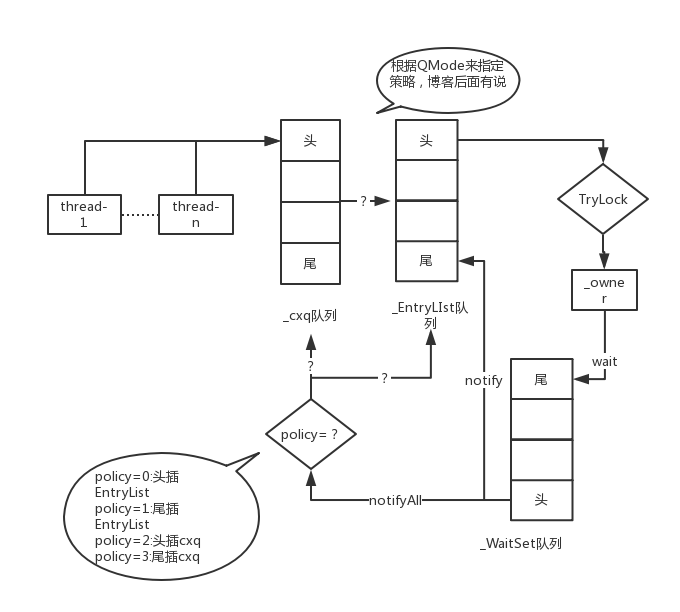

### 分布式锁

**使用场景**


在实际环境中我们有很多场景会用到分布式锁，例如全局计数器，只要涉及到多个实例进程对同一份数据进行修改等操作都会需要分布式锁。在比如在下单，更新缓存，减少库存等场景下也会用到分布式锁。


### 锁

//Mark Word可能有以下几种状态:

// *  Inflated(膨胀完成)     - just return
// *  Stack-locked(轻量级锁) - coerce it to inflated
// *  INFLATING(膨胀中)     - busy wait for conversion to complete
// *  Neutral(无锁)        - aggressively inflate the object.
// *  BIASED(偏向锁)       - Illegal.  We should never see this

#### 内置锁(ObjectMonitor)

通常所说的对象的内置锁，是对象头Mark Word中的重量级锁指针指向的monitor对象，该对象是在HotSpot底层C++语言编写的(openjdk里面看)，简单看一下代码：

```
//结构体如下
ObjectMonitor::ObjectMonitor() {  
  _header       = NULL;  
  _count       = 0;  
  _waiters      = 0,  
  _recursions   = 0;       //线程的重入次数
  _object       = NULL;  
  _owner        = NULL;    //标识拥有该monitor的线程
  _WaitSet      = NULL;    //等待线程组成的双向循环链表，_WaitSet是第一个节点
  _WaitSetLock  = 0 ;  
  _Responsible  = NULL ;  
  _succ         = NULL ;  
  _cxq          = NULL ;    //多线程竞争锁进入时的单向链表
  FreeNext      = NULL ;  
  _EntryList    = NULL ;    //_owner从该双向循环链表中唤醒线程结点，_EntryList是第一个节点
  _SpinFreq     = 0 ;  
  _SpinClock    = 0 ;  
  OwnerIsThread = 0 ;  
}  
```

ObjectMonitor队列之间的关系转换可以用下图表示：




## Spring的启动加载过程

Spring 上下文类 ClassPathXmlApplicationContext，构造方法`ClassPathXmlApplicationContext(String[] configLocations, boolean refresh, ApplicationContext parent)`中 主要做了两件事，

1、 setConfigLocations 设置配置资源路径。包括往资源列表中添加Java进程中的变量和系统的环境变量，处理占位符${...}

2、 refresh() 方法完成配置类的解析、各种BeanFactoryPostProcessor和BeanPostProcessor的注册、国际化配置的初始化、web内置容器的构造等等

### refresh（）：

```java
	@Override
	public void refresh() throws BeansException, IllegalStateException {
		synchronized (this.startupShutdownMonitor) {
			// Prepare this context for refreshing.
			prepareRefresh();

			// Tell the subclass to refresh the internal bean factory.
			ConfigurableListableBeanFactory beanFactory = obtainFreshBeanFactory();

			// Prepare the bean factory for use in this context.
			prepareBeanFactory(beanFactory);

			try {
				// Allows post-processing of the bean factory in context subclasses.
				postProcessBeanFactory(beanFactory);

				// Invoke factory processors registered as beans in the context.
				invokeBeanFactoryPostProcessors(beanFactory);

				// Register bean processors that intercept bean creation.
				registerBeanPostProcessors(beanFactory);

				// Initialize message source for this context.
				initMessageSource();

				// Initialize event multicaster for this context.
				initApplicationEventMulticaster();

				// Initialize other special beans in specific context subclasses.
				onRefresh();

				// Check for listener beans and register them.
				registerListeners();

				// Instantiate all remaining (non-lazy-init) singletons.
				finishBeanFactoryInitialization(beanFactory);

				// Last step: publish corresponding event.
				finishRefresh();
			}

			catch (BeansException ex) {
				if (logger.isWarnEnabled()) {
					logger.warn("Exception encountered during context initialization - " +
							"cancelling refresh attempt: " + ex);
				}

				// Destroy already created singletons to avoid dangling resources.
				destroyBeans();

				// Reset 'active' flag.
				cancelRefresh(ex);

				// Propagate exception to caller.
				throw ex;
			}

			finally {
				// Reset common introspection caches in Spring's core, since we
				// might not ever need metadata for singleton beans anymore...
				resetCommonCaches();
			}
		}
	}
```

```java
public void refresh() throws BeansException, IllegalStateException {
        synchronized (this.startupShutdownMonitor) {
            // Prepare this context for refreshing.
            //设置环境变量和容器的开关标志
            prepareRefresh();

            // Tell the subclass to refresh the internal bean factory.
            //刷新beanFactory，删除旧的beanFactory，创建新的beanFactory
            ConfigurableListableBeanFactory beanFactory = obtainFreshBeanFactory();

            // Prepare the bean factory for use in this context.
            // 准备beanfactory来使用这个上下文.做一些准备工作，例如classloader，beanPostProcessor等 
            prepareBeanFactory(beanFactory);

            try {
                // Allows post-processing of the bean factory in context subclasses.
                postProcessBeanFactory(beanFactory);

                // Invoke factory processors registered as beans in the context.
                //执行注册到该上下文的BeanFactoryPostProcessors  
                invokeBeanFactoryPostProcessors(beanFactory);

                // Register bean processors that intercept bean creation.
//注册BeanPostProcessors，注意只是注册，和上一行不同，没有invoke
                registerBeanPostProcessors(beanFactory);

                // Initialize message source for this context.
                initMessageSource();

                // Initialize event multicaster for this context.
                initApplicationEventMulticaster();

                // Initialize other special beans in specific context subclasses.
                onRefresh();

                // Check for listener beans and register them.
                registerListeners();

                // Instantiate all remaining (non-lazy-init) singletons.
//创建所有非懒加载的单例类（并invoke BeanPostProcessors）
                finishBeanFactoryInitialization(beanFactory);

                // Last step: publish corresponding event.
                finishRefresh();
            }

            catch (BeansException ex) {
                if (logger.isWarnEnabled()) {
                    logger.warn("Exception encountered during context initialization - " +
                            "cancelling refresh attempt: " + ex);
                }

                // Destroy already created singletons to avoid dangling resources.
                destroyBeans();

                // Reset 'active' flag.
                cancelRefresh(ex);

                // Propagate exception to caller.
                throw ex;
            }

            finally {
                // Reset common introspection caches in Spring's core, since we
                // might not ever need metadata for singleton beans anymore...
                resetCommonCaches();
            }
        }
    }
```


用synchronized ：为了避免refresh方法还没结束又发起一次启动或者销毁容器

### obtainFreshBeanFactory() ：

其中的refreshBeanFactory()方法 创建bean工厂  进行了Bean的初始化

   *判断当前ApplicationContext是否存在BeanFactory，如果存在的话就销毁所有 Bean，关闭 BeanFactory*

loadBeanDefinitions()方法加载bean到beanFactory中，实例化DefaultListableBeanFactory。然后根据配置(系统配置或者指定的 `classpath:application-ioc.xml`) 加载bean到BeanFactory中。解析配置文件 （XML或java代码配置等）

BeanFactory是一个Bean容器，而BeanDefinition就是Bean的一种形式（它里面包含了Bean指向的类、是否单例、是否懒加载、Bean的依赖关系等相关的属性）。BeanFactory中就是保存的BeanDefinition。

 

doCreateBean（）：

 // 这里是处理bean初始化完成后的各种回调，例如init-method、InitializingBean 接口、BeanPostProcessor 接口         exposedObject = initializeBean(beanName, exposedObject, mbd);